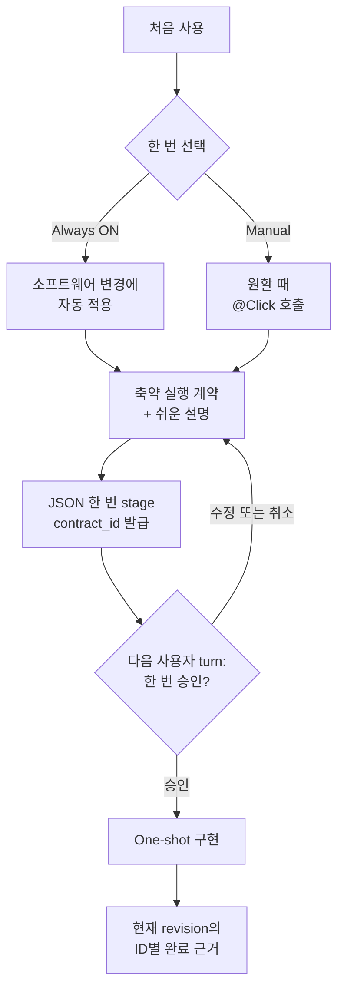

# Click

[English](README.md) | 한국어 | [简体中文](README.zh-CN.md)

[](https://github.com/grapefruit0205/click/actions/workflows/ci.yml)
[](LICENSE)

> 무엇을 바꾸고 무엇을 지킬지 한 번 합의한 뒤, 그 경계 안에서 구현과 필요한 검증을 끝냅니다.

Click은 코딩 에이전트와 소프트웨어 변경을 한 번 합의한 뒤, 계획을 다시 쓰거나 저장소 전체를 다시 훑거나 같은 결과를 다른 도구로 재확인하지 않고 끝까지 진행하고 싶은 사용자를 위한 Codex 플러그인입니다. 요청과 관련 저장소 맥락을 짧은 계약—무엇을 바꿀지, 무엇을 반드시 지킬지, 어떤 근거면 완료인지—으로 만들고 쉬운 말로 설명한 뒤 승인을 기다립니다. 승인 후에는 구현과 검증을 그 경계 안에 유지합니다.

소프트웨어 변경에 기본 적용하려면 **Always ON(추천)**을, `@Click`을 부른 작업에만 적용하려면 **Manual**을 선택합니다. 질문·설명·단순 조회·수정 없는 코드 리뷰는 가볍게 유지됩니다.

## 핵심 목적

Click의 핵심 목적은 사용자가 승인한 하나의 변경 경계를 제안부터 구현과 필요한 검증까지 유지하는 것입니다. 더 큰 명세를 만들거나 아키텍처 패턴을 대신 선택하는 도구가 아닙니다. 무엇을 바꿀지, 무엇을 지킬지, 어떤 근거면 충분한지를 명확히 한 뒤 관찰 가능한 재계획·저장소 전체 재탐색·중복 검증을 제한하면서 승인 범위 안의 필요한 구현 선택은 열어 둡니다.

## 빠르게 시작하기

```bash
codex plugin marketplace add grapefruit0205/click
codex plugin add click@click
```

ChatGPT 데스크톱 앱을 다시 시작하고 포함된 Click Hook을 검토해 신뢰한 뒤 새 작업을 시작합니다. 첫 코드 변경 요청 전에 Click이 한 번만 묻습니다.

```text
앞으로 소프트웨어 변경에 Always ON을 사용할까요(추천), 아니면 @Click을 부를 때만 Manual로 사용할까요?
```

기본 경험을 원하면 Always ON을 선택합니다. 명시적으로만 사용하려면 Manual을 고른 뒤 다음처럼 호출합니다.

```text
@Click 주문 취소 기능을 추가해줘. 중복 환불을 방지하고 기존 API 호환성을 유지해야 해.
```

## Google Antigravity 어댑터(실험적 소스 빌드)

이 저장소는 Codex 플러그인과 계약 상태 머신·evidence ledger·검증 예산·
shell-free runner를 공유하는 독립형 Google Antigravity 플러그인도 생성합니다.

```bash
python3 scripts/build_antigravity_distribution.py
agy plugin install ./dist/antigravity
```

Antigravity IDE에서는 `dist/antigravity`를 워크스페이스의
`.agents/plugins/click` 또는 전역 `~/.gemini/config/plugins/click`에 복사할
수도 있습니다. Codex는 기존 `.codex-plugin/plugin.json`과 Codex Hook
어댑터를 계속 사용하므로 한 플랫폼 지원이 다른 플랫폼을 대체하지 않습니다.

Antigravity의 Hook 계약은 Codex와 다릅니다. 따라서 구조화 명령은 번들
launcher를 사용하고, 완전히 idle인 `model_stop`, 새로 읽을 수 있는 사용자
transcript 항목, 다음 `PreInvocation`을 제안과 승인 사이의 실행 경계로
취급합니다. Antigravity native read 사이의
중복 차단과 Browser evidence는 아직 지원하지 않습니다. 완전 동등성을
가정하지 말고 정확한 제한은
[`platforms/antigravity/README.md`](platforms/antigravity/README.md)를 확인하세요.

## v0.21.1로 업데이트

Click을 이미 설치했다면 Git 마켓플레이스 스냅샷을 명시적으로 갱신하고 플러그인을 다시 설치해야 이번 버전이 적용됩니다.

```bash
codex plugin marketplace upgrade click
codex plugin add click@click
```

ChatGPT 데스크톱 앱을 다시 시작하고 갱신된 Click Hook을 검토해 신뢰한 뒤 새 작업을 시작합니다. 기존 모드 설정은 대상 저장소 밖에 그대로 유지됩니다. v0.21.1은 계약이나 증거 schema를 바꾸지 않습니다. `click-gate`를 직접 호출한다면 계속 verify 프로토콜 버전 `2`를 사용하고 모든 check에 승인된 argv `evidence_id`를 넣으며, `pass`에는 발급된 `contract_id`만 전달하고 `done_when`은 구조화된 증거 참조를 사용합니다. 예전 설치가 만든 실행 대기 중 runner 명령은 재사용하지 말고, 갱신된 Hook이 새 명령을 발급하게 합니다.

나중에 “Click을 Always ON으로 설정해줘” 또는 “Click을 Manual로 설정해줘”라고 바꿀 수 있고, 이 설정은 대상 저장소 밖에 유지됩니다. 정확히 한 turn만 우회하려면 사용자 프롬프트 첫 줄에 `@Click bypass` 또는 자동완성 형식인 `[@Click](plugin://click@click) bypass`를 씁니다. Hook은 같은 turn의 `click-gate bypass` 한 번만 승인하고 active 계약은 그대로 보존합니다. active 계약을 버릴 때는 같은 형식의 `cancel` 명령으로 `click-gate cancel` 한 번을 승인합니다. `@Click` 이름과 명령의 대소문자는 구분하지 않지만 plugin URI는 정확히 일치해야 하며, 명령 줄에 다른 문구를 붙일 수 없습니다. 실제 작업 내용은 둘째 줄부터 이어서 쓸 수 있습니다. 두 권한은 재사용하거나 다음 turn으로 가져갈 수 없습니다. Click은 프로젝트 안에 설정이나 계약 파일을 만들지 않습니다.

<details>
<summary>Build Brief 또는 예전 Click 설치에서 이전하기</summary>

`click@build-brief` 0.9.0을 설치했다면:

```bash
codex plugin remove click@build-brief
codex plugin marketplace remove build-brief
codex plugin marketplace add grapefruit0205/click
codex plugin add click@click
```

Build Brief 0.8이라면 첫 번째 명령을 `codex plugin remove build-brief@build-brief`로 바꿉니다.

</details>

## v0.21.0의 증거별 완료 판정

v0.21은 계약에 선언한 모든 완료 증거를 현재 코드 revision의 Hook 상태와 연결합니다. local argv check는 자신이 증명하는 승인된 evidence ID를 지정하고, 성공한 Browser 작업은 관찰된 뒤 명시적으로 finalize됩니다. hosted·manual·existing은 Hook이 외부 사실을 독립적으로 증명하는 것이 아니라 명시적인 attestation으로 남습니다. 모든 선언 증거가 current이고 관리 서비스가 활성 상태가 아니면 즉시 완료되므로 argv 증거가 없는 계약에 무관한 local 검증 명령을 억지로 추가하지 않습니다.

## 작동 방식



처음 한 요청을 아직 보지 못한 설계에 대한 승인으로 간주하지 않습니다. Click은 `plain_language`까지 포함한 계약 JSON을 한 번 stage하고 불투명한 `contract_id`를 받은 뒤, 그 id와 `outcome`부터 `verification`까지의 개발자용 필드를 보여주고 계약 안의 `plain_language` 정확한 값을 쉬운 설명으로 한 번만 표시한 다음 멈춥니다. 같은 뜻을 별도의 두 번째 요약으로 다시 쓰지 않습니다. Hook은 `staged_turn_id`를 기록하고 같은 `UserPromptSubmit` turn의 pass와 대체 stage를 거부합니다. 다음 turn의 명시적 승인은 JSON을 다시 보내지 않고 발급된 id만 pass하며, Hook은 이를 staged digest와 대조한 뒤 `approved_turn_id`를 기록합니다. 제안을 수정해 stage하면 새 id가 발급되어 이전 handle은 무효가 됩니다. 이 장치는 다른 사용자 응답이 있었다는 사실을 증명하지만, 그 자연어가 실제로 승인을 뜻하는지는 Skill이 충실하게 해석해야 합니다.

승인한 결과·경계·반드시 지킬 동작·검증 약속이 실제로 바뀌는 경우에만 중단합니다. 승인 경계 안에서 필요한 파일·라이브러리·도구·서비스·구현 수단은 새 계약이 필요하지 않습니다.

Manual의 fail-open은 active Click 계약이 없을 때만 적용됩니다. 계약을 stage했거나 승인했지만 현재 revision에 필요한 모든 증거 ID를 완료하지 않았다면 그 세션 상태가 다음 turn에서도 일반 mutation을 막습니다. 따라서 승인 turn에서 계약에 묶인 `contract_id`를 pass하기 전에 실수로 코드를 바꿀 수 없습니다. 승인된 구현이 중단되어 다음 turn에 이어갈 때는 같은 id를 arm·pass한 뒤 계속하며, JSON을 다시 보내거나 새 계약을 만들지 않습니다.

현재 코드 revision에서 계약에 등록한 모든 증거 ID가 완료되고 Click이 관리하는 서비스가 활성 상태가 아니면 다음 변경 요청은 새 계약을 정상적으로 stage할 수 있습니다. argv 증거가 하나도 없는 계약은 local `verify`를 억지로 실행할 필요가 없습니다. 아직 수집하지 않았거나 실행 중·실패·추가 수정으로 stale인 증거가 하나라도 있으면 계약을 교체할 수 없습니다. 새 계약은 조회·mutation·증거 상태를 깨끗하게 초기화하고 다시 한 번 승인을 받으므로 `bypass`나 상태 파일 수동 삭제가 필요 없습니다.

## 예시: 요청에서 승인까지

다음처럼 요청했다고 가정합니다.

```text
@Click 주문 취소 기능을 추가해줘. 중복 환불을 방지하고 기존 API 호환성을 유지해야 해.
```

Click이 개발자용 보기와 쉬운 설명을 나눠 보여주기 전, stage하는 canonical JSON은 다음과 같은 축약 형태입니다.

```json
{
  "outcome": "기존 API로 취소 가능한 주문을 취소하고 환불은 최대 한 번만 실행한다.",
  "boundary": {
    "in_scope": ["현재 주문 취소 및 환불 경로"],
    "out_of_scope": ["새 결제 사업자 추가", "관련 없는 주문 상태 정리"]
  },
  "must_hold": [
    "동시에 요청하거나 재시도해도 두 번째 환불이 생기지 않는다.",
    "기존 요청 필드, 응답 필드, 상태 의미를 호환되게 유지한다.",
    "결제 사업자 호출 실패를 환불 완료 상태로 기록하지 않는다."
  ],
  "build": {
    "approach": [
      "현재 취소 경로를 재사용하고 멱등 환불 기록과 원자적인 환불 상태 전이를 추가한다."
    ],
    "semantics": [
      "환불 결과는 한 번만 기록하고 반복 요청에는 기록된 결과를 반환한다."
    ]
  },
  "verification": {
    "scale": "full",
    "evidence": [
      {
        "id": "E1",
        "kind": "argv",
        "description": "성공·중복·동시 요청·결제 사업자 실패를 다루는 주문 취소 테스트"
      },
      {
        "id": "E2",
        "kind": "argv",
        "description": "기존 API 회귀 테스트"
      }
    ],
    "done_when": [
      {
        "condition": "환불 동작이 정확하다.",
        "primary_evidence": "E1"
      },
      {
        "condition": "공개 API가 호환된다.",
        "primary_evidence": "E2"
      }
    ]
  },
  "plain_language": "고객은 취소 가능한 주문을 취소할 수 있지만 재시도하거나 동시에 요청해도 환불은 한 번만 됩니다. 공개 API는 그대로 유지되고 결제 호출 실패가 환불 완료로 잘못 기록되지 않습니다. 결제와 동시성을 다루므로 Click은 full 검증을 추천합니다."
}
```

stage 결과는 `CLICK_CONTRACT_ID=ctr_0123456789abcdef0123456789abcdef`입니다. Click은 이 id와 `outcome`부터 `verification`까지의 개발자용 필드를 보여주고, 계약 JSON에 digest로 묶인 `plain_language` 값을 쉬운 설명으로 정확히 한 번 표시한 뒤 계약과 검증 규모를 승인할지, 고칠지, 취소할지 묻습니다. 승인은 쉬운 설명만이 아니라 계약에 담긴 개발자 의미 전체를 승인한다는 뜻이며, 다음 turn에는 이 id만 pass해 구현을 시작합니다.

실제 설계는 저장소마다 달라집니다. 이 예시는 모든 환불 시스템에 적용되는 정답이 아니라 계약의 형태를 보여줍니다.

## 축약 계약

| 필드 | 고정하는 것 |
| --- | --- |
| `outcome` | 구체적인 결과와 사용자에게 보이는 동작 |
| `boundary` | 바꿔도 되는 범위와 건드리지 않을 범위 |
| `must_hold` | 관찰 가능한 안전·호환성·정확성 약속 |
| `build` | 저장소에 맞춘 가장 작은 구현 경로 |
| `verification` | 위험에 맞춘 검증 규모 하나와 완료 근거 |
| `plain_language` | 비개발자도 이해할 수 있게 풀어쓴 같은 계약 |

`build.semantics`, `build.order`, `verification.intermediate_gate`는 상태 의미, 안전한 순서, 되돌리기 어려운 경계가 실제로 필요할 때만 추가합니다. 같은 작업을 phases, steps, tasks, plan으로 반복해 늘어놓지 않습니다.

계약은 결과와 경계를 고정하지만 모든 저수준 구현 선택까지 고정하지는 않습니다. 그래서 승인 범위 안에서 의존성·파일·도구가 필요해져도 매번 재승인하지 않고 작게 유지할 수 있습니다.

## 방해하지 않는 Always ON

| 요청 | Always ON 동작 |
| --- | --- |
| 소프트웨어 생성·수정·삭제·리팩터링·수리 | 축약 계약과 쉬운 설명을 보여주고 승인 한 번을 기다림 |
| 수정 없는 코드 리뷰 | 구현 계약과 승인 없이 읽기 전용 anti-loop 안전망만 적용 |
| 질문 또는 설명 | 평소처럼 바로 답변 |
| 단순 읽기 전용 조회 | 관찰 기록을 만들지 않고 평소처럼 확인 |
| 첫 줄이 일반 또는 자동완성 `@Click bypass` | 해당 turn의 우회 한 번을 승인하고 active 계약은 유지 |
| 첫 줄이 일반 또는 자동완성 `@Click cancel` | active 계약을 지우는 cancel 한 번을 승인 |

코드 리뷰에서는 필요하면 저장소 전체 목록을 처음 한 번 확인할 수 있습니다. 성공한 뒤에는 범위를 좁혀 확인해야 하며, 동일한 성공 읽기·검색과 두 번째 저장소 전체 목록 탐색을 차단합니다. 계획 도구 반복과 프로젝트 수정도 리뷰 모드에서는 거부합니다. 발견 사항을 나중에 고쳐 달라고 요청하면 별도의 축약 구현 계약을 시작합니다.

인식 가능한 단순 직접 조회는 계속 편하게 쓸 수 있습니다. 애매하거나 기록해야 하는 작업은 shell 문자열을 억지로 추측하지 않고 프로그램과 인자 배열을 받는 `click-gate inspect`를 사용합니다. 리뷰 안전망은 지원되는 로컬 Hook 경로만 다루며, 숨은 추론, hosted search, matcher 밖 connector, 사용자 정의 래퍼의 반복까지 제거하지는 못합니다.

## 실행 루프 없이 구현

계약 stage부터 리뷰·구현·검증까지 Hook은 다음 관찰 가능한 행동을 제한합니다.

| 안전망 | 동작 |
| --- | --- |
| 이미 얻은 근거 재사용 | 한 번 성공한 동일 구조화 읽기·검색은 범위 안의 코드 수정으로 근거가 오래되기 전까지 차단합니다. |
| 병렬 계획 금지 | workflow가 armed·staged·승인 후 미완료·review 상태인 동안 이후 turn에서도 `update_plan`을 거부합니다. 사용자 승인 bypass는 그 turn의 계획만 허용하고, 현재 revision의 모든 증거 ID가 완료되고 관리 서비스가 활성 상태가 아니어야 이후 일반 계획이 다시 허용됩니다. |
| 전체 목록 재탐색 금지 | 루트의 `rg --files`, `find .`, 루트 재귀 목록, 동등한 Git 목록 스캔을 거부하고 경로를 좁힌 확인은 허용합니다. |
| 명령 의도를 명시 | 활성 상태에서 애매한 Bash는 거부하고 조회는 `inspect`, 구현 명령은 `mutate`, 최종 검사는 `verify`를 사용하도록 안내합니다. |
| 검증을 예산 안에 유지 | argv 근거는 `evidence_id`가 있는 구조화된 `click-gate verify` 묶음으로 실행하고 승인한 규모 안에 들어야 합니다. |
| ID별 완료 기록 | 계약에 등록한 모든 증거가 현재 revision에서 완료되고 관리 서비스가 활성 상태가 아니어야 합니다. argv가 없으면 local `verify`를 요구하지 않습니다. |
| Browser 근거 제한 | Browser MCP는 주 증거로 명시한 경우만 3회·90초 대표 세션을 허용합니다. 성공한 대표 세션 뒤 `click-gate evidence`로 그 ID를 finalize하며 긴 시간 진행과 완료 후 재호출을 거부합니다. |
| 로컬 서버 수명주기 소유 | 인식 가능한 개발 서버는 `click-gate service`로 시작·종료해 Click이 정확한 격리 자식을 정리합니다. |
| 제안과 승인 분리 | stage가 digest에 묶인 불투명 id를 발급합니다. 같은 turn의 pass와 대체 stage를 거부하고 다음 승인 turn에는 그 id만 pass합니다. |

실패한 관찰 또는 출력이 48,000바이트를 넘은 관찰은 변경 없이 한 번 재시도할 수 있습니다. 소스가 수정되면 이전 근거가 오래됐을 수 있으므로 성공 관찰과 증거 완료 기록을 초기화합니다. Hook 상태 변경에는 크로스 플랫폼 잠금을 사용해 병렬 결과 기록이 잘못된 “실행 중” 상태를 남기지 않게 합니다. Hook은 요청 digest와 본문을 포함하지 않는 메타데이터만 저장하며 명령·출력·증거 설명은 저장하지 않습니다. evidence ID도 원문 대신 결정적 해시로 저장하지만, 예측 가능한 짧은 ID의 비밀성을 보장하는 장치는 아닙니다.

이 안전망은 도구 수준에서 동작하며 추론 토큰 제한이나 운영체제 샌드박스가 아닙니다. Hook은 숨은 추론, 자연어로만 쓴 계획, matcher 밖 connector나 hosted tool, 의미상 경계 준수 여부를 볼 수 없고, 허용된 사용자 코드 안에 여러 작업을 숨기는 것도 막지 못합니다.

### 구조화 capability

`inspect`·`mutate`·`service`와 evidence finalize는 프로토콜 버전 `1`을 사용하고, check별 증거 결합을 추가한 `verify`는 버전 `2`를 사용합니다. 실행 capability는 실행 파일과 모든 인자를 분리합니다. 승인된 argv 배열은 새 POSIX session 또는 Windows process group에서 `shell=False`로 실행되므로 요청 안에 pipeline, redirection, command substitution, shell wrapper를 숨길 수 없고 자식의 group 대상 signal이 Codex 부모 group에 닿지 않습니다.

```text
click-gate inspect '{"version":1,"commands":[["git","status","--short"],["sed","-n","1,160p","src/app.py"]]}'
click-gate mutate '{"version":1,"argv":["python3","scripts/generate.py","--target","src"]}'
click-gate service '{"version":1,"action":"start","argv":["python3","-m","http.server","4173","--bind","127.0.0.1"]}'
click-gate service '{"version":1,"action":"stop"}'
click-gate evidence '{"version":1,"evidence_id":"E-browser"}'
```

`inspect`는 Hook이 허용한 제한된 읽기 전용 작업만 받습니다. 읽기 실행 파일은 bare name만 허용하며 구분자가 붙은 이름, Windows drive-prefix 이름, 저장소의 PATH shadow, 저장소로 향하는 symlink는 fail-closed로 거부합니다. 경계는 가장 가까운 상위 Git 저장소 전체이며 Git 밖에서는 현재 작업 디렉터리입니다. 인식된 직접 읽기는 shell 없는 runner로 바꾸고, PATH에서 빈 항목·상대경로·저장소 항목을 제거한 뒤 해석한 절대 실행 파일을 사용합니다. 읽기 자식에서는 `LD_*`, `DYLD_*`, `GCONV_PATH`, `LOCPATH` 같은 loader 주입 변수도 제거하고, Git 조회는 `GIT_*` 및 system/global Git config도 무시합니다. `mutate`는 실행 전에 승인 상태·정확한 digest·일회용 token·재실행 상태·실행 전 만료를 원자적으로 claim합니다. 한 번 claim되면 결과 기록 또는 사용자의 취소 전까지 active로 남아 시간 경과만으로 병렬 runner를 허용하지 않습니다. 모든 상태형 runner는 주변 `PLUGIN_DATA`를 믿지 않고 canonical `gate-state` root와 state path를 전달합니다. 장시간 서버는 `service`를 사용하며 start runner와 detached supervisor가 각각 spawn 전에 digest-bound one-use claim을 수행한 뒤 정확한 자식 process group만 정리합니다. 잘못된 요청, shell interpreter, `pkill` 같은 직접 process-control 이름은 계속 fail-closed입니다. Click은 workflow guardrail이지 운영체제 sandbox가 아닙니다. secret·network·외부 경로·저장소 밖 실행 파일의 동시 same-user 교체·승인된 프로그램 안에 숨은 동작은 보호하지 않습니다. 정확한 schema와 적용 경계는 [capability protocol](skills/click/references/capability-protocol.md)에 있습니다.

SSH Git 조회는 **Experimental이며 원격 POSIX shell만 지원**합니다. 제한된 `git status`, `git rev-parse HEAD`, `git merge-base`, `git remote get-url`만 허용하고 사용자가 SSH option을 넣을 수 없습니다. 이미 알려진 host key를 요구하며 대화형 password, host-key 갱신, forwarding, local command, TTY를 끄고 connection·keepalive 제한으로 빠르게 실패합니다. 모르는 host, POSIX가 아닌 원격 shell, 응답하지 않는 server는 fail-closed입니다. 일반 원격 실행기나 보안 sandbox가 아닙니다.

## 자동 검증 예산

Click은 현재 위험과 저장소 근거로 충분한 최소 규모를 고릅니다. 사용자는 계약과 함께 그 규모를 승인하므로 검증 예산만 따로 다시 묻지 않습니다.

각 증거는 `verification.evidence`에 id·`kind`·설명으로 한 번만 선언합니다. 각 `done_when` 조건은 `primary_evidence`로 충분하면서 가장 싼 증거 id 하나를 참조하며, id 하나가 여러 조건을 함께 충족해도 됩니다. Click은 현재 revision에 유효한 근거와 좁은 자동 검사를 먼저 사용하고, 더 싼 근거로 조건을 증명할 수 없을 때만 브라우저·수동·hosted·전체 suite·시간이 긴 end-to-end 검증을 사용합니다. 자동 검사 결과를 다른 화면에서 다시 증명하지 않으며 모든 조건이 가리키는 증거 ID가 현재 revision에서 완료되고 관리 서비스가 활성 상태가 아니면 즉시 멈춥니다. argv 증거가 없다면 local `verify` batch는 필요하지 않습니다.

Hook은 표준 Browser MCP 경로를 구조적으로 계측합니다. 참조된 증거 하나의 `kind`가 `browser`일 때만 3회 호출·측정 시간 90초의 직렬 대표 세션을 허용하며, 30초 초과 tool timeout과 5초 초과 명시적 wait를 거부합니다. Browser 호출이 성공하면 현재 revision에서 관찰된 상태가 되고, 충분한 대표 세션을 마친 뒤 `click-gate evidence '{"version":1,"evidence_id":"E-browser"}'`로 그 ID를 finalize합니다. 성공한 Browser 호출 없이 finalize할 수 없고 완료 후 재호출도 거부합니다.

`hosted`·`manual`·`existing` 증거도 실제 확인을 마친 뒤 같은 `click-gate evidence` 요청으로 완료 사실을 명시적으로 확인 기록(attestation)합니다. 이는 어떤 ID를 완료로 기록했는지 구조적으로 남기지만, matcher 밖 hosted 실행이나 수동 판단의 진실성을 Hook이 독립적으로 증명한다는 뜻은 아닙니다. `argv` ID는 이 attestation 경로에서 거부되며 반드시 해당 `evidence_id`가 결합된 `verify` check의 실제 성공으로만 완료됩니다. 이후 mutation은 모든 ID의 현재 완료 상태와 Browser 수집 상태를 stale로 만듭니다. 외부 상태에는 evidence ID 원문 대신 해시만 저장합니다.

| 규모 | 주로 쓰는 경우 | 자동 상한 |
| --- | --- | ---: |
| `quick` | 작고 국소적이며 되돌리기 쉬운 변경 | 1단위 |
| `focused` | 범위가 정해진 일반 기능 또는 수정 | 4단위 |
| `full` | 결제·인증·삭제·마이그레이션·공개 계약·경계를 넘는 동시성 | 10단위 |

`targeted` 검사는 1단위, `broad` 검사는 3단위, `deep` 검사는 5단위입니다. 제출한 값을 그대로 비용으로 믿지 않습니다. Hook은 runner 종류를 먼저 찾고 실제 범위를 따로 추론합니다. 정확한 파일이나 test node 하나는 targeted일 수 있지만 `-k`·regex filter, 여러 파일·package, directory, 전체 suite는 최소 broad입니다. integration·security node 하나는 broad이고 해당 suite 전체는 deep입니다. 더 낮게 제출한 검사는 자동으로 올린 뒤 총비용을 계산합니다. 상한일 뿐 반드시 모두 쓸 목표가 아닙니다.

Click은 아직 완료되지 않은 argv 증거를 한 batch에 모두 포함하고 각 check에 해당 ID를 명시해 다음 runner에 전달합니다. 같은 증거에 여러 check가 필요하면 같은 `evidence_id`를 인접하게 사용하며 모두 성공해야 그 ID가 완료됩니다.

```text
click-gate verify '{"version":2,"checks":[{"evidence_id":"E1","argv":["python3","-m","unittest","discover","-s","tests","-q"],"class":"broad"},{"evidence_id":"E2","argv":["git","diff","--check"],"class":"targeted"}]}'
```

각 check의 `evidence_id`는 승인된 registry의 `kind: "argv"` 항목 하나와 정확히 결합되어야 합니다. Hook은 제출한 class를 검증·정규화하고 승인된 묶음을 shell 없이 실행해 실제 종료 코드를 ID별로 기록합니다. ID가 빠졌거나 등록되지 않았거나 argv가 아닌 kind를 가리키면 거부합니다. Python 검증은 pytest·unittest·coverage의 명시적 module runner를 받으며 Windows의 `py -3 -m ...`도 지원하지만, Python `-c`와 직접 Python 스크립트는 거부합니다. 정확한 파일을 지정한 `node --check`·`node --test`, `uv run pytest`, `npm run lint`, `npm run build`, `ruff check`, `mypy`, `tsc --noEmit`, `cargo check`, `cargo clippy`, `go vet` 같은 형태도 인식해 실제 범위에 맞춰 계산합니다. 전체 `node --test`는 broad이며 Node eval·print는 검증으로 받지 않습니다. 예전 shell 문자열 `commands`와 `evidence_id`가 없는 verify v1 check는 migration 안내와 함께 거부합니다. 일시적인 실패라면 해당 ID를 변경 없이 한 번 재시도할 수 있고, 그 뒤에는 범위 안의 수정이 필요합니다. 이후 소스를 수정하면 앞선 성공 결과가 오래된 것으로 간주되어 같은 ID를 다시 실행할 수 있습니다.

실행되지 않은 verification 예약만 만료 후 재시도할 수 있습니다. 이미 claim된 batch는 결과를 기록하거나 사용자가 취소할 때까지 running입니다. Git worktree에서는 batch 전의 tracked content와 기존 **non-ignored untracked** content를 snapshot하며, 최초 snapshot을 만들지 못하면 어떤 check도 실행하지 않습니다. 보호한 내용이 바뀌거나 새 non-ignored untracked 경로가 생기면 거짓 성공을 기록하지 않고 stale 실패시키며 mutation revision을 올립니다. 예상 산출물은 Git ignore 대상으로 두거나 승인된 mutation 단계에서 미리 생성해야 합니다. Git 밖에서는 content-diff 안전망을 사용할 수 없지만 argv 검증, shell 없는 실행, revision 상태 검사는 계속 적용됩니다.

최소 class 추론은 단순한 비용 축소 제출을 막습니다. 알 수 없는 검증형 이름의 사용자 정의 래퍼는 보수적으로 `deep`으로 계산하고 인식하지 못한 명령은 거부하지만, 허용된 프로그램 내부에 비싼 작업을 숨길 가능성까지 측정하지는 못합니다. 따라서 보안·자원 샌드박스가 아니며 선택한 테스트의 의미가 충분하다고 증명하지도 않습니다.

## 최소설계가 중요한 것을 빼지는 않습니다

최소설계는 형식과 반복을 줄이는 것이지 필요한 안전 조건을 지우는 것이 아닙니다.

| 관심사 | 필요할 때 계약이 지키는 것 |
| --- | --- |
| 동시성 | 경합 동작, 중복 실행, 멱등성 |
| 상태 | 허용 상태 전이, 저장 시점, 소유권 |
| 실패 | 부분 실패, 재시도, 복구, 외부 오류 |
| 보안 | 인증, 권한, 비밀정보, 개인정보 경계 |
| 호환성 | 기존 API, 데이터, 상태값, 사용자 동작 |

중요한 조건은 `must_hold`에, 구체적인 상태·실패 의미는 필요할 때 `build.semantics`에 둡니다. 증거 원천은 `verification.evidence`에 선언하고 관찰 가능한 완료 조건은 `verification.done_when`에서 그 id를 참조합니다. Hook은 계약 형식·승인 순서·digest 동일성·보이는 반복·보이는 검증 범위를 지킵니다. 구현이 아키텍처적으로 옳고 의미까지 정확하다고 Hook 하나로 증명하는 것은 아닙니다.

정확히 말하면 Click Hook은 새 마이크로서비스·queue·추상화가 과설계인지 의미적으로 판정하지 않습니다. Skill과 의미 grader가 근거 있는 최소설계를 선호하고, Hook은 설계를 계속 불리는 원인이 되기 쉬운 반복 계획·저장소 전체 재탐색·반복 검증 루프를 차단합니다. 제품 주장은 이 관찰 가능한 적용 경계로 제한합니다.

## 누구를 위한 플러그인인가요?

Click의 핵심 대상은 다음 두 그룹입니다.

- 성능 좋은 모델의 재계획·반복 탐색·과도한 검증에 피로를 느끼는 사용자
- 최소설계 뒤 끊지 않고 MVP·내부 도구·자동화·명확한 기능을 구현하고 싶은 사용자

특히 다음 작업에 잘 맞습니다.

- 기존 API를 유지해야 하는 브라운필드 기능;
- 멱등성·동시성·상태 전이·실패 복구가 있는 작업;
- 안전 경계가 명확한 마이그레이션이나 영향도가 큰 변경;
- 다른 사람이나 에이전트가 같은 의미를 구현해야 하는 인수인계;
- 최소 계획 뒤에 끊지 않고 구현하고 싶은 MVP·내부 도구·자동화.

작고 명확하고 되돌리기 쉬운 수정이나 탐색 작업이며 승인 경계를 남길 필요가 없다면 Manual 또는 현재 turn 우회가 더 간단합니다. 법률·규제·보안·운영상 되돌리기 어려운 작업에서 Click은 전문가 검토, 권한 확인, 배포 통제를 대신하지 않습니다.

## 근거와 솔직한 한계

현재 공개 릴리스 v0.21.1은 결정적 suite를 release gate로 사용합니다. 영구 모드, turn 분리 승인, active-contract 잠금, 읽기·계획 anti-loop, ID가 결합된 argv 검증, 증거별 현재 revision 완료, Browser 수집 후 finalize, 외부 attestation의 정직한 한계, 관리형 서버 one-use launch claim과 종료, 저장소 제외 실행 파일 해석, state-root binding, 실행 전 runner claim, 강화된 Git 조회, Git snapshot fail-closed, process 격리, 검증 중 workspace 변경 감지, 배포 일관성, 저장소 정책을 검증 대상으로 둡니다.

저장소에는 결정적 fixture 기반 정책 검토를 위한 version-18 golden case와 의미 grader도 포함되어 있습니다. 이 자료는 계약 형식과 기대 동작을 검사하며 runtime 생산성을 측정하지 않습니다.

이 gate는 관찰 가능한 Hook과 계약 동작만 증명합니다. 서로 관련 없는 실제 저장소에서 독립적으로 측정하기 전까지 Click이 프로젝트 전반의 성공률·정확도·시간·토큰·과설계를 개선한다고 주장하지 않습니다.

Click이 이 분야에서 최초이거나 유일하다고 주장하지 않습니다. spec-driven·autonomous loop·승인 게이트 도구와 겹치지만, 영구 선택 한 번·축약 계약 하나·승인 한 번·One-shot 구현·관찰 가능한 anti-loop 안전망·필요한 완료 근거만 쓰는 예산에 의도적으로 좁게 집중합니다.

개발자 커뮤니티에 바로 맞춰 쓸 수 있는 홍보 초안은 [COMMUNITY_POSTS.md](COMMUNITY_POSTS.md)에 있습니다.

<details>
<summary>저장소 구조와 로컬 검증</summary>

```text
.codex-plugin/plugin.json             플러그인 매니페스트
.agents/plugins/marketplace.json      GitHub 마켓플레이스 항목
skills/click/                         One-shot 설계·구현 Skill
skills/click/references/modes.md      영구 모드와 코드 리뷰 동작
skills/click/references/capability-protocol.md  구조화 runner schema
skills/fix/                           축약 수정 Skill
hooks/click_gate.py                   계약·capability·anti-loop·예산 안전망
hooks/hooks.json                      라이프사이클 Hook 설정
evals/                                golden case·의미 grader
tests/                                Hook·grader·정책 결정적 테스트
scripts/validate_distribution.py     저장소 자체 release validator
COMMUNITY_POSTS.md                    영문·국문 커뮤니티 홍보 초안
LICENSE                               MIT 라이선스
```

```bash
python3 scripts/validate_distribution.py
python3 -m compileall -q hooks evals scripts tests
python3 -m unittest discover -s tests -v
git diff --check
```

</details>

<details>
<summary>비슷한 접근</summary>

| 프로젝트 | 겹치는 부분 | Click이 더 좁게 집중하는 부분 |
| --- | --- | --- |
| [GitHub Spec Kit](https://github.com/github/spec-kit) | 명세·계획·작업·구현 | 지속적인 다중 명령 명세 대신 축약 계약 하나와 승인 한 번 |
| [OpenSpec](https://github.com/Fission-AI/OpenSpec) | AI 코딩 전 합의 | 프로젝트 로컬 명세 저장소 없이 대상 저장소 밖에 digest와 본문 없는 lifecycle metadata만 보관 |
| [Kiro Specs](https://kiro.dev/docs/cli/v3/specs/) | 요구사항·설계·작업·검증 실행 | 전체 계약 한 번 검토 뒤 One-shot 구현 |
| [Agentic SDLC Codex Plugin](https://github.com/aantenore/agentic-sdlc-codex-plugin) | hash로 묶인 제안과 승인 | 더 넓은 SDLC 거버넌스보다 작은 구현 전 경계 |

이 표는 제한된 비교이며 신규성에 대한 전수 조사가 아닙니다.

</details>

## 라이선스

Click은 [MIT 라이선스](LICENSE)로 배포됩니다.
