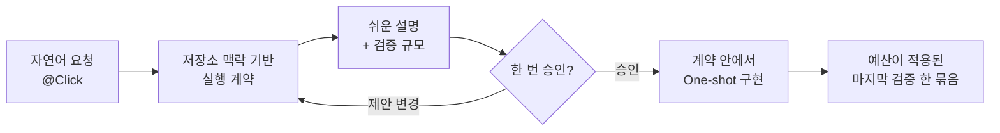

# Click

[English](README.md) | 한국어

[](https://github.com/grapefruit0205/click/actions/workflows/ci.yml)
[](LICENSE)

**Contract-first, build-fast. 최소한의 설계 계약을 한 번 승인하면 Click이 그 안에서 작동하는 결과까지 구현합니다.**

Click은 명시적으로 선택하는 Codex 플러그인입니다. `@Click`을 멘션하고 자연어로 원하는 소프트웨어를 말하면 관련 저장소를 읽어 축약된 개발자용 실행 계약으로 번역하고, 같은 내용을 쉬운 말로 설명하고, 적절한 최종 검증 규모를 선택한 뒤 코딩 전에 한 번만 승인을 요청합니다. 구현이 끝나면 Hook이 그 자동 예산 안에서 최종 검증 명령을 계량하고 실행합니다.

아키텍처 패턴 선택기가 아닙니다. 사용자가 모듈러 모노리스, 마이크로서비스, 이벤트 드리븐, 배치, 함수형 중 하나를 고를 필요가 없습니다. 실제 요구 동작과 코드베이스가 필요로 하는 설계 언어를 Click이 도출합니다.

## 아주 간단히 설명하면

1. `@Click`을 멘션하고 원하는 결과를 자연어로 말합니다.
2. Click이 저장소에서 가장 좁은 관련 범위를 확인합니다.
3. 축약된 개발자용 계약 하나, 쉬운 설명 하나, 검증 규모 하나를 보여줍니다.
4. 사용자가 한 번 승인합니다.
5. Click이 계약 안에서 One-shot으로 구현하고, Hook이 예산을 적용해 마지막 검증 묶음을 한 번 실행합니다.



저장소에서 안전하게 판단할 수 있는 기술 선택을 하나씩 되묻지 않습니다. 중요한 가정은 계약 안에 눈에 보이게 넣어 한꺼번에 검토하게 합니다. 승인 전에는 제안을 바꿀 수 있고, 승인 후에는 의미 계약을 고정한 채 그 안에서 끝까지 구현합니다.

## 정확히 무엇을 고정하나요?

Hook은 계약 digest와 계약 내용을 포함하지 않는 검증 상태 정보를 대상 저장소 밖에 기록하며 계약 본문은 저장하지 않습니다. 승인 뒤 전달되는 계약은 JSON을 정규화했을 때 stage한 계약과 정확히 같아야 하며, 다른 계약이면 거부합니다.

고정되는 것은 **작업의 의미**입니다.

- 결과와 사용자에게 보이는 동작
- 작업 경계와 반드시 지킬 조건
- 중요한 상태·실패·호환성 동작
- 명시한 제약과 검증 약속

모든 구현 도구를 고정하는 것은 아닙니다. 승인된 의미 범위 안에서는 필요한 라이브러리·의존성·MCP·외부 서비스·grader·파일·세부 구현 방식을 Click이 재승인 없이 선택할 수 있습니다. 그래서 구현 수단마다 다시 묻지 않고 One-shot으로 진행할 수 있습니다.

승인하지 않은 새 권한, 계약에 포함되지 않은 비가역적 또는 유료 외부 작업, 승인된 결과나 의미 경계의 변경이 필요할 때만 중단합니다.

Hook이 강제하는 것은 계약 형식·순서·stage와 pass 계약의 동일성, 그리고 화면에 보이는 검증 명령에 대한 결정적 예산 정책입니다. 아키텍처가 옳은지, 사람이 실제로 승인했는지, 모든 코드가 의미상 계약과 일치하는지, 사용자 정의 스크립트 내부에서 실제로 얼마나 많은 검증이 실행되는지는 증명하지 못합니다.

## 검증은 적게, 마지막에 한 번

계약에는 검증 규모 하나와 `done_when` 목록 하나만 들어갑니다. 계획·phase·step·task마다 별도의 테스트 지점을 만들지 않습니다.

| 규모 | 추천 상황 | 자동 상한 | 마지막 검증 묶음 |
| --- | --- | ---: | --- |
| `quick` | 작고 국소적이며 되돌리기 쉬운 작업 | 1단위 | 가장 가까운 의미 있는 검사와 최종 diff/status 확인 |
| `focused` | 일반 기능과 버그 수정 | 4단위 | 변경 동작 테스트, 가장 가까운 회귀 검사, 최종 diff/status 확인 |
| `full` | 결제·인증·삭제·마이그레이션·공개 계약·영향 큰 동시성 | 10단위 | 가능한 전체 테스트와 관련 통합·마이그레이션·보안·E2E 검사 |

간단한 대상 검증 명령은 1단위, 인식 가능한 광범위 테스트 묶음은 3단위, 보안·감사·커버리지·E2E·벤치마크 명령은 5단위입니다. 규모는 Click이 자동으로 선택하며 사용자가 별도 예산을 설정하지 않습니다. 계약 전체를 한 번 승인할 때 함께 승인됩니다.

완료 시 Click은 내부 `click-gate verify` 러너에 항목당 명령 하나씩 제출합니다. 명령 연결, 파이프, 리디렉션, 백그라운드 실행, 명령 치환, 줄바꿈은 실제 비용을 숨길 수 있어 거부합니다. 인식 가능한 광범위 검증은 이 예산 묶음으로만 실행합니다. 구현에 필요한 일반 빌드·앱 실행·국소 피드백은 허용하지만 최종 증거로 취급하지 않습니다.

러너는 실제 종료 코드를 기록합니다. 성공한 묶음은 이유 없이 반복할 수 없습니다. 이후 코드가 바뀌면 결과가 오래된 것으로 표시되어 같은 묶음을 다시 실행할 수 있습니다. 실패한 묶음은 일시적 오류에 대비해 변경 없이 한 번 재시도할 수 있고, 그다음 재시도에는 범위 안의 코드 변경이 필요합니다.

완료 검사는 구현이 끝난 뒤 한 묶음으로 한 번 실행합니다. 중간 Gate는 비가역적 마이그레이션, 삭제, 배포, 유료 API 호출처럼 지나간 뒤 복구가 훨씬 어려워지는 지점에만 사용합니다.

## 사용자용 호출은 하나

설계·구현·수정 요청 모두 `@Click`으로 시작합니다.

```text
@Click 기존 전체 환불 동작을 바꾸지 않으면서 레거시 결제 코드에 부분 환불을 추가해줘.
```

Click이 Top-down 축약 계약, 쉬운 설명, 검증 규모를 만들고 한 번의 승인을 기다립니다.

```text
@Click 결제 버튼을 두 번 누르면 같은 요청이 중복돼. 기존 결제 API는 유지하면서 고쳐줘.
```

Fix는 가장 좁은 오류 경로를 추적하고, 확인된 근거와 원인 가설을 구분해 작은 수정 계약을 만듭니다. 한 번 승인하면 수정하고 마지막 검증을 한 번 실행합니다.

플러그인 내부에는 설계·구현용 `$click`과 작은 수정용 `$fix`라는 명시 호출 Skill이 들어 있습니다. 기술 인터페이스로 직접 호출할 수 있지만 사용자 안내와 예시는 플러그인 멘션인 `@Click`을 기본으로 씁니다. 네이티브 슬래시 명령을 설치하지 않으며, 두 Skill 모두 자동 호출이 꺼져 있어 평범한 요청에는 개입하지 않습니다.

## 예시: YouTube 자동 답글 요청

아래 내용은 **Click의 작동 방식을 설명하는 참조 예시**입니다. 이 저장소에는 YouTube 자동 답글 봇 코드가 들어 있지 않으며 실제로 배포하지도 않습니다.

입력:

```text
@Click 내 YouTube 채널 댓글에 자동으로 답글을 게시하는 도구를 만들어줘.
Gemini API로 답글을 만들되 욕설·개인정보·광고성 댓글에는 답글을 달지 마.
```

“어디에 댓글을 달까요?”, “고정 문구인가요, AI인가요?”, “어떤 모델인가요?”를 차례로 되묻는 대신, 요청과 저장소 근거를 이용해 한 번에 검토할 계약을 만듭니다. 축약하면 다음과 같습니다.

- YouTube API로 댓글을 가져오고 답글을 게시하며 Gemini로 답글 후보를 만듭니다.
- 욕설·개인정보·광고성 댓글은 게시 전에 제외합니다.
- 처리한 댓글 ID를 기록해 재시도해도 중복 답글을 달지 않습니다.
- 인증정보는 코드 밖에 두고, API 제한을 지키며, 일시적 실패를 안전하게 재시도하고, 운영 중지 장치를 둡니다.
- 저장소에 적절한 런타임·스케줄러·저장 방식이 있으면 재사용하고, 필요하면 범위 안에서 다른 의존성이나 서비스를 선택합니다.
- `focused` 검증을 추천해 필터링·중복 방지·API 실패·dry-run 게시 경계를 마지막에 한 번 확인합니다.

쉬운 설명:

> 새 YouTube 댓글을 확인하고 Gemini가 답글 초안을 만듭니다. 욕설·개인정보·광고성 댓글은 건너뛰고, 이미 처리한 댓글을 기억해 두 번 답글을 달지 않습니다. 인증정보는 코드에 넣지 않고, 잠시 발생한 API 오류는 안전하게 재시도하며, 운영자가 게시를 멈출 수 있습니다. 구현이 끝나면 합의한 focused 검증을 한 번 실행합니다.

그다음 질문은 하나입니다.

> 이 계약과 focused 검증 규모를 승인하시겠습니까? 승인하면 이 범위 안에서 One-shot으로 구현하겠습니다.

처음 요청이 “자동 댓글 도구 만들어줘”처럼 짧아도, Click은 플랫폼과 생성 방식에 대한 제안을 계약의 가정으로 보여줄 수 있습니다. 승인하면 그 가정을 받아들이는 것이고, 승인 전에는 제안을 바꿀 수 있습니다.

## 계약을 개발자 언어로 보면

| 필드 | 의미 |
| --- | --- |
| `outcome` | 완성될 결과와 사용자에게 보이는 동작 |
| `boundary` | 필수 `in_scope` 범위와 명시적인 `out_of_scope` 제한 |
| `must_hold` | 바뀌면 안 되는 동작·호환성·안전 조건 |
| `build` | 저장소에 맞는 최소 구현 방향; 필요할 때만 `semantics`와 `order` 포함 |
| `verification` | `quick`·`focused`·`full` 중 하나와 관찰 가능한 `done_when` 조건 |
| `plain_language` | 같은 계약을 쉽게 풀어쓴 설명 |

기존 `plan`, `implementation`, `phases`, `steps`, `tasks`, `execution_order`, `minimality`, `proof`는 별도 계약 필드로 만들지 않습니다. 필요한 의미를 `outcome`, `boundary`, `must_hold`, `build`, `verification`에 합쳐 파일 하나짜리 수정을 작은 프로젝트 계획으로 부풀리지 않습니다.

Hook은 직렬화한 계약을 최대 4,000자로 제한합니다. 이는 목표 길이가 아니라 상한이며, 일반 계약은 이보다 훨씬 짧아야 합니다.

## 최소설계가 생략하지 않는 것

**작은 설계는 빠진 설계가 아닙니다.** Click이 줄이는 것은 계약 필드, 반복 계획, 승인 횟수입니다. 요청과 현재 시스템에서 실제로 중요한 안전 의미는 최소화 대상이 아니며 계약에 포함해야 합니다.

| 영역 | 축약 계약에서 지키는 의미 |
| --- | --- |
| 동시성 | 경합, 중복 실행, 멱등성처럼 동시에 일어날 때도 유지되어야 하는 결과 |
| 상태 | 허용되는 상태 전이, 저장 시점, 데이터 소유권처럼 잘못 바뀌면 안 되는 조건 |
| 실패 | 부분 실패, 재시도, 복구, 외부 시스템 오류 뒤에도 유지되어야 하는 동작 |
| 보안 | 인증·권한·비밀정보·개인정보 경계처럼 침범하면 안 되는 조건 |
| 호환성 | 기존 API·데이터·상태값·사용자 동작에서 그대로 유지해야 하는 약속 |

이 조건들은 먼저 `must_hold`에 고정합니다. 상태·실패·보안·동시성·호환성의 구체적인 의미가 구현을 제약할 때만 `build.semantics`를 추가하고, 순서가 안전성에 영향을 줄 때만 `build.order`를 추가합니다. 마지막으로 `verification.done_when`에 관찰 가능한 확인 항목을 둡니다. **조건부 필드라는 말은 필요한 안전 조건을 무시해도 된다는 뜻이 아니라, 관련 없는 항목으로 계약을 채우지 않는다는 뜻입니다.**

Hook은 이 의미가 실제 코드에 올바르게 구현됐다고 증명하지 않습니다. 계약의 형식·승인 순서·동일성을 지키고, 의미 grader는 중요한 누락을 지적하도록 구성되어 있습니다. 실제 신뢰도는 승인한 `done_when` 테스트와 코드 검토에서 확보해야 합니다.

## GitHub에서 설치

저장소·마켓플레이스·플러그인·Skill 이름을 모두 Click으로 통일했습니다.

```bash
codex plugin marketplace add grapefruit0205/click
codex plugin add click@click
```

`click@build-brief` 0.9.0이 설치되어 있다면 다음처럼 이전합니다.

```bash
codex plugin remove click@build-brief
codex plugin marketplace remove build-brief
codex plugin marketplace add grapefruit0205/click
codex plugin add click@click
```

더 오래된 Build Brief 0.8 설치라면 첫 번째 명령만 `codex plugin remove build-brief@build-brief`로 바꾸면 됩니다.

ChatGPT 데스크톱 앱을 다시 시작하고 포함된 Click Hook을 검토해 신뢰한 뒤, 새 작업을 시작해야 최신 Skill과 Hook이 로드됩니다.

## 언제 사용하면 좋나요?

잘못 이해한 불변 조건, 보이지 않는 가정, 범위 이탈의 비용이 계약 한 번을 검토하는 비용보다 클 때 적합합니다. 예를 들면 브라운필드 호환성, 데이터 소유권, 멱등성, 동시성, 마이그레이션, 실패 동작, 사람과 에이전트 사이 인수인계입니다.

작고 명확하며 되돌리기 쉬운 수정이나 탐색용 프로토타입은 일반 자연어 코딩이 더 간단합니다. 강한 코딩 모델은 이미 설계를 추론합니다. Click의 가치는 모델에 지능을 추가하는 것이 아니라 그 설계를 보이게 만들고 한 번의 승인에 묶는 데 있습니다.

## 근거와 한계

저장소의 결정적 테스트는 명시 호출 전용, 미호출 fail-open, opt-out, 안전한 읽기 명령, 축약 계약 완전성, 조건부 build 제약, 검증 규모와 단위 상한, stage/pass digest 동일성, One-shot 계약 잠금, 최종 검증 실행·재시도 상태, 계약 본문을 저장하지 않는 상태 파일, 저장소 정책을 다룹니다. 공개 CI는 Linux·macOS·Windows에서 실행됩니다.

포함된 golden case, 의미 grader, A/B runner는 평가 기반 시설입니다. v0.9 이후의 실제 행동 A/B 결과로 구현 성공률·불변 조건 누락·시간·토큰 개선이 입증된 상태는 아닙니다.

Hook은 순서와 인식 가능한 명령 예산을 지키는 안전망이지 보안·자원 샌드박스가 아닙니다. 사용자 정의 래퍼는 화면상 명령 하나 안에 여러 검사를 숨길 수 있고, 선택한 검사가 의미상 충분한지도 Hook이 판단하지 못합니다. 저장소에 없는 법적 정책·실제 트래픽·조직 관행·인증정보·외부 권한은 여전히 사용자의 입력이 필요할 수 있습니다. Click 자체는 MCP 서버나 제3자 런타임 의존성을 포함하지 않지만, Click이 만드는 계약은 승인 범위에 필요하면 MCP·서비스·의존성을 사용할 수 있습니다.

## 저장소 구조

```text
.codex-plugin/plugin.json             플러그인 매니페스트
.agents/plugins/marketplace.json      GitHub 마켓플레이스 항목
skills/click/                         One-shot 설계·구현 Skill
skills/fix/                           작은 수정 전용 Skill
hooks/click_gate.py                   계약·digest·검증 예산 안전망
hooks/hooks.json                      라이프사이클 Hook 설정
evals/                                golden case·A/B runner·의미 grader
tests/                                Hook·grader·정책 결정적 테스트
LICENSE                               MIT 라이선스
```

검증 명령:

```bash
python3 /path/to/skill-creator/scripts/quick_validate.py skills/click
python3 /path/to/skill-creator/scripts/quick_validate.py skills/fix
python3 /path/to/plugin-creator/scripts/validate_plugin.py .
python3 -m unittest discover -s tests -v
```

## 비슷한 접근

Click이 최초이거나 유일한 spec-driven workflow라고 주장하지 않습니다.

| 프로젝트 | 겹치는 부분 | Click이 더 좁게 집중하는 부분 |
| --- | --- | --- |
| [GitHub Spec Kit](https://github.com/github/spec-kit) | 명세·계획·작업·구현 | 지속적인 다중 명령 명세 대신 명시 호출 계약 하나와 승인 한 번 |
| [OpenSpec](https://github.com/Fission-AI/OpenSpec) | AI 코딩 전 합의 | 프로젝트 로컬 명세 저장소 없이 대상 저장소 밖에 digest만 보관 |
| [Kiro Specs](https://kiro.dev/docs/cli/v3/specs/) | 요구사항·설계·작업·검증 실행 | 전체 계약 한 번 검토와 One-shot 구현 |
| [Agentic SDLC Codex Plugin](https://github.com/aantenore/agentic-sdlc-codex-plugin) | 해시로 묶인 제안과 승인 | 더 넓은 SDLC 거버넌스보다 작은 구현 전 경계 |

이 표는 제한된 비교이며 신규성에 대한 전수 조사가 아닙니다.

## 라이선스

Click은 [MIT 라이선스](LICENSE)로 배포됩니다.
