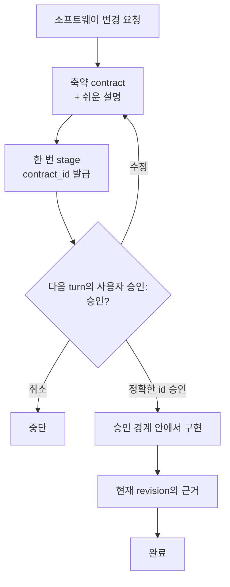

# Click — Hook이 강제하는 Codex 코딩 에이전트 워크플로우

[English](README.md) | 한국어 | [简体中文](README.zh-CN.md)

커뮤니티: [LINUX DO](https://linux.do/)

[](https://github.com/grapefruit0205/click/actions/workflows/ci.yml)
[](LICENSE)

### 프롬프트만으로 코딩 워크플로우를 제어하던 시대는 끝났습니다.

> **프롬프트는 행동을 제안할 수 있습니다. Hook은 워크플로우를 강제할 수 있습니다.**

**Click은 소프트웨어 변경 요청을 하나의 축약 contract로 만들고, 영속적인 Hook 상태 머신으로 관찰 가능한 실행 경로를 사용자가 승인한 경계 안에 유지하는 Codex 플러그인입니다.**

대부분의 코딩 에이전트 워크플로우는 아직 모델에게 이런 규칙을 기억하라고 요청합니다.

```text
계획은 한 번만 세워.
범위를 벗어나지 마.
저장소 전체를 다시 훑지 마.
계획을 계속 다시 쓰지 마.
정말 필요한 검증만 실행해.
```

컨텍스트가 길어지고 작업이 갈라지면 모델은 같은 계획을 다시 만들거나, 저장소를 다시 탐색하거나, 이미 증명한 결과를 또 증명하기 시작할 수 있습니다.

Click은 이런 규칙을 **프롬프트의 부탁**에만 맡기지 않고 지원되는 **도구 실행 경계**로 옮깁니다.

```text
요청
 ↓
축약 contract
 ↓
다음 turn의 사용자 승인
 ↓
구현
 ↓
현재 revision의 완료 근거
 ↓
완료
```

> **어떻게 구현할지는 모델이 결정합니다. 워크플로우가 다음 단계로 갈 수 있는지는 Hook이 결정합니다.**

**계약 하나. 승인 한 번. 구현 경계 하나. 완료 근거 한 세트.**

## 핵심 목적

> **Click은 사용자가 승인한 의도에 AI 실행을 결속하고, 실제 수행 증거를 돌려줍니다.**

Click의 안정적인 제품 경계는 모델 워크플로우 최적화기가 아니라 승인과
증거를 결속하는 runtime입니다. 정식 진입 기준과 정책 계층은
[Click 제품 헌법](PRODUCT_CONSTITUTION.md)에, 현재 동작을 바꾸지 않는 분류
목록은 [Click guard 분류](GUARD_CLASSIFICATION.md)에 있습니다.

v0.24.6에는 아래에 설명된 기존 anti-loop hard gate가 아직 남아 있습니다.
전략 규칙을 명시적 사용자 정책이나 비차단 advisory로 옮기는 별도 변경이
완료되기 전까지는 현재 동작을 그대로 문서화합니다.

## 왜 Click인가요?

프롬프트는 에이전트에게 무엇을 *해야 하는지* 말할 수 있습니다. Click은 관찰 가능한 tool path에서 지금 무엇을 *할 수 있는지*에 영속 상태를 둡니다.

| 프롬프트만 쓰는 워크플로우 | Click |
| --- | --- |
| 모델이 계획을 기억하기를 기대 | 승인된 workflow 상태를 유지 |
| 승인 시점이 맞기를 기대 | digest에 묶인 `contract_id`를 stage하고 다음 사용자 turn을 요구 |
| 다시 탐색하지 말라고 요청 | 첫 유용한 root inventory 뒤에는 범위를 좁힘 |
| 다시 계획하지 말라고 요청 | workflow가 active일 때 matcher가 잡는 `update_plan` churn을 거부 |
| 같은 검증을 반복하지 말라고 요청 | 현재 structured evidence와 receipt를 재사용 |
| 작업이 커질수록 검증도 커짐 | 완료 근거를 승인된 검증 예산에 결합 |
| 에이전트가 끝났다고 하면 종료 | 최신 mutation revision의 증거가 current여야 완료 |

핵심은 단순합니다.

> **코딩 에이전트에게 계속 절차를 기억하라고 부탁하지 말고, 절차를 실행 경계에 넣습니다.**

## Hook이 실제로 강제하는 것

stage, implementation, review, verification 동안 Click은 다음과 같은 **관찰 가능한 workflow 규칙**을 강제할 수 있습니다.

- **제안과 승인을 분리합니다.** stage하면 불투명한 `contract_id`가 나오고 같은 사용자 turn에서 stage와 pass를 동시에 할 수 없습니다.
- **승인 전 mutation을 막습니다.** 정확한 staged ID가 승인되고 pass될 때까지 active contract가 잠금 상태를 유지합니다.
- **재계획을 제한합니다.** Click workflow가 active일 때 matcher가 잡는 `update_plan` 호출은 명시적인 한 turn bypass를 제외하고 거부합니다.
- **저장소 탐색 범위를 좁힙니다.** 현재 revision의 첫 유용한 root inventory는 허용할 수 있지만 이후 broad inventory는 path-scoped inspection으로 좁혀야 합니다.
- **성공한 관찰을 재사용합니다.** 범위 안 mutation으로 stale되기 전까지 같은 structured read를 반복하지 않습니다.
- **검증을 evidence에 결합합니다.** local check는 자신이 증명하는 승인된 `evidence_id`를 지정하고 누적 검증은 승인된 규모 안에 있어야 합니다.
- **완료 상태가 코드 revision을 따라갑니다.** mutation이 생기면 이전 완료 근거를 조용히 재사용하지 않고 stale로 만듭니다.
- **로컬 서버 수명주기를 관리합니다.** 인식된 개발 서버는 Click의 managed service 경로를 사용해 정확한 격리 자식을 정리합니다.

Hook이 제어하는 것은 **관찰 가능한 tool path**입니다. 숨은 추론을 읽거나 의미적 정확성을 단독으로 증명하거나 운영체제 sandbox 역할을 하지는 않습니다.

## 축약 contract

Click은 요청과 관련 저장소 맥락을 작은 실행 계약 하나로 만듭니다.

| 필드 | 고정하는 것 |
| --- | --- |
| `outcome` | 구체적인 결과와 사용자에게 보이는 동작 |
| `boundary` | 바꿔도 되는 범위와 건드리지 않을 범위 |
| `must_hold` | 관찰 가능한 안전·호환성·정확성 약속 |
| `build` | 저장소에 맞춘 가장 작은 구현 경로 |
| `verification` | 위험에 맞춘 검증 규모와 완료 근거 |
| `plain_language` | 비개발자도 이해할 수 있게 풀어쓴 같은 계약 |

계약이 고정하는 것은 **의미, 경계, 완료 약속**입니다. 모든 파일·의존성·라이브러리·저수준 구현 선택을 얼려 두는 것이 아닙니다.

승인 범위 안에서 필요한 파일·도구·의존성이 발견되면 사용할 수 있습니다. 승인한 결과·경계·must-hold 동작·검증 약속이 실질적으로 바뀔 때만 다시 승인이 필요합니다.

## 작동 방식



처음 요청은 아직 보지 못한 설계에 대한 승인이 아닙니다. Click은 canonical contract를 한 번 stage하고 불투명한 `contract_id`를 받은 뒤 계약을 보여주고 멈춥니다. 다음 승인에서는 JSON 전체를 다시 보내지 않고 그 ID만 pass합니다.

최신 mutation revision에서 선언한 모든 evidence source가 current이고 Click managed service가 활성 상태가 아니면 계약이 완료되고 다음 변경은 깨끗한 workflow 상태에서 시작합니다.

## 빠르게 시작하기

```bash
codex plugin marketplace add grapefruit0205/click
codex plugin add click@click
```

ChatGPT 데스크톱 앱을 다시 시작하고 포함된 Click Hook을 확인해 신뢰한 뒤 새 작업을 시작합니다.

처음 사용할 때 소프트웨어 변경에 기본 적용하려면 **Always ON**, `@Click`을 언급할 때만 적용하려면 **Manual**을 선택합니다.

```text
@Click 주문 취소 기능을 추가해줘.
중복 환불을 막고 기존 API 호환성을 유지해줘.
```

나중에 “Click을 Always ON으로 설정해줘” 또는 “Click을 Manual로 설정해줘”라고 바꿀 수 있습니다. 한 turn만 우회하는 `@Click bypass`와 active 계약을 버리는 `@Click cancel`도 지원합니다.

## contract 예시

위 주문 취소 요청에 대해 저장소 근거를 확인한 뒤 다음과 같은 형태가 나올 수 있습니다.

```json
{
  "outcome": "기존 API로 취소 가능한 주문을 취소하고 환불은 최대 한 번만 실행한다.",
  "boundary": {
    "in_scope": ["현재 주문 취소 및 환불 경로"],
    "out_of_scope": ["새 결제 사업자", "관련 없는 주문 상태 정리"]
  },
  "must_hold": [
    "동시 요청이나 재시도로 두 번째 환불이 생기지 않는다.",
    "기존 요청 필드, 응답 필드, 상태 의미를 호환되게 유지한다."
  ],
  "build": {
    "approach": ["현재 취소 경로를 재사용하고 환불 전이를 멱등적이고 원자적으로 만든다."]
  },
  "verification": {
    "scale": "full",
    "evidence": [
      {"id": "E1", "kind": "argv", "description": "주문 취소와 중복 환불 테스트"},
      {"id": "E2", "kind": "argv", "description": "기존 API 회귀 테스트"}
    ],
    "done_when": [
      {"condition": "환불 동작이 정확하다.", "primary_evidence": "E1"},
      {"condition": "공개 API가 호환된다.", "primary_evidence": "E2"}
    ]
  },
  "plain_language": "고객은 취소 가능한 주문을 취소할 수 있지만 재시도하거나 동시에 요청해도 두 번 환불되지 않습니다. 기존 API 호환성은 유지됩니다."
}
```

실제 설계는 저장소마다 달라집니다. 이 예시는 모든 환불 시스템의 정답이 아니라 contract 형태를 보여줍니다.

## 증거 기반 anti-loop

| 안전망 | 동작 |
| --- | --- |
| 이미 얻은 근거 재사용 | 성공한 동일 structured read/search는 범위 안 mutation으로 stale되기 전까지 반복하지 않음 |
| plan churn 차단 | workflow가 armed·staged·승인 후 미완료·review 상태일 때 matcher가 잡는 `update_plan`을 거부 |
| 첫 inventory 뒤 범위 축소 | 현재 revision의 첫 유용한 root inventory 뒤에는 broad inventory를 거부 |
| 명령 의도 명시 | active 상태의 애매한 shell 작업 대신 structured `inspect`·`mutate`·`service`·`verify`를 사용 |
| 검증을 한 예산에 결합 | local check마다 등록된 `argv` source를 지정하고 누적 예약이 승인 규모 안에 있어야 함 |
| source별 완료 추적 | 선언한 모든 source가 current여야 하며 `argv` source가 없으면 억지 local check를 만들지 않음 |
| Browser evidence 중복 제거 | 성공한 정규화 입력은 반복하지 않고 동일 실패는 한 번만 그대로 재시도 |

## 자동 검증 예산

Click은 현재 위험과 저장소 근거를 기준으로 충분한 최소 검증 규모를 고르고 사용자는 그 규모를 contract와 함께 승인합니다.

| 규모 | 주로 쓰는 경우 | 자동 상한 |
| --- | --- | ---: |
| `quick` | 작고 국소적이며 되돌리기 쉬운 변경 | 1단위 |
| `focused` | 범위가 명확한 일반 기능 또는 수정 | 4단위 |
| `full` | 결제·인증·삭제·마이그레이션·공개 계약·경계를 넘는 동시성 | 10단위 |

`targeted` check는 1단위, `broad`는 3단위, `deep`은 5단위입니다. 상한일 뿐 반드시 모두 사용할 목표는 아닙니다.

근거는 local `argv` check 또는 명시적으로 선언한 Browser·hosted·manual·existing source가 될 수 있습니다. `argv` source는 연결된 local runner의 실제 성공으로만 완료됩니다. non-argv 완료는 명시적인 attestation이며 Hook은 승인된 source와 현재 revision을 기록하지만 matcher 밖 외부 작업이나 수동 작업의 진실성을 독립적으로 증명하지는 않습니다.

## 구조화 capability

Click은 실행 파일과 인자를 분리하고 구조화 capability 경로를 사용합니다.

```text
click-gate inspect '{"version":1,"commands":[["git","status","--short"],["sed","-n","1,160p","src/app.py"]]}'
click-gate mutate '{"version":1,"argv":["python3","scripts/generate.py","--target","src"]}'
click-gate service '{"version":1,"action":"start","argv":["python3","-m","http.server","4173","--bind","127.0.0.1"]}'
click-gate service '{"version":1,"action":"stop"}'
click-gate evidence '{"version":1,"evidence_id":"E-browser"}'
click-gate verify '{"version":2,"checks":[{"evidence_id":"E1","argv":["python3","-m","pytest","tests/test_cancellation.py"],"class":"targeted"}]}'
```

인식된 read는 Hook의 제한된 read-only capability 정책 안에서 실행됩니다. 정확한 schema, trusted executable 규칙, shell-free 실행, snapshot, claim, process 경계는 [capability protocol](skills/click/references/capability-protocol.md)에 있습니다.

Click은 **workflow guardrail**이지 OS 보안 sandbox가 아닙니다.

## Google Antigravity 어댑터 — 실험적

이 저장소는 Click의 contract 상태 머신·evidence ledger·검증 예산·shell-free runner를 공유하는 독립형 Google Antigravity 플러그인도 생성합니다.

```bash
python3 scripts/build_antigravity_distribution.py
agy plugin install ./dist/antigravity
```

Antigravity IDE에서는 `dist/antigravity`를 워크스페이스의 `.agents/plugins/click` 또는 전역 `~/.gemini/config/plugins/click`에 복사할 수도 있습니다.

Antigravity의 Hook contract는 Codex와 다릅니다. native file/search와 별도 MCP·Skill 도구는 계속 사용할 수 있지만 cross-tool 중복 제거와 Browser evidence는 아직 지원하지 않습니다. 정확한 제한은 [`platforms/antigravity/README.md`](platforms/antigravity/README.md)를 확인하세요.

## 기존 설치 업데이트 — v0.24.6

현재 릴리스는 **v0.24.6**입니다.

```bash
codex plugin marketplace upgrade click
codex plugin add click@click
```

ChatGPT 데스크톱 앱을 다시 시작하고 갱신된 Hook을 검토해 신뢰하세요. Windows에서 v0.24.6은 Python launcher fallback을 추가하고, 호스트가 해당 Hook 이벤트를 전달하는 경우 Desktop의 `exec_command` 계열 실행을 Click 경로로 정규화합니다. 이전 설치가 만든 실행 대기 중 runner 명령은 재사용하지 말고 새 Hook이 다시 발급하게 합니다.

자세한 릴리스 이력은 [RELEASE_NOTES.md](RELEASE_NOTES.md)에 있습니다.

## 근거와 솔직한 한계

Click은 Hook이 실제로 관찰하고 강제할 수 있는 범위에서만 강한 주장을 합니다.

Hook이 다음을 할 수 있다고 주장하지 않습니다.

- 숨은 추론이나 자연어로만 작성된 계획을 검사;
- matcher 밖 모든 connector나 hosted tool을 관찰;
- Codex 클라이언트가 일치하는 Hook 이벤트를 전달하지 않는 실행 경로를 강제;
- 의미적 경계 준수나 아키텍처 정확성을 단독으로 증명;
- matcher 밖 수동·외부 attestation이 실제로 수행됐는지 독립적으로 증명;
- 허용된 사용자 프로그램 내부에 숨은 여러 동작을 차단;
- 전문가 검토·권한 확인·배포 통제·OS sandbox를 대체.

저장소의 결정적 테스트 suite는 Linux·macOS·Windows에서 관찰 가능한 Hook과 contract 동작을 검증합니다. 서로 관련 없는 실제 저장소에서 독립적으로 측정하기 전까지 프로젝트 전반의 성공률·정확도·시간·토큰 사용량·과설계를 개선한다고 주장하지 않습니다.

## 비슷한 접근

Click은 spec-driven·autonomous-loop·approval-gated 도구와 일부 겹치지만 의도적으로 **축약 contract 하나, 승인 한 번, 구현 경계 하나, 관찰 가능한 anti-loop 안전망, 제한된 evidence commitment 하나**에 좁게 집중합니다.

커뮤니티 홍보 초안은 [COMMUNITY_POSTS.md](COMMUNITY_POSTS.md)에 있습니다.

## 라이선스

Click은 [MIT 라이선스](LICENSE)로 배포됩니다.
