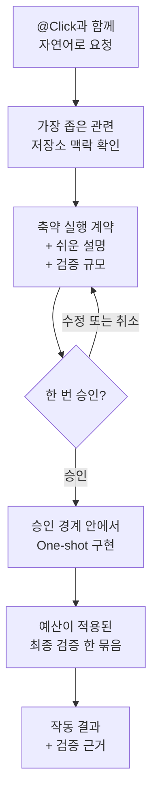

# Click

[English](README.md) | 한국어

[](https://github.com/grapefruit0205/click/actions/workflows/ci.yml)
[](LICENSE)

> 구현 경계만 한 번 승인하고, 다시 계획하지 않은 채 끝까지 만듭니다.

Click은 소프트웨어 작업에서 `@Click`으로 명시적으로 부르는 Codex 플러그인입니다. 원하는 결과를 자연어로 말하면 가장 좁은 관련 저장소 맥락을 확인하고, 요청을 축약된 실행 계약으로 번역하고, 같은 내용을 쉬운 말로 설명한 뒤 코드 수정 전에 한 번만 승인을 요청합니다.

승인 뒤에는 그 계약 안에서 One-shot으로 구현합니다. Hook은 관찰 가능한 재읽기·재탐색·재계획·예산 밖 검증 루프를 막되, 승인된 범위 안에서 필요한 구현 선택은 열어 둡니다.

Click은 아키텍처 패턴 선택기나 완전한 명세 시스템이 아닙니다. 사용자가 모듈러 모노리스, 이벤트 드리븐, 배치, 함수형 중 하나를 미리 고를 필요가 없습니다. 요청한 동작과 기존 시스템에 실제로 필요한 최소 설계 언어를 Click이 도출합니다.

## 빠르게 시작하기

```bash
codex plugin marketplace add grapefruit0205/click
codex plugin add click@click
```

ChatGPT 데스크톱 앱을 다시 시작하고 포함된 Click Hook을 검토해 신뢰한 뒤 새 작업을 시작합니다. 플러그인을 멘션해 호출합니다.

```text
@Click 주문 취소 기능을 추가해줘. 중복 환불을 방지하고 기존 API 호환성을 유지해야 해.
```

`@Click`을 명시적으로 부르지 않은 작업에서는 Click이 fail-open 상태를 유지합니다. 별도 작업 흐름을 추가하지 않고 아무것도 차단하지 않습니다.

<details>
<summary>Build Brief 또는 예전 Click 설치에서 이전하기</summary>

`click@build-brief` 0.9.0을 설치했다면:

```bash
codex plugin remove click@build-brief
codex plugin marketplace remove build-brief
codex plugin marketplace add grapefruit0205/click
codex plugin add click@click
```

Build Brief 0.8이라면 첫 번째 명령을 `codex plugin remove build-brief@build-brief`로 바꿉니다.

</details>

## 작동 방식



처음 한 요청을 아직 보지 못한 설계에 대한 승인으로 간주하지 않습니다. Click이 먼저 개발자용 계약과 쉬운 설명을 함께 보여줍니다. 사용자는 제안을 수정하거나 취소할 수 있습니다. 승인한 뒤에는 의미 계약을 고정하고, 또 다른 계획을 승인해 달라고 묻지 않은 채 구현합니다.

승인한 결과·경계·반드시 지킬 동작·검증 약속이 실제로 바뀌는 경우에만 중단합니다. 승인 경계 안에서 필요한 파일·라이브러리·도구·서비스·구현 수단은 새 계약이 필요하지 않습니다.

## 예시: 요청에서 승인까지

다음처럼 요청했다고 가정합니다.

```text
@Click 주문 취소 기능을 추가해줘. 중복 환불을 방지하고 기존 API 호환성을 유지해야 해.
```

Click은 코드를 건드리기 전에 다음과 같은 축약 계약을 제시할 수 있습니다.

```json
{
  "outcome": "기존 API로 취소 가능한 주문을 취소하고 환불은 최대 한 번만 실행한다.",
  "boundary": {
    "in_scope": ["현재 주문 취소 및 환불 경로"],
    "out_of_scope": ["새 결제 사업자 추가", "관련 없는 주문 상태 정리"]
  },
  "must_hold": [
    "동시에 요청하거나 재시도해도 두 번째 환불이 생기지 않는다.",
    "기존 요청 필드, 응답 필드, 상태 의미를 호환되게 유지한다.",
    "결제 사업자 호출 실패를 환불 완료 상태로 기록하지 않는다."
  ],
  "build": {
    "approach": [
      "현재 취소 경로를 재사용하고 멱등 환불 기록과 원자적인 환불 상태 전이를 추가한다."
    ],
    "semantics": [
      "환불 결과는 한 번만 기록하고 반복 요청에는 기록된 결과를 반환한다."
    ]
  },
  "verification": {
    "scale": "full",
    "done_when": [
      "성공, 중복, 동시 요청, 결제 사업자 실패를 주문 취소 테스트로 확인한다.",
      "기존 API 회귀 테스트가 계속 통과한다."
    ]
  },
  "plain_language": "고객은 취소 가능한 주문을 취소할 수 있지만 재시도하거나 동시에 요청해도 환불은 한 번만 됩니다. 공개 API는 그대로 유지되고 결제 호출 실패가 환불 완료로 잘못 기록되지 않습니다. 결제와 동시성을 다루므로 Click은 full 검증을 추천합니다."
}
```

그다음 Click은 이 계약과 검증 규모를 승인할지, 고칠지, 취소할지 한 번 묻습니다. 승인은 쉬운 요약만이 아니라 계약에 담긴 개발자 의미 전체를 승인한다는 뜻이며, 승인하면 구현이 시작됩니다.

실제 설계는 저장소마다 달라집니다. 이 예시는 모든 환불 시스템에 적용되는 정답이 아니라 계약의 형태를 보여줍니다.

## 축약 계약

| 필드 | 고정하는 것 |
| --- | --- |
| `outcome` | 구체적인 결과와 사용자에게 보이는 동작 |
| `boundary` | 바꿔도 되는 범위와 건드리지 않을 범위 |
| `must_hold` | 관찰 가능한 안전·호환성·정확성 약속 |
| `build` | 저장소에 맞춘 가장 작은 구현 경로 |
| `verification` | 위험에 맞춘 검증 규모 하나와 완료 근거 |
| `plain_language` | 비개발자도 이해할 수 있게 풀어쓴 같은 계약 |

`build.semantics`, `build.order`, `verification.intermediate_gate`는 상태 의미, 안전한 순서, 되돌리기 어려운 경계가 실제로 필요할 때만 추가합니다. 같은 작업을 phases, steps, tasks, plan으로 반복해 늘어놓지 않습니다.

계약은 결과와 경계를 고정하지만 모든 저수준 구현 선택까지 고정하지는 않습니다. 그래서 승인 범위 안에서 의존성·파일·도구가 필요해져도 매번 재승인하지 않고 작게 유지할 수 있습니다.

## 실행 루프 없이 구현

승인 뒤 Hook은 관찰 가능한 행동 네 가지를 제한합니다.

| 안전망 | 동작 |
| --- | --- |
| 이미 얻은 근거 재사용 | 한 번 성공한 동일 정규화 읽기·검색은 범위 안의 코드 수정으로 근거가 오래되기 전까지 차단합니다. |
| 재계획 금지 | 일치하는 `update_plan` 호출과 대체 계약을 stage 또는 pass하려는 시도를 거부합니다. |
| 전체 목록 재탐색 금지 | 루트의 `rg --files`, `find .`, 루트 재귀 목록, 동등한 Git 목록 스캔을 거부하고 경로를 좁힌 확인은 허용합니다. |
| 광범위 검증을 예산 안에 유지 | 전체 테스트·보안·coverage·audit·E2E·benchmark로 인식되는 검사는 `click-gate verify`를 통해 실행해야 합니다. |

실패한 관찰 또는 출력이 48,000바이트를 넘은 관찰은 변경 없이 한 번 재시도할 수 있습니다. 소스가 수정되면 이전 근거가 오래됐을 수 있으므로 성공 관찰 기록을 초기화합니다. Hook은 명령 digest와 본문을 포함하지 않는 메타데이터만 저장하며 명령과 출력은 저장하지 않습니다.

이 안전망은 도구 수준에서 동작하며 추론 토큰 제한이 아닙니다. Hook은 숨은 추론, 자연어로만 쓴 계획, matcher 밖 connector, 의미상 경계 준수 여부를 볼 수 없고, 사용자 정의 래퍼 하나 안에 여러 작업을 숨기는 것도 막지 못합니다.

## 자동 검증 예산

Click은 현재 위험과 저장소 근거로 충분한 최소 규모를 고릅니다. 사용자는 계약과 함께 그 규모를 승인하므로 검증 예산만 따로 다시 묻지 않습니다.

| 규모 | 주로 쓰는 경우 | 자동 상한 |
| --- | --- | ---: |
| `quick` | 작고 국소적이며 되돌리기 쉬운 변경 | 1단위 |
| `focused` | 범위가 정해진 일반 기능 또는 수정 | 4단위 |
| `full` | 결제·인증·삭제·마이그레이션·공개 계약·경계를 넘는 동시성 | 10단위 |

단순한 대상 검사 명령은 1단위, 광범위 suite는 3단위, 보안·audit·coverage·E2E·benchmark 명령은 5단위입니다. 상한일 뿐 반드시 모두 쓸 목표가 아닙니다.

Click은 항목마다 shell 명령 하나를 다음 runner에 전달합니다.

```text
click-gate verify '{"commands":["<command>", "<command>"]}'
```

Hook이 승인된 최종 묶음을 실행하고 실제 종료 코드를 기록합니다. 일시적인 실패라면 같은 묶음을 변경 없이 한 번 재시도할 수 있고, 그 뒤에는 범위 안의 수정이 필요합니다. 이후 소스를 수정하면 앞선 성공 결과가 오래된 것으로 간주되어 같은 묶음을 다시 실행할 수 있습니다.

예산은 화면에 보이고 인식 가능한 명령에 적용됩니다. 사용자 정의 래퍼는 비싼 작업을 숨길 수 있으므로 보안·자원 샌드박스가 아니며 선택한 테스트의 의미가 충분하다고 증명하지도 않습니다.

## 최소설계가 중요한 것을 빼지는 않습니다

최소설계는 형식과 반복을 줄이는 것이지 필요한 안전 조건을 지우는 것이 아닙니다.

| 관심사 | 필요할 때 계약이 지키는 것 |
| --- | --- |
| 동시성 | 경합 동작, 중복 실행, 멱등성 |
| 상태 | 허용 상태 전이, 저장 시점, 소유권 |
| 실패 | 부분 실패, 재시도, 복구, 외부 오류 |
| 보안 | 인증, 권한, 비밀정보, 개인정보 경계 |
| 호환성 | 기존 API, 데이터, 상태값, 사용자 동작 |

중요한 조건은 `must_hold`에, 구체적인 상태·실패 의미는 필요할 때 `build.semantics`에, 관찰 가능한 완료 근거는 `verification.done_when`에 둡니다. Hook은 계약 형식·승인 순서·digest 동일성·보이는 반복·보이는 검증 범위를 지킵니다. 구현이 아키텍처적으로 옳고 의미까지 정확하다고 Hook 하나로 증명하는 것은 아닙니다.

## 언제 쓰면 좋은가요?

암묵적인 가정을 두는 것보다 경계 하나를 눈으로 검토하는 편이 나을 때 `@Click`을 사용합니다. 예를 들면:

- 기존 API를 유지해야 하는 브라운필드 기능;
- 멱등성·동시성·상태 전이·실패 복구가 있는 작업;
- 안전 경계가 명확한 마이그레이션이나 영향도가 큰 변경;
- 다른 사람이나 에이전트가 같은 의미를 구현해야 하는 인수인계;
- 최소 계획 뒤에 끊지 않고 구현하고 싶은 MVP나 내부 도구.

작고 명확하고 되돌리기 쉬운 수정이나 탐색 작업이며 승인 경계를 남길 필요가 없다면 일반 프롬프트가 더 간단합니다. 법률·규제·보안·운영상 되돌리기 어려운 작업에서 Click은 전문가 검토, 권한 확인, 배포 통제를 대신하지 않습니다.

## 근거와 솔직한 한계

현재 v0.12.1 소스 릴리스는 호출·fail-open·축약 계약 검증·승인 동일성·관찰 가능한 anti-loop 안전망·검증 상한·재시도 상태·본문을 저장하지 않는 Hook 상태·의미 grader 동작·저장소 정책을 다루는 결정적 테스트 63개를 통과합니다. [GitHub Actions 실행 33129834392](https://github.com/grapefruit0205/click/actions/runs/33129834392)는 Linux·macOS·Windows에서 모두 통과했습니다.

저장소에는 golden case, 의미 grader, A/B runner도 포함되어 있습니다. 이는 평가 기반 시설이지 실제 프로젝트 전반에서 Click이 성공률·정확도·시간·토큰을 이미 개선했다는 증거가 아닙니다. 그런 행동 비교에는 반복 실행과 사람의 보정이 더 필요합니다.

Click이 이 분야에서 최초이거나 유일하다고 주장하지 않습니다. spec-driven 및 승인 게이트 도구와 겹치지만, 축약 계약 하나·승인 한 번·One-shot 구현·관찰 가능한 anti-loop 안전망·최종 검증 예산 하나에 의도적으로 좁게 집중합니다.

<details>
<summary>저장소 구조와 로컬 검증</summary>

```text
.codex-plugin/plugin.json             플러그인 매니페스트
.agents/plugins/marketplace.json      GitHub 마켓플레이스 항목
skills/click/                         One-shot 설계·구현 Skill
skills/fix/                           축약 수정 Skill
hooks/click_gate.py                   계약·anti-loop·digest·검증 안전망
hooks/hooks.json                      라이프사이클 Hook 설정
evals/                                golden case·A/B runner·의미 grader
tests/                                Hook·grader·정책 결정적 테스트
LICENSE                               MIT 라이선스
```

```bash
python3 /path/to/skill-creator/scripts/quick_validate.py skills/click
python3 /path/to/skill-creator/scripts/quick_validate.py skills/fix
python3 /path/to/plugin-creator/scripts/validate_plugin.py .
python3 -m unittest discover -s tests -v
```

</details>

<details>
<summary>비슷한 접근</summary>

| 프로젝트 | 겹치는 부분 | Click이 더 좁게 집중하는 부분 |
| --- | --- | --- |
| [GitHub Spec Kit](https://github.com/github/spec-kit) | 명세·계획·작업·구현 | 지속적인 다중 명령 명세 대신 명시 호출 계약 하나와 승인 한 번 |
| [OpenSpec](https://github.com/Fission-AI/OpenSpec) | AI 코딩 전 합의 | 프로젝트 로컬 명세 저장소 없이 대상 저장소 밖에 digest만 보관 |
| [Kiro Specs](https://kiro.dev/docs/cli/v3/specs/) | 요구사항·설계·작업·검증 실행 | 전체 계약 한 번 검토 뒤 One-shot 구현 |
| [Agentic SDLC Codex Plugin](https://github.com/aantenore/agentic-sdlc-codex-plugin) | hash로 묶인 제안과 승인 | 더 넓은 SDLC 거버넌스보다 작은 구현 전 경계 |

이 표는 제한된 비교이며 신규성에 대한 전수 조사가 아닙니다.

</details>

## 라이선스

Click은 [MIT 라이선스](LICENSE)로 배포됩니다.
