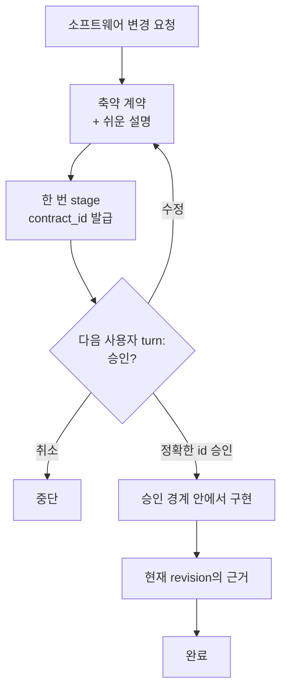

# Click — Hook이 강제하는 Codex 코딩 에이전트 워크플로우

[English](README.md) | 한국어 | [简体中文](README.zh-CN.md)

커뮤니티: [LINUX DO](https://linux.do/)

[](https://github.com/grapefruit0205/click/actions/workflows/ci.yml)
[](LICENSE)

### 프롬프트만으로 코딩 워크플로우를 제어하던 시대는 끝났습니다.

> **프롬프트는 행동을 제안할 수 있습니다. Hook은 워크플로우를 강제할 수 있습니다.**

**Click은 소프트웨어 변경 요청을 작은 실행 계약으로 만들고, 영속적인 Hook 상태 머신으로 관찰 가능한 실행 경로를 사용자가 승인한 경계 안에 유지하는 Codex 플러그인입니다.**

대부분의 코딩 에이전트 워크플로우는 아직 모델에게 이런 규칙을 기억하라고 요청합니다.

```text
계획은 한 번만 세워.
범위를 벗어나지 마.
저장소 전체를 다시 훑지 마.
계획을 계속 다시 쓰지 마.
정말 필요한 검증만 실행해.
```

컨텍스트가 길어지고 작업이 갈라지면 모델은 같은 계획을 다시 만들거나, 저장소를 다시 탐색하거나, 이미 증명한 결과를 또 증명하기 시작할 수 있습니다.

Click은 이런 규칙을 **프롬프트의 부탁**에만 맡기지 않고, 지원되는 **도구 실행 경계**로 옮깁니다.

```text
요청
 ↓
축약 계약
 ↓
다음 turn의 사용자 승인
 ↓
구현
 ↓
현재 revision의 완료 근거
 ↓
완료
```

> **어떻게 구현할지는 모델이 결정합니다. 워크플로우가 다음 단계로 넘어갈 수 있는지는 Hook이 결정합니다.**

**계약 하나. 승인 한 번. 구현 경계 하나. 완료 근거 한 세트.**

## 왜 Click인가요?

프롬프트는 에이전트에게 무엇을 **해야 하는지** 말할 수 있습니다. Click은 에이전트가 지금 무엇을 **할 수 있는지**에 상태를 추가합니다.

| 프롬프트만 쓰는 워크플로우 | Click |
| --- | --- |
| 모델이 계획을 기억하길 기대 | 승인된 workflow 상태를 영속적으로 유지 |
| 적절한 시점에 승인이 일어나길 기대 | digest에 묶인 계약 ID를 stage하고 다음 사용자 turn의 승인을 요구 |
| 다시 스캔하지 말라고 요청 | 필요한 첫 전체 inventory만 허용하고 이후에는 범위를 좁힘 |
| 다시 계획하지 말라고 요청 | active workflow에서 plan-tool 반복을 거부 |
| 같은 검증을 반복하지 말라고 요청 | 현재 근거를 재사용하고 성공한 동일 검증의 중복 실행을 차단 |
| 작업이 커지며 검증도 계속 커짐 | 완료 근거를 승인된 검증 예산에 결합 |
| “대충 끝난 것 같음”을 완료로 판단 | 최신 mutation revision에 필요한 선언 근거가 current여야 완료 |

Click의 핵심 아이디어는 단순합니다.

> **코딩 에이전트에게 프로세스를 기억하라고 계속 부탁하지 마세요. 프로세스를 실행 경계에 넣으세요.**

## Hook이 실제로 강제하는 것

Click은 stage·구현·리뷰·검증 과정에서 다음과 같은 **관찰 가능한 workflow 규칙**을 강제할 수 있습니다.

- **제안과 승인을 분리합니다.** 계약을 stage하면 불투명한 `contract_id`가 발급되고 같은 사용자 turn에서 stage와 pass를 함께 할 수 없습니다.
- **승인 전 mutation을 막습니다.** active 계약은 정확한 staged ID가 승인되고 pass되기 전까지 잠긴 상태를 유지합니다.
- **재계획을 제한합니다.** Click workflow가 active인 동안 matcher가 잡는 `update_plan` 반복을 거부합니다. 사용자가 명시한 한 turn bypass는 예외입니다.
- **저장소 재탐색은 점점 좁아집니다.** 현재 revision을 이해하기 위한 첫 root inventory는 필요하면 허용하지만 이후 전체 inventory는 거부하고 좁은 조회만 허용합니다.
- **이미 성공한 구조화 조회는 재사용합니다.** 범위 안의 mutation으로 근거가 stale되기 전까지 같은 성공 관찰을 반복하지 않습니다.
- **검증을 evidence에 묶습니다.** local check는 자신이 증명하는 승인된 `evidence_id`를 지정하고 누적 검증 비용은 승인 예산 안에 있어야 합니다.
- **완료는 최신 코드 revision을 따라갑니다.** mutation이 일어나면 revision이 올라가고 이전 완료 근거는 자동으로 stale됩니다.
- **로컬 서버의 수명주기를 관리합니다.** 인식 가능한 개발 서버는 Click의 managed service 경로로 실행되어 정확한 격리 자식 프로세스를 정리할 수 있습니다.

Hook이 제어하는 것은 **관찰 가능한 tool path**입니다. 숨은 추론을 읽거나, 설계가 의미적으로 옳다고 증명하거나, 운영체제 sandbox 역할을 하는 것은 아닙니다.

## 축약 실행 계약

Click은 요청과 관련 저장소 맥락을 하나의 작은 실행 계약으로 만듭니다.

| 필드 | 고정하는 것 |
| --- | --- |
| `outcome` | 구체적인 결과와 사용자에게 보이는 동작 |
| `boundary` | 바꿀 수 있는 범위와 작업 밖에 둘 범위 |
| `must_hold` | 관찰 가능한 안전·호환성·정확성 약속 |
| `build` | 저장소에 맞춘 가장 작은 구현 경로 |
| `verification` | 위험에 맞춘 검증 규모 하나와 완료 근거 |
| `plain_language` | 같은 계약을 비전문가도 이해할 수 있게 풀어쓴 설명 |

계약이 고정하는 것은 **의미, 경계, 완료 약속**입니다. 모든 파일·의존성·라이브러리·저수준 구현 선택을 얼려버리지는 않습니다.

승인 범위 안에서 새 파일·도구·의존성이 필요해진다면 그대로 사용할 수 있습니다. 승인한 결과·경계·must-hold 동작·검증 약속이 실질적으로 바뀔 때만 재승인이 필요합니다.

## 작동 방식



처음 요청했다고 해서 아직 보여주지도 않은 설계를 승인한 것으로 처리하지 않습니다. Click은 canonical JSON을 한 번 stage하고 불투명한 `contract_id`를 받은 뒤 계약을 보여주고 멈춥니다. Hook은 staged turn을 기록하고 같은 turn의 pass나 대체 stage를 거부합니다.

다음 사용자 turn의 명시적 승인은 JSON 전체가 아니라 발급된 ID만 pass합니다. Hook은 그 ID를 staged digest와 대조한 뒤에야 구현을 진행시킵니다. 제안을 수정하면 새 ID를 발급하고 이전 handle을 무효화합니다.

최신 mutation revision에서 선언한 모든 완료 근거가 current이고 Click이 관리하는 서비스가 남아 있지 않으면 계약이 완료되고 다음 변경 작업을 깨끗한 상태로 시작할 수 있습니다.

## 빠르게 시작하기

```bash
codex plugin marketplace add grapefruit0205/click
codex plugin add click@click
```

ChatGPT 데스크톱 앱을 다시 시작하고 포함된 Click Hook을 검토해 신뢰한 뒤 새 작업을 시작합니다.

처음에는 다음 중 하나를 선택합니다.

```text
Always ON
```

소프트웨어 변경 작업에 기본으로 적용하거나,

```text
Manual
```

`@Click`을 직접 언급한 작업에만 적용할 수 있습니다.

예시:

```text
@Click 주문 취소 기능을 추가해줘.
중복 환불을 막고 기존 API 호환성을 유지해야 해.
```

나중에 “Click을 Always ON으로 설정해줘” 또는 “Click을 Manual로 설정해줘”라고 변경할 수 있습니다. 설정은 대상 저장소 밖에 유지됩니다.

정확히 한 turn만 우회하려면 첫 줄에 `@Click bypass`를 쓰고, active 계약을 버리려면 `@Click cancel`을 사용합니다. 자동완성 `plugin://click@click` 형식도 지원합니다. 두 권한 모두 해당 turn에서만 유효하고 재사용할 수 없습니다.

## 방해하지 않는 Always ON

| 요청 | Always ON 동작 |
| --- | --- |
| 소프트웨어 생성·수정·삭제·리팩터링·수리 | 축약 계약 하나를 보여주고 승인 한 번을 기다림 |
| 수정 없는 코드 리뷰 | 구현 계약 없이 읽기 전용 anti-loop guard만 적용 |
| 질문 또는 설명 | 평소처럼 바로 답변 |
| 단순 읽기 전용 조회 | 전체 observation ledger를 만들지 않고 평소처럼 확인 |
| 첫 줄의 `@Click bypass` | 해당 turn의 bypass 한 번만 승인하고 active 계약은 유지 |
| 첫 줄의 `@Click cancel` | active 계약을 지우는 cancel 한 번만 승인 |

## 계약 예시

다음 요청을 예로 들어보겠습니다.

```text
@Click 주문 취소 기능을 추가해줘. 중복 환불을 방지하고 기존 API 호환성을 유지해야 해.
```

저장소에 따라 Click은 다음과 같은 형태의 계약을 stage할 수 있습니다.

```json
{
  "outcome": "기존 API로 취소 가능한 주문을 취소하고 환불은 최대 한 번만 실행한다.",
  "boundary": {
    "in_scope": ["현재 주문 취소 및 환불 경로"],
    "out_of_scope": ["새 결제 사업자 추가", "관련 없는 주문 상태 정리"]
  },
  "must_hold": [
    "동시 요청이나 재시도로 두 번째 환불이 생기지 않는다.",
    "기존 요청 필드, 응답 필드, 상태 의미를 호환되게 유지한다.",
    "결제 사업자 실패를 환불 완료 상태로 기록하지 않는다."
  ],
  "build": {
    "approach": ["현재 취소 경로를 재사용하고 환불 전이를 멱등적이고 원자적으로 만든다."]
  },
  "verification": {
    "scale": "full",
    "evidence": [
      {"id": "E1", "kind": "argv", "description": "주문 취소와 중복 환불 테스트"},
      {"id": "E2", "kind": "argv", "description": "기존 API 회귀 테스트"}
    ],
    "done_when": [
      {"condition": "환불 동작이 정확하다.", "primary_evidence": "E1"},
      {"condition": "공개 API가 호환된다.", "primary_evidence": "E2"}
    ]
  },
  "plain_language": "고객은 취소 가능한 주문을 취소할 수 있지만 재시도하거나 동시에 요청해도 두 번 환불되지 않습니다. 기존 API 호환성은 유지됩니다."
}
```

실제 설계는 저장소마다 달라집니다. 이 예시는 모든 환불 시스템의 정답이 아니라 계약의 형태를 보여줍니다.

## 증거 기반 anti-loop

| 안전망 | 동작 |
| --- | --- |
| 이미 얻은 근거 재사용 | 성공한 동일 구조화 읽기·검색은 범위 안 mutation으로 stale되기 전까지 다시 실행하지 않음 |
| plan churn 차단 | workflow가 armed·staged·승인 후 미완료·review 상태일 때 matcher가 잡는 `update_plan`을 거부 |
| 첫 inventory 뒤 범위 축소 | 현재 revision의 첫 유용한 root inventory는 허용할 수 있지만 이후 broad inventory는 거부 |
| 명령 의도 명시 | active 상태의 애매한 Bash 대신 구조화 `inspect`·`mutate`·`service`·`verify`를 사용 |
| 검증을 한 예산에 결합 | local final check마다 등록된 `argv` evidence source를 지정하고 누적 예약이 승인 규모 안에 있어야 함 |
| source별 완료 추적 | 최신 revision에서 선언한 모든 source가 current여야 하며 `argv` source가 없다면 억지 local check를 만들지 않음 |
| Browser evidence 중복 제거 | 성공한 정규화 입력은 반복하지 않고 동일 실패는 한 번만 재시도하며 다른 입력은 허용 |
| 제안·승인 분리 | 같은 turn의 stage/pass를 거부하고 다음 승인에서는 digest에 묶인 정확한 ID만 pass |

## 자동 검증 예산

Click은 현재 위험과 저장소 근거를 기준으로 충분한 최소 검증 규모를 고릅니다. 사용자는 그 규모를 계약과 함께 승인합니다.

| 규모 | 주로 쓰는 경우 | 자동 상한 |
| --- | --- | ---: |
| `quick` | 작고 국소적이며 되돌리기 쉬운 변경 | 1단위 |
| `focused` | 범위가 명확한 일반 기능 또는 수정 | 4단위 |
| `full` | 결제·인증·삭제·마이그레이션·공개 계약·경계를 넘는 동시성 | 10단위 |

`targeted` check는 1단위, `broad`는 3단위, `deep`은 5단위입니다. Hook은 사용자가 낮게 제출한 class를 그대로 믿지 않고 최소 실제 범위를 추론합니다.

증거는 local `argv` check 또는 명시적으로 선언한 Browser·hosted·manual·existing source가 될 수 있습니다. `argv` evidence는 연결된 local runner의 실제 성공으로만 완료됩니다. non-argv source는 명시적 completion attestation을 사용하며, Hook은 승인된 ID·kind·현재 revision을 기록하지만 matcher 밖 외부 실행이나 수동 작업의 진실성을 독립적으로 증명하지는 않습니다.

## 구조화 capability

Click은 실행 프로그램과 인자를 분리하고 승인된 argv 배열을 shell 없이 실행합니다.

```text
click-gate inspect '{"version":1,"commands":[["git","status","--short"],["sed","-n","1,160p","src/app.py"]]}'
click-gate mutate '{"version":1,"argv":["python3","scripts/generate.py","--target","src"]}'
click-gate service '{"version":1,"action":"start","argv":["python3","-m","http.server","4173","--bind","127.0.0.1"]}'
click-gate service '{"version":1,"action":"stop"}'
click-gate evidence '{"version":1,"evidence_id":"E-browser"}'
click-gate verify '{"version":2,"checks":[{"evidence_id":"E1","argv":["python3","-m","pytest","tests/test_cancellation.py"],"class":"targeted"}]}'
```

인식된 read는 Hook의 제한된 읽기 전용 capability 정책 안에서 실행됩니다. 검증은 pytest/unittest/coverage, Node, `uv`, npm, Ruff, mypy, TypeScript, Cargo, Go의 일반적인 제한형 실행을 인식합니다. 정확한 schema와 적용 경계는 [capability protocol](skills/click/references/capability-protocol.md)에 있습니다.

Click은 workflow guardrail이지 **운영체제 sandbox가 아닙니다.** secret·임의 network access·외부 경로·승인된 사용자 프로그램 안에 숨은 동작까지 보호하지 않습니다.

## Google Antigravity 어댑터 — 실험적

이 저장소는 Click의 계약 상태 머신·evidence ledger·검증 예산·shell-free runner를 공유하는 독립형 Google Antigravity 플러그인도 생성합니다.

```bash
python3 scripts/build_antigravity_distribution.py
agy plugin install ./dist/antigravity
```

Antigravity IDE에서는 `dist/antigravity`를 워크스페이스의 `.agents/plugins/click` 또는 전역 `~/.gemini/config/plugins/click`에 복사할 수도 있습니다.

Antigravity의 Hook 계약은 Codex와 다릅니다. native file/search와 별도 MCP·Skill 도구는 계속 사용할 수 있지만 cross-tool 중복 제거와 Browser evidence는 현재 지원하지 않습니다. 정확한 제한은 [`platforms/antigravity/README.md`](platforms/antigravity/README.md)를 확인하세요.

## 기존 설치 업데이트

v0.24.3은 Git marketplace snapshot을 갱신하고 플러그인을 다시 설치합니다.

```bash
codex plugin marketplace upgrade click
codex plugin add click@click
```

ChatGPT 데스크톱 앱을 다시 시작하고 갱신된 Hook을 검토해 신뢰하세요. 예전 설치가 만든 실행 대기 중 runner 명령은 재사용하지 말고 새 Hook이 다시 발급하게 합니다.

<details>
<summary>Build Brief에서 이전하기</summary>

```bash
codex plugin remove click@build-brief
codex plugin marketplace remove build-brief
codex plugin marketplace add grapefruit0205/click
codex plugin add click@click
```

Build Brief 0.8이라면 첫 번째 명령을 `codex plugin remove build-brief@build-brief`로 바꿉니다.

</details>

## 최소설계가 중요한 것을 빼지는 않습니다

최소설계는 형식과 반복을 줄이는 것이지 필요한 안전 조건을 지우는 것이 아닙니다.

| 관심사 | 필요할 때 계약이 지키는 것 |
| --- | --- |
| 동시성 | 경합 동작, 중복 실행, 멱등성 |
| 상태 | 허용 상태 전이, 저장 시점, 소유권 |
| 실패 | 부분 실패, 재시도, 복구, 외부 오류 |
| 보안 | 인증, 권한, 비밀정보, 개인정보 경계 |
| 호환성 | 기존 API, 데이터, 상태값, 사용자에게 보이는 동작 |

Skill과 semantic grader는 근거가 있는 최소설계를 선호합니다. Hook은 새 microservice·queue·추상화가 의미적으로 “과설계”인지 판정하지 않습니다. 대신 설계를 계속 불리는 원인이 되기 쉬운 **관찰 가능한 재계획·재탐색·반복 검증 루프**를 차단합니다.

## 누구를 위한 플러그인인가요?

Click은 특히 다음 사용자와 작업에 잘 맞습니다.

- 성능 좋은 코딩 모델의 반복 계획·저장소 재탐색·과도한 검증에 피로를 느끼는 사용자;
- 기존 API를 유지해야 하는 브라운필드 기능;
- 멱등성·동시성·상태 전이·실패 복구가 중요한 작업;
- 명확한 안전 경계가 있는 마이그레이션이나 영향도가 큰 변경;
- 다른 사람이나 에이전트가 같은 승인 의미를 구현해야 하는 인수인계;
- 최소 계획 뒤 끊지 않고 구현하고 싶은 MVP·내부 도구·자동화.

작고 명확하고 되돌리기 쉬운 수정이나 탐색 작업에서 지속적인 승인 경계가 필요 없다면 Manual 또는 한 turn bypass가 더 간단합니다.

## 근거와 솔직한 한계

Click의 결정적 테스트 suite는 영구 모드, turn 분리 승인, active-contract 잠금, read·plan anti-loop, evidence-bound 검증, 현재 revision 완료, 누적 검증 예약, 정확한 receipt 재사용, Browser input 중복 제거, managed-service 정리, process isolation, Git snapshot fail-closed, 검증 중 workspace mutation 감지, 배포 일관성, 저장소 정책을 검증합니다. 필수 CI는 Linux·macOS·Windows에서 실행됩니다.

이 gate가 증명하는 것은 **관찰 가능한 Hook과 계약 동작뿐입니다.**

Click은 Hook이 다음을 할 수 있다고 주장하지 않습니다.

- 숨은 추론이나 자연어로만 작성된 계획을 검사;
- matcher 밖 모든 connector나 hosted tool을 관찰;
- 의미적 경계 준수나 아키텍처 정확성을 단독으로 증명;
- 수동 작업이나 matcher 밖 외부 근거가 실제로 수행됐는지 독립적으로 증명;
- 허용된 사용자 프로그램 내부에 숨은 여러 동작을 차단;
- 전문가 검토·권한 확인·배포 통제·OS 보안 sandbox를 대체.

또한 서로 관련 없는 실제 저장소에서 독립적으로 측정하기 전까지 프로젝트 전반의 성공률·정확도·시간·토큰 사용량·과설계를 개선한다고 주장하지 않습니다.

이 경계는 의도적입니다. **Hook이 관찰하고 강제할 수 있는 곳에서는 강하게 주장하고, 나머지는 정확하게 한계를 밝힙니다.**

개발자 커뮤니티용 홍보 초안은 [COMMUNITY_POSTS.md](COMMUNITY_POSTS.md)에 있습니다.

<details>
<summary>저장소 구조와 로컬 검증</summary>

```text
.codex-plugin/plugin.json             플러그인 manifest
.agents/plugins/marketplace.json      GitHub marketplace 항목
skills/click/                         One-shot 설계·구현 Skill
skills/click/references/modes.md      영구 모드와 코드 리뷰 동작
skills/click/references/capability-protocol.md  구조화 runner schema
skills/fix/                           축약 수정 Skill
hooks/click_state.py                  상태 경로·원자적 저장·잠금
hooks/click_process.py                shell-free 프로세스 실행·격리·종료
hooks/click_evidence.py               내용 비저장 evidence registry·ledger 동작
hooks/click_gate.py                   계약 정책·capability 조율·anti-loop·예산
hooks/hooks.json                      lifecycle Hook 설정
evals/                                golden case·semantic grader
tests/                                Hook·grader·정책 결정적 테스트
scripts/validate_distribution.py     저장소 자체 release validator
COMMUNITY_POSTS.md                    커뮤니티 홍보 초안
LICENSE                               MIT 라이선스
```

```bash
python3 scripts/validate_distribution.py
python3 -m compileall -q hooks evals scripts tests
python3 -m unittest discover -s tests -v
git diff --check
```

</details>

<details>
<summary>비슷한 접근</summary>

| 프로젝트 | 겹치는 부분 | Click이 더 좁게 집중하는 부분 |
| --- | --- | --- |
| [GitHub Spec Kit](https://github.com/github/spec-kit) | 명세·계획·작업·구현 | 지속적인 다중 명령 명세 대신 축약 계약 하나와 승인 한 번 |
| [OpenSpec](https://github.com/Fission-AI/OpenSpec) | AI 코딩 전 합의 | 프로젝트 로컬 명세 저장소 없이 대상 저장소 밖에 digest와 내용 비저장 lifecycle metadata만 보관 |
| [Kiro Specs](https://kiro.dev/docs/cli/v3/specs/) | 요구사항·설계·작업·검증 실행 | 전체 계약 한 번 검토 뒤 One-shot 구현 |
| [Agentic SDLC Codex Plugin](https://github.com/aantenore/agentic-sdlc-codex-plugin) | hash로 묶인 제안과 승인 | 더 넓은 SDLC 거버넌스보다 작은 구현 전 경계 |

이 표는 제한된 비교이며 신규성에 대한 전수 조사가 아닙니다.

</details>

## 라이선스

Click은 [MIT 라이선스](LICENSE)로 배포됩니다.