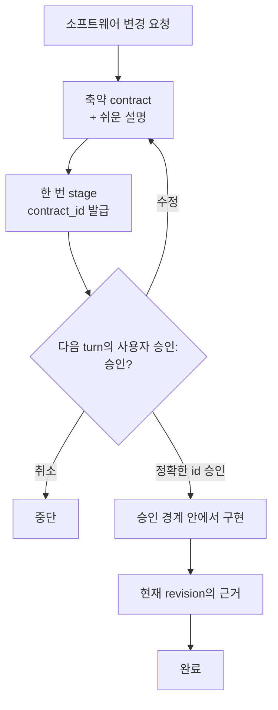

# Click — Codex 코딩 에이전트를 위한 revision-aware evidence

[English](README.md) | 한국어 | [简体中文](README.zh-CN.md)

커뮤니티: [LINUX DO](https://linux.do/)

[](https://github.com/grapefruit0205/click/actions/workflows/ci.yml)
[](LICENSE)

### 평소처럼 작업하고, 코드와 일치하는 증거를 남기세요.

> **기본은 Evidence. 위험한 작업에는 승인 결속 Guarded.**

**Click은 host가 평소처럼 작업하도록 두면서 prompt lineage, mutation revision, 재사용 가능한 검증 evidence를 기록하는 Codex 플러그인입니다. 위험도가 높은 작업은 Guarded 모드에서 사람이 읽기 쉬운 계약 하나에 실행을 결속할 수 있습니다.**

대부분의 코딩 에이전트 워크플로우는 아직 모델에게 이런 규칙을 기억하라고 요청합니다.

```text
계획은 한 번만 세워.
범위를 벗어나지 마.
저장소 전체를 다시 훑지 마.
계획을 계속 다시 쓰지 마.
정말 필요한 검증만 실행해.
```

컨텍스트가 길어지고 작업이 갈라지면 모델은 같은 계획을 다시 만들거나, 저장소를 다시 탐색하거나, 이미 증명한 결과를 또 증명하기 시작할 수 있습니다.

Click은 권한과 evidence 보장을 지원되는 **도구 실행 경계**로 옮깁니다.
탐색 선호는 그 경계에서도 비차단 안내로 남으며 실행 권한이 되지 않습니다.

```text
요청 → 구현 → 현재 revision evidence → 정직한 영수증

고위험 작업: 4개 섹션 계약 → 다음 turn 승인 → Guarded 실행 → 영수증
```

> **어떻게 구현할지는 모델이 결정합니다. 워크플로우가 다음 단계로 갈 수 있는지는 Hook이 결정합니다.**

**기본 모드에는 Click 재승인 마찰이 없고, 필요할 때만 강한 승인 경계를 켭니다.**

## 핵심 목적

> **Click은 일반 host 승인 작업에는 revision-aware evidence를 돌려주고, Guarded를 선택하면 AI 실행을 승인된 의도에 결속합니다.**

Click의 안정적인 제품 경계는 모델 워크플로우 최적화기가 아니라 승인과
증거를 결속하는 runtime입니다. 정식 진입 기준과 정책 계층은
[Click 제품 헌법](PRODUCT_CONSTITUTION.md)에, 현재 guard 목록과 전환 상태는
[Click guard 분류](GUARD_CLASSIFICATION.md)에 있습니다.

Click은 권한과 evidence 무결성은 hard runtime 보장으로 유지하고, 모델의
workflow 전략은 권한 없는 안내로 취급합니다. 특히 `update_plan`은 계속
사용할 수 있지만 active contract를 승인·교체·확장할 수 없고 contract digest나
evidence 상태도 바꾸지 않습니다.

## 왜 Click인가요?

프롬프트는 에이전트에게 무엇을 *해야 하는지* 말할 수 있습니다. Click은 관찰 가능한 tool path에서 지금 무엇을 *할 수 있는지*에 영속 상태를 둡니다.

| 프롬프트만 쓰는 워크플로우 | Click |
| --- | --- |
| 모델이 계획을 기억하기를 기대 | 승인된 workflow 상태를 유지 |
| 승인 시점이 맞기를 기대 | digest에 묶인 `contract_id`를 stage하고 다음 사용자 turn을 요구 |
| 다시 탐색하지 말라고 요청 | 비차단 범위 축소 안내를 제공하며 inventory 횟수는 권한을 바꾸지 않음 |
| 다시 계획하지 말라고 요청 | 비차단 안내를 제공하며 `update_plan`은 contract 권한을 바꾸지 못함 |
| 같은 검증을 반복하지 말라고 요청 | 현재 structured evidence와 receipt를 재사용 |
| 검증이 작업 의도에서 벗어나도 방치 | 각 완료 조건을 revision-bound evidence와 정확한 receipt에 결합 |
| 에이전트가 끝났다고 하면 종료 | 최신 mutation revision의 증거가 current여야 완료 |

핵심은 단순합니다.

> **코딩 에이전트에게 계속 절차를 기억하라고 부탁하지 말고, 절차를 실행 경계에 넣습니다.**

### 추론이 아니라 실행 경계를 강제합니다

> **Click은 실행이 해도 되는 일을 제한하지, 모델이 어떻게 생각할지를 제한하지 않습니다.**

어떤 파일을 어떤 순서로 읽을지, 문제를 어떻게 추론할지, 어떤 구현을
선택할지, 구체적으로 어떤 검증 명령을 실행할지는 승인된 contract 안에서
모델이 결정합니다. Click의 hard enforcement는 관찰 가능한 행동이 중요해지는
지점, 즉 승인, mutation과 외부 side effect, replay·변조 방지, evidence
무결성에서 시작합니다.

따라서 모델별 탐색 요령을 hard gate로 만들지 않으면서도 무인 작업의 실행
경계를 지킬 수 있습니다.

### revision이 아니라 proof input이 바뀔 때 다시 검증합니다

Git revision이 새로 생겼다고 해서 통과한 모든 검증이 자동으로 무효가 되는
것은 아닙니다. Click의 **dependency-aware revision cache**는 그 검증이 왜
유효했는지를 기록합니다. 해석된 dependency 파일과 내용, 정확한 check,
환경, 실행 파일, 알려진 host coverage, 승인된 mutation snapshot이 모두
그대로일 때만 정확한 성공 evidence를 다음 revision에서도 재사용합니다.

```text
revision 12  인증 코드 변경  → 인증 테스트 실행 → 통과
revision 13  README만 변경    → proof input 불변 → 통과 증거 재사용
revision 14  인증 코드 변경  → proof input 변경 → 테스트 재실행
```

필요한 결속 중 하나라도 없거나 모호하거나 달라졌다면 Click은 안전한 쪽으로
실패하고 검증을 다시 요구합니다. 따라서 모델의 “관련 없는 변경입니다”라는
말만 믿지 않으면서도 문서 하나를 고친 뒤 300개 테스트 전체를 불필요하게
다시 실행하는 일을 피할 수 있습니다.

## 세 가지 모드

| 모드 | 사용자 경험 | 실행 권한 |
| --- | --- | --- |
| **Evidence** (기본) | Click 계약·승인 질문 없이 정상 실행하고 마지막에 evidence 영수증 확인 | host |
| **Guarded** | 목표·변경 범위·유지 항목·완료 확인을 한 번 승인한 뒤 범위 안에서 연속 실행 | 승인된 계약 |
| **Off** | 일반 작업은 Click이 관리하지 않으며 명시적 `@Click`은 Guarded 시작 가능 | host |

기존에 저장된 권한 선택은 업그레이드해도 의미가 유지됩니다. `on`은 Guarded로, `manual`은 Off로 바뀌며 새 설치와 미설정 사용자만 Evidence를 기본값으로 사용합니다. 이미 stage되었거나 완료되지 않은 Guarded 계약은 완료하거나 명시적으로 취소할 때까지 잠금이 유지됩니다.

Evidence 영수증은 `approval_bound: false`, `execution_authority: host`라고 명시하며 Click이 승인했다고 가장하지 않습니다. Guarded 영수증은 contract digest, 승인 turn, one-use claim, replay·변조 방지, mutation revision, 환경과 evidence lineage를 그대로 결속합니다.

## Hook이 실제로 강제하는 것

stage, implementation, review, verification 동안 Click은 다음과 같은 **관찰 가능한 workflow 규칙**을 강제할 수 있습니다.

- **Guarded 제안과 승인을 분리합니다.** stage하면 불투명한 `contract_id`가 나오고 같은 사용자 turn에서 stage와 pass를 동시에 할 수 없습니다.
- **Guarded에서는 승인 전 mutation을 막습니다.** 정확한 staged ID가 승인되고 pass될 때까지 active contract가 잠금 상태를 유지합니다.
- **Evidence 영수증을 정직하게 만듭니다.** host 권한, follow-up prompt digest, mutation, check, 환경, cache lineage를 결속합니다.
- **계획은 advisory로 둡니다.** `update_plan` 같은 plan tool은 계속 사용할 수 있으며 active contract를 승인·교체·확장하지 못합니다.
- **저장소 탐색은 advisory로 둡니다.** 서로 다른 digest의 broad inventory는 다른 broad inventory가 실행 중이거나 성공한 뒤에도 범위 축소 안내와 함께 사용할 수 있습니다. 실행 중 runner와 실행 interlock만 hard guard로 유지합니다.
- **반복 관찰도 계속 사용할 수 있습니다.** 성공한 동일 structured read/search의 새 요청에는 재사용 안내와 새 one-use runner를 제공하며, 소진된 runner token 재생과 혼동하지 않습니다.
- **검증을 evidence에 결합합니다.** local check는 자신이 증명하는 승인된 `evidence_id`를 지정합니다. Click은 정확한 실행 receipt를 결합하되 모델이 선택한 검증 범위가 충분한지는 점수화하지 않습니다.
- **완료 상태가 코드 revision을 따라갑니다.** mutation이 생기면 이전 완료 근거를 조용히 재사용하지 않고 stale로 만듭니다.
- **로컬 서버 수명주기를 관리합니다.** 인식된 개발 서버는 Click의 managed service 경로를 사용해 정확한 격리 자식을 정리합니다.

Hook이 제어하는 것은 **관찰 가능한 tool path**입니다. 숨은 추론을 읽거나 의미적 정확성을 단독으로 증명하거나 운영체제 sandbox 역할을 하지는 않습니다.

## Guarded 계약

Guarded 내부에서는 schema 검증과 digest 결속을 위해 canonical JSON을 유지합니다. 성공한 stage Hook 응답이 정확한 **작업 목표**, **변경 범위**, **변경하지 않는 부분**, **완료 확인** projection과 ID를 함께 주므로 Skill이 내용을 다시 요약할 필요가 없습니다. 원본 JSON은 선택적인 ‘기술 계약 보기’에 두며, 사람용 projection은 contract plaintext로 저장하지 않습니다.

| 필드 | 고정하는 것 |
| --- | --- |
| `outcome` | 구체적인 결과와 사용자에게 보이는 동작 |
| `boundary` | 바꿔도 되는 범위와 건드리지 않을 범위 |
| `must_hold` | 관찰 가능한 안전·호환성·정확성 약속 |
| `build` | 저장소에 맞춘 가장 작은 구현 경로 |
| `verification` | 위험에 맞춘 검증 규모와 완료 근거 |
| `plain_language` | 비개발자도 이해할 수 있게 풀어쓴 같은 계약 |

계약이 고정하는 것은 **의미, 경계, 완료 약속**입니다. 모든 파일·의존성·라이브러리·저수준 구현 선택을 얼려 두는 것이 아닙니다.

승인 범위 안에서 필요한 파일·도구·의존성이 발견되거나 세부 지시·범위 축소 follow-up이 들어오면 audit digest를 남기고 계속할 수 있습니다. 승인한 결과·사용자에게 보이는 동작·경계·must-hold·권한·검증 약속이 실질적으로 바뀔 때만 다시 승인합니다. Follow-up digest는 요청이 기록됐음을 증명하지만, 그 의미가 기존 범위 안이라고 runtime이 판정했다는 증명은 아닙니다.

## Guarded 작동 방식



처음 요청은 아직 보지 못한 설계에 대한 승인이 아닙니다. Click은 canonical contract를 한 번 stage하고 불투명한 `contract_id`를 받은 뒤 계약을 보여주고 멈춥니다. 다음 승인에서는 JSON 전체를 다시 보내지 않고 그 ID만 pass합니다.

최신 mutation revision에서 선언한 모든 evidence source가 current이고 Click managed service가 활성 상태가 아니면 계약이 완료되고 다음 변경은 깨끗한 workflow 상태에서 시작합니다.

## 빠르게 시작하기

```bash
codex plugin marketplace add grapefruit0205/click
codex plugin add click@click
```

ChatGPT 데스크톱 앱을 다시 시작하고 포함된 Click Hook을 확인해 신뢰한 뒤 새 작업을 시작합니다.

신규 설치와 기존 사용자는 **Evidence**가 기본입니다. 평소처럼 작업하면 Click 자체 승인 질문 없이 evidence를 남깁니다. 고위험 작업에는 **Guarded**, 일반 Click 관리를 끄려면 **Off**를 선택합니다.

```text
click-gate default evidence
click-gate default guarded
click-gate default off
```

```text
@Click 주문 취소 기능을 추가해줘.
중복 환불을 막고 기존 API 호환성을 유지해줘.
```

모드는 나중에 바꿀 수 있습니다. 한 turn만 우회하는 `@Click bypass`와 active 계약을 버리는 `@Click cancel`도 유지되며, 둘 다 active Guarded 계약을 몰래 해제하지 않습니다.

## Guarded 기술 계약 예시

사용자는 보통 네 부분의 쉬운 화면만 봅니다. ‘기술 계약 보기’를 열면 canonical JSON은 다음처럼 보일 수 있습니다.

```json
{
  "outcome": "기존 API로 취소 가능한 주문을 취소하고 환불은 최대 한 번만 실행한다.",
  "boundary": {
    "in_scope": ["현재 주문 취소 및 환불 경로"],
    "out_of_scope": ["새 결제 사업자", "관련 없는 주문 상태 정리"]
  },
  "must_hold": [
    "동시 요청이나 재시도로 두 번째 환불이 생기지 않는다.",
    "기존 요청 필드, 응답 필드, 상태 의미를 호환되게 유지한다."
  ],
  "build": {
    "approach": ["현재 취소 경로를 재사용하고 환불 전이를 멱등적이고 원자적으로 만든다."]
  },
  "verification": {
    "scale": "full",
    "evidence": [
      {"id": "E1", "kind": "argv", "description": "주문 취소와 중복 환불 테스트", "dependencies": ["src/orders/", "tests/test_cancellation.py"]},
      {"id": "E2", "kind": "argv", "description": "기존 API 회귀 테스트"}
    ],
    "done_when": [
      {"condition": "환불 동작이 정확하다.", "primary_evidence": "E1"},
      {"condition": "공개 API가 호환된다.", "primary_evidence": "E2"}
    ]
  },
  "plain_language": "고객은 취소 가능한 주문을 취소할 수 있지만 재시도하거나 동시에 요청해도 두 번 환불되지 않습니다. 기존 API 호환성은 유지됩니다."
}
```

실제 설계는 저장소마다 달라집니다. 이 예시는 모든 환불 시스템의 정답이 아니라 contract 형태를 보여줍니다.

## 증거 기반 anti-loop

| 안전망 | 동작 |
| --- | --- |
| 반복 관찰을 차단하지 않고 안내 | 성공했거나 반복 실패한 동일 structured read/search도 새 one-use runner로 실행할 수 있고 안내만 제공하며, 같은 digest의 runner가 실행 중이면 계속 차단 |
| 계획을 막지 않고 안내 | `update_plan`은 계속 사용할 수 있지만 contract를 stage·승인·교체·확장하지 못함 |
| broad inventory 뒤 범위 축소 안내 | 서로 다른 broad 요청은 안내와 함께 계속 사용할 수 있고 실행 중인 동일 digest runner는 별도 상태 interlock이 막음 |
| 일반 argv 재시도를 차단하지 않고 안내 | 고정 실패 횟수만으로 새 verification 재시도를 막지 않지만 protected repository content를 바꾼 verification은 기록된 mutation 경로가 필요함 |
| 명령 의도 명시 | active 상태의 애매한 shell 작업 대신 structured `inspect`·`mutate`·`service`·`verify`를 사용 |
| 검증 전략을 권한화하지 않음 | 모델이 evidence와 `argv`를 고르고 Click은 정확한 check-group digest와 관찰 결과를 receipt에 결합 |
| 알려진 host coverage 결속 | 검증 receipt에 현재 Codex 또는 Antigravity의 known-surface digest를 넣어 다른 host나 Hook coverage revision의 증거가 조용히 재사용되지 않게 함 |
| dependency-safe evidence 재사용 | Guarded는 승인 dependency 또는 커밋 매핑을, Evidence는 커밋 매핑만 사용할 수 있고 모든 해석 binding이 같을 때만 다음 revision으로 이어감 |
| source별 완료 추적 | 선언한 모든 source가 current여야 하며 `argv` source가 없으면 억지 local check를 만들지 않음 |
| Browser workflow 반복 advisory | 정규화된 Browser 반복·재시도·긴 timed interaction은 안내와 함께 허용하고, 할당 source·직렬 호출·tool result·revision·완료 replay 결속은 계속 차단으로 보장 |

## Advisory 검증 profile

Guarded에서는 승인 전에 충분한 최소 profile을 제안하고 contract digest에 결속합니다. Evidence에는 승인 단계가 없고 runtime은 focused marker만 유지하며 모델이 실행 중 실제 check를 고릅니다. Click은 정확한 check-group digest·revision·환경·실행 파일·host coverage·결과를 receipt에 결속하지만 검증 충분성이나 숫자 추정치를 권한으로 사용하지 않습니다.

| Profile | 주로 쓰는 경우 |
| --- | --- |
| `quick` | 작고 국소적이며 되돌리기 쉬운 변경 |
| `focused` | 범위가 명확한 일반 기능 또는 수정 |
| `full` | 결제·인증·삭제·마이그레이션·공개 계약·경계를 넘는 동시성 |

기존 class-unit 필드는 저장된 state와 직접 호출자의 호환을 위해 읽을 수만 있게 남아 있으며 receipt 증거도 runtime 안내도 아닙니다. 숫자 검증 예산은 사용자나 저장소가 그 정책을 명시적으로 소유할 때만 강제해야 합니다.

Guarded 근거는 선언한 local `argv`·Browser·hosted·manual·existing source가 될 수 있고, Evidence는 실제 사용하는 argv id를 동적으로 등록합니다. argv는 runner의 실제 성공으로만 완료됩니다. non-argv attestation은 matcher 밖 외부·수동 작업을 독립적으로 증명하지 않습니다.

Guarded의 argv source는 stage 전에 저장소 상대 `dependencies`를 선언해 승인 digest에 결속할 수 있습니다. Evidence는 실행 중 dependency 추측에 권한을 주지 않으며 커밋된 `.click/evidence-dependencies.json`만 cross-revision 재사용에 사용합니다. Click은 해석 파일과 내부 상대 symlink를 기록하고 관련 매핑·mutation receipt·workspace가 달라지면 다시 검증합니다.

## 구조화 capability

Click은 실행 파일과 인자를 분리하고 구조화 capability 경로를 사용합니다.

```text
click-gate inspect '{"version":1,"commands":[["git","status","--short"],["sed","-n","1,160p","src/app.py"]]}'
click-gate mutate '{"version":1,"argv":["python3","scripts/generate.py","--target","src"]}'
click-gate service '{"version":1,"action":"start","argv":["python3","-m","http.server","4173","--bind","127.0.0.1"]}'
click-gate service '{"version":1,"action":"stop"}'
click-gate evidence '{"version":1,"evidence_id":"E-browser"}'
click-gate verify '{"version":2,"checks":[{"evidence_id":"E1","argv":["python3","-m","pytest","tests/test_cancellation.py"],"class":"targeted"}]}'
```

인식된 read는 Hook의 제한된 read-only capability 정책 안에서 실행됩니다. 정확한 schema, trusted executable 규칙, shell-free 실행, snapshot, claim, process 경계는 [capability protocol](skills/click/references/capability-protocol.md)에 있습니다.

Click은 **workflow guardrail**이지 OS 보안 sandbox가 아닙니다.

## Google Antigravity 어댑터 — 실험적

이 저장소는 Click의 contract 상태 머신·evidence ledger·검증 receipt 측정·shell-free runner를 공유하는 독립형 Google Antigravity 플러그인도 생성합니다.

```bash
python3 scripts/build_antigravity_distribution.py
agy plugin install ./dist/antigravity
```

Antigravity IDE에서는 `dist/antigravity`를 워크스페이스의 `.agents/plugins/click` 또는 전역 `~/.gemini/config/plugins/click`에 복사할 수도 있습니다.

Antigravity의 Hook contract는 Codex와 다릅니다. native file/search와 별도 MCP·Skill 도구는 계속 사용할 수 있지만 cross-tool 중복 제거와 Browser evidence는 아직 지원하지 않습니다. 정확한 제한은 [`platforms/antigravity/README.md`](platforms/antigravity/README.md)를 확인하세요.

## 기존 설치 업데이트 — v0.50.0

현재 릴리스는 **v0.50.0**입니다.

```bash
codex plugin marketplace upgrade click
codex plugin add click@click
```

ChatGPT 데스크톱 앱을 다시 시작하고 갱신된 Hook을 검토해 신뢰하세요. v0.50.0은 gate facade의 과거 private module forwarder 144개를 문서화된 `_validate_contract` 호환 binding 하나로 줄이고, domain 테스트가 각 소유 모듈을 직접 사용하도록 정리했습니다. public host entry point와 Evidence/Guarded 권한, runner 복구, receipt 의미, Antigravity runtime 동작은 그대로 유지됩니다. 새 Hook 코드를 로드하려면 업그레이드 후 새 작업을 시작하세요.

자세한 릴리스 이력은 [RELEASE_NOTES.md](RELEASE_NOTES.md)에 있습니다.

## 완료 영수증

현재 evidence가 완료되고 관리 서비스가 멈추면 `click-gate receipt export`가
canonical v2 envelope를 출력합니다. Guarded는 contract ID·digest·stage·승인
turn을 결속합니다. Evidence는 `contract: null`, `approval_bound: false`,
`execution_authority: host`와 intent·follow-up digest를 기록합니다. 둘 다 claim,
최종 mutation/workspace digest, evidence별 환경·실행 파일·host coverage·dependency
lineage를 결속합니다. 원문 argv·token·contract prose·prompt·workspace 경로는
포함하지 않습니다.

지원 host가 mutation의 대응 `PostToolUse`를 생략해도 Click은 성공 exit code를
꾸며내지 않습니다. 이후 같은 revision 또는 더 최신 revision에서 one-use
verification이 통과하고 최종 evidence와 workspace snapshot도 일치할 때만 해당
승인된 claim을 `observed`로 정산할 수 있습니다. 그 후속 증인이 없는 claim은
계속 export를 차단합니다.

출력된 JSON을 실행 명령 밖에서 파일로 저장한 뒤 네트워크나 활성 Click
state 없이 검증할 수 있습니다.

```text
click-gate receipt verify ./completion-receipt.json
```

현재 envelope의 assurance는 `unsigned-integrity-only`입니다. 본문이
malformed이거나 canonical digest가 맞지 않으면 거부하지만, 공격자가 본문과
digest를 함께 다시 쓰는 경우는 판별하지 못합니다. 발행자 진위와 부인 방지는
후속 공개키 서명 계층이 필요합니다.

## 근거와 솔직한 한계

Click은 Hook이 실제로 관찰하고 강제할 수 있는 범위에서만 강한 주장을 합니다.

host coverage receipt는 명시적으로 `known-surfaces-only`입니다. host 또는 등록된 Hook 표면의 변경은 탐지하지만 host가 전달하지 않은 이벤트를 만들어낼 수는 없습니다.

Hook이 다음을 할 수 있다고 주장하지 않습니다.

- 숨은 추론이나 자연어로만 작성된 계획을 검사;
- matcher 밖 모든 connector나 hosted tool을 관찰;
- Codex 클라이언트가 일치하는 Hook 이벤트를 전달하지 않는 실행 경로를 강제;
- 의미적 경계 준수나 아키텍처 정확성을 단독으로 증명;
- matcher 밖 수동·외부 attestation이 실제로 수행됐는지 독립적으로 증명;
- 허용된 사용자 프로그램 내부에 숨은 여러 동작을 차단;
- 전문가 검토·권한 확인·배포 통제·OS sandbox를 대체.

저장소의 결정적 테스트 suite는 Linux·macOS·Windows에서 관찰 가능한 Hook과 contract 동작을 검증합니다. 서로 관련 없는 실제 저장소에서 독립적으로 측정하기 전까지 프로젝트 전반의 성공률·정확도·시간·토큰 사용량·과설계를 개선한다고 주장하지 않습니다.

## 비슷한 접근

Click은 spec-driven·autonomous-loop·approval-gated 도구와 일부 겹치지만 의도적으로 **축약 contract 하나, 승인 한 번, 구현 경계 하나, 관찰 가능한 anti-loop 안전망, 제한된 evidence commitment 하나**에 좁게 집중합니다.

커뮤니티 홍보 초안은 [COMMUNITY_POSTS.md](COMMUNITY_POSTS.md)에 있습니다.

## 라이선스

Click은 [MIT 라이선스](LICENSE)로 배포됩니다.
