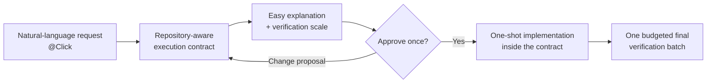

# Click

English | [한국어](README.ko.md)

[](https://github.com/grapefruit0205/click/actions/workflows/ci.yml)
[](LICENSE)

**Contract-first, build-fast. Approve the minimum sufficient contract once; Click implements inside it to a working result.**

Click is an explicitly selected Codex plugin. Mention `@Click` with a natural-language software request. It reads the relevant repository, translates the request into a compact developer execution contract, explains the same meaning plainly, chooses how much final verification is appropriate, and asks for one approval before coding. After implementation, its Hook meters and executes the final verification commands against that automatically selected budget.

It is not an architecture-pattern picker. You do not have to choose “modular monolith,” “microservices,” “event-driven,” “batch,” or “functional.” Click derives the engineering language the real behavior and codebase require.

## The short version

1. Mention `@Click` and describe the result you want.
2. Click inspects the smallest relevant part of the repository.
3. It shows one compact developer contract, one easy explanation, and one verification scale.
4. You approve once.
5. Click implements in one shot, then the Hook meters and executes the completion checks once.



Click does not ask a chain of technical preference questions when it can infer a safe choice from the repository. Consequential assumptions are placed in the contract so you review them together. Before approval, you can change that proposal. After approval, Click keeps the semantic contract fixed and finishes inside it.

## What exactly is locked?

The Hook stores the contract digest and non-content verification metadata outside the target repository. It does not persist the contract text. The contract passed after approval must be byte-for-byte equivalent after canonical JSON normalization; a different contract is rejected.

The lock applies to the **meaning of the work**:

- the outcome and user-visible behavior;
- the boundary and must-hold conditions;
- material system and failure behavior;
- explicit constraints and the verification commitment.

It does not freeze every implementation tool. Inside that approved envelope, Click may choose necessary libraries, dependencies, MCP tools, external services, graders, files, and low-level tactics without asking for another contract. This is what makes the workflow one-shot rather than a series of implementation approvals.

Click stops only when it needs authority you did not grant, an uncovered irreversible or paid external action, or a change to the approved outcome or semantic boundary.

The Hook enforces contract shape, ordering, staged-versus-passed equality, and the deterministic budget policy for visible verification commands. It does not prove architecture correctness, genuine human approval, semantic fidelity of every changed line, or the true work hidden inside a custom script.

## Verification without ceremony

The contract contains one verification scale and one `done_when` list. It does not create separate test checkpoints for plans, phases, steps, or tasks.

| Scale | Recommended for | Automatic ceiling | Final batch |
| --- | --- | ---: | --- |
| `quick` | Small, local, reversible work | 1 unit | Nearest meaningful check and final diff/status review |
| `focused` | Ordinary features and repairs | 4 units | Direct behavior tests, closest regression checks, and final diff/status review |
| `full` | Payments, auth, deletion, migrations, public contracts, or high-impact concurrency | 10 units | Available full suite plus relevant integration, migration, security, or end-to-end checks |

A simple targeted command costs 1 unit, a recognized broad suite costs 3, and a recognized security, audit, coverage, end-to-end, or benchmark command costs 5. Click chooses the scale; the user does not configure this budget separately. The single contract approval includes it.

At completion, Click submits one command per entry through the internal `click-gate verify` runner. Chaining, pipes, redirection, background execution, command substitution, and newlines are rejected because they hide the real cost. Recognized broad checks run only through this budgeted batch. Routine builds, app runs, and narrow implementation feedback remain available and are not treated as the final proof.

The runner records the real exit code. A successful batch cannot be repeated needlessly. If later code changes, the result becomes stale and the same batch may run again. A failed batch gets one unchanged retry for a transient failure; further retries require an in-scope mutation.

The completion checks run together once after implementation. An intermediate gate is reserved for an irreversible migration, deletion, deployment, paid API call, or similar point where continuing would make recovery materially harder.

## One user-facing invocation

Use `@Click` for design, implementation, and repair requests.

```text
@Click Add partial refunds to this legacy checkout without changing existing full refunds.
```

Click produces the compact top-down contract, an easy explanation, and a verification scale, then waits for one approval.

```text
@Click The payment button can send the same request twice. Preserve the existing payment API and fix it.
```

Fix traces the narrow defect, separates evidence from a root-cause hypothesis, and creates a compact repair contract. After one approval, it repairs the issue and runs the completion checks once.

Internally the plugin contains two explicit-only Skills: `$click` for design and implementation and `$fix` for compact repairs. Those direct Skill names remain available as a technical interface, but user-facing documentation and examples use the plugin mention `@Click`. The plugin does not install native slash commands. Both Skills have implicit invocation disabled, so ordinary requests remain ordinary Codex requests.

## Example: a YouTube auto-reply request

This is a **workflow example only**. The repository does not contain or deploy a YouTube reply bot.

Input:

```text
@Click Build a tool that automatically posts replies to comments on my YouTube channel.
Use the Gemini API to write replies, but do not reply to abusive comments,
personal information, or spam.
```

Instead of asking separate rounds such as “Which platform?”, “Fixed text or AI?”, and “Which model?”, Click uses the supplied facts and repository evidence to show one approval target. An abridged version might say:

- Use the YouTube API for comment retrieval and reply posting, and Gemini for reply candidates.
- Filter abusive, personal-information, and promotional comments before posting.
- Record processed comment IDs so retries cannot post duplicate replies.
- Keep credentials outside source control, respect rate limits, retry transient failures, and provide an operational stop control.
- Reuse the repository's runtime, scheduler, and storage when suitable; choose another in-scope dependency or service if needed.
- Recommend `focused` verification: filtering, duplicate prevention, API-failure handling, and a dry-run posting boundary in one final batch.

Plain explanation:

> The tool checks new YouTube comments and lets Gemini draft a reply. It skips abusive, private, or promotional comments and remembers handled comments so it does not reply twice. Credentials stay outside the code, temporary API failures are retried safely, and the operator can stop posting. After implementation, the agreed focused checks run once.

Click then asks one question:

> Do you approve this contract and its focused verification scale? If approved, I will implement it in one shot.

If the first request were only “make an automatic comment tool,” Click could expose a proposed platform and generation strategy as visible contract assumptions instead of conducting a questionnaire. Approval accepts those assumptions; changing the proposal before approval is still allowed.

## The contract in developer terms

| Field | Meaning |
| --- | --- |
| `outcome` | Concrete result and user-visible behavior |
| `boundary` | Required `in_scope` work and explicit `out_of_scope` limits |
| `must_hold` | Observable behavior, compatibility, and safety conditions that cannot change |
| `build` | Smallest repository-aware approach; optional `semantics` and `order` only when material |
| `verification` | One `quick`, `focused`, or `full` scale and observable `done_when` checks |
| `plain_language` | Faithful easy explanation of the same contract |

The old `plan`, `implementation`, `phases`, `steps`, `tasks`, `execution_order`, `minimality`, and `proof` fields are intentionally not separate contract sections. Their useful meaning is folded into `outcome`, `boundary`, `must_hold`, `build`, and `verification` so a one-file edit does not become a miniature project plan.

The Hook caps the serialized contract at 4,000 characters. This is a ceiling, not a target; ordinary contracts should be much shorter.

## What minimum design does not remove

**A small design is not an incomplete design.** Click reduces contract fields, repeated plans, and approval rounds. Safety semantics that materially affect the requested result or current system are not targets for removal; they belong in the contract.

| Area | Meaning preserved by the compact contract |
| --- | --- |
| Concurrency | Results that must survive races, duplicate execution, or idempotent retries |
| State | Valid state transitions, persistence points, and data ownership that must not drift |
| Failure | Behavior that must survive partial failure, retries, recovery, or an external-system error |
| Security | Authentication, authorization, secret, and privacy boundaries that must not be crossed |
| Compatibility | Existing API, data, status, and user-visible behavior that must remain stable |

These conditions are first fixed in `must_hold`. Add `build.semantics` only when concrete state, failure, security, concurrency, or compatibility meaning constrains implementation, and add `build.order` only when sequence affects safety. Put observable checks in `verification.done_when`. **Conditional fields do not make necessary safeguards optional; they prevent irrelevant filler from expanding the contract.**

The Hook does not prove that these meanings were correctly implemented in code. It protects contract shape, approval order, and equality, while the semantic grader is designed to flag material omissions. Confidence in the result still comes from the approved `done_when` checks and code review.

## Installation from GitHub

The repository, marketplace, plugin, and Skill are all named Click.

```bash
codex plugin marketplace add grapefruit0205/click
codex plugin add click@click
```

If `click@build-brief` 0.9.0 is installed, migrate it with:

```bash
codex plugin remove click@build-brief
codex plugin marketplace remove build-brief
codex plugin marketplace add grapefruit0205/click
codex plugin add click@click
```

For the older Build Brief 0.8 installation, replace the first command with `codex plugin remove build-brief@build-brief`.

Restart the ChatGPT desktop app, review and trust the included Click Hook, and start a new task so Codex loads the current Skills and Hook.

## When Click is useful

Use Click when a misunderstood invariant, invisible assumption, or scope drift would cost more than reviewing one contract—for example brownfield compatibility, data ownership, idempotency, concurrency, migrations, failure behavior, or a handoff between people and agents.

Use ordinary natural-language coding when the change is tiny, obvious, reversible, or exploratory. Strong coding models already infer design; Click's value is making that design visible and binding it to one approval, not adding intelligence to the model.

## Evidence and limits

The repository deterministically tests explicit-only activation, uninvoked fail-open behavior, opt-out, safe read-only commands, compact-contract completeness, conditional build constraints, verification profiles and unit ceilings, staged-versus-passed digest equality, one-shot contract locking, final-batch execution and retry state, contract-text-free state, and repository policy. Public CI runs on Linux, macOS, and Windows.

The included golden cases, semantic grader, and A/B runner are evaluation infrastructure. Post-v0.9 behavioral A/B evidence has not yet established that Click improves implementation success, reduces missed invariants, or saves time and tokens across real projects.

The Hook is an ordering and recognized-command budget guardrail, not a security or resource sandbox. A custom wrapper can conceal several checks inside one visible command, and the Hook cannot decide whether the selected checks are semantically sufficient. Repository-absent legal policy, real traffic, organizational practice, credentials, and external authorization can still require user input. Click itself ships no MCP server or third-party runtime dependency; contracts it generates may use an MCP, service, or dependency when the approved scope justifies it.

## Repository structure

```text
.codex-plugin/plugin.json             Plugin manifest
.agents/plugins/marketplace.json      GitHub marketplace entry
skills/click/                         One-shot design-and-build Skill
skills/fix/                           Compact repair Skill
hooks/click_gate.py                   Contract, digest, and verification-budget guard
hooks/hooks.json                      Lifecycle Hook configuration
evals/                                Golden cases, A/B runner, semantic grader
tests/                                Deterministic Hook, grader, and policy tests
LICENSE                               MIT License
```

Validation:

```bash
python3 /path/to/skill-creator/scripts/quick_validate.py skills/click
python3 /path/to/skill-creator/scripts/quick_validate.py skills/fix
python3 /path/to/plugin-creator/scripts/validate_plugin.py .
python3 -m unittest discover -s tests -v
```

## Related approaches

Click is not presented as the first or only spec-driven workflow.

| Project | Overlap | Click's narrower emphasis |
| --- | --- | --- |
| [GitHub Spec Kit](https://github.com/github/spec-kit) | Specification, planning, tasks, implementation | One explicitly invoked contract and one approval rather than a persistent multi-command specification process |
| [OpenSpec](https://github.com/Fission-AI/OpenSpec) | Agreement before AI-assisted coding | No project-local specification store; the Hook keeps only a digest outside the target repository |
| [Kiro Specs](https://kiro.dev/docs/cli/v3/specs/) | Requirements, design, tasks, verified execution | One complete contract review and one-shot implementation |
| [Agentic SDLC Codex Plugin](https://github.com/aantenore/agentic-sdlc-codex-plugin) | Hash-bound proposals and approval | A smaller explicit pre-code boundary rather than broader SDLC governance |

This is a bounded comparison, not an exhaustive novelty search.

## License

Click is released under the [MIT License](LICENSE).
