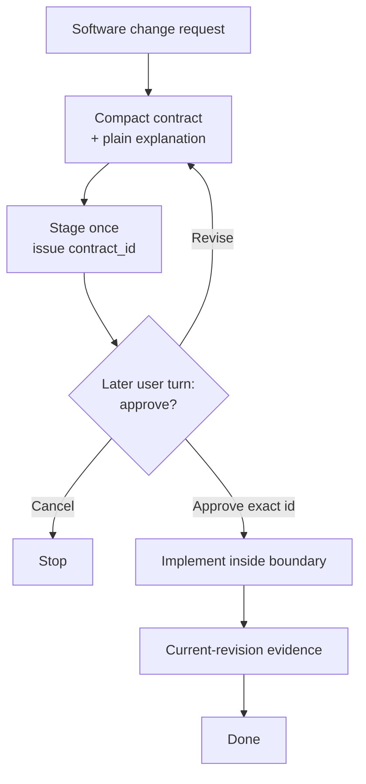

# Click — Revision-aware evidence and approval-bound execution for Codex

English | [한국어](README.ko.md) | [简体中文](README.zh-CN.md)

Community: [LINUX DO](https://linux.do/)

[](https://github.com/grapefruit0205/click/actions/workflows/ci.yml)
[](LICENSE)

> **Keep Codex inside the change you approved — and make “done” mean current evidence, not model confidence.**

### Work normally. Keep proof that still matches the code.

> **Evidence by default. Approval-bound execution when the risk calls for it.**

**Click is a Codex plugin that records prompt lineage, mutation revisions, and reusable verification evidence while the host runs normally. For higher-risk work, Guarded mode binds execution to one human-readable approved contract.**

Click uses a **persistent Hook state machine** to mediate supported actions on the **observable execution path**. Workflow optimization stays advisory: exploration and planning receive **non-blocking guidance** rather than becoming execution authority.

Click does not make the model smarter. It makes **approval, mutation authority, and completion evidence persistent and inspectable instead of relying on the model to remember them.**

## Why Click?

Coding-agent sessions can lose a stable execution boundary as context grows. The agent may revisit broad repository context, rewrite its plan, widen the task, begin changing files before review, or repeat verification that is no longer necessary.

Prompts can ask the model not to do those things. Click moves the parts that require real authority or trustworthy evidence into persistent runtime state.

| Common problem | What Click changes |
| --- | --- |
| The plan gets rewritten as the session grows | The approved contract remains canonical; `update_plan` stays advisory and cannot alter contract authority |
| The agent starts modifying files before review | Mutation stays locked until the exact staged `contract_id` is approved in a later user turn |
| Repository context is repeatedly rediscovered | Broad and repeated reads remain available, but Click can provide non-blocking narrowing and reuse guidance |
| The same proof is run again | Current structured evidence and exact receipts can be reused when they are still valid |
| Code changes after verification | A mutation advances the revision and makes older completion evidence stale |
| The agent says the work is done | Declared evidence must be current for the latest mutation revision |

This design can **reduce unnecessary replanning, broad repository re-scans, and duplicate verification** by giving the agent a stable approved target and reusable current evidence. These are workflow benefits, not universal hard guarantees: Click intentionally keeps exploration and planning strategy advisory, and it does not claim project-wide improvements in tool calls, tokens, time, or success rate without independent measurements.

```text
normal work: request → implementation → current-revision evidence → honest receipt

higher risk: request → four-section contract → later approval → guarded execution → receipt
```

> **The model decides how to implement the change. Click decides whether observable execution has the authority and evidence required to move forward.**

**One default with no Click approval friction. One opt-in guard for work that needs it.**

## Core purpose

> **Click returns revision-aware evidence for normal host-authorized work, and can bind AI execution to approved intent when Guarded mode is selected.**

Click's stable product boundary is an authorization-and-evidence runtime, not a model workflow optimizer. The canonical admission test and policy layers are in the [Click Product Constitution](PRODUCT_CONSTITUTION.md); the current guard inventory and migration status are in [Click Guard Classification](GUARD_CLASSIFICATION.md).

Click keeps authority and evidence integrity as hard runtime guarantees while treating model workflow strategy as non-authoritative guidance. In particular, `update_plan` remains available: it cannot approve, replace, or widen the active contract, and it does not change the contract digest or evidence state.

The core idea is simple:

> **Do not keep asking the coding agent to remember the process. Put authority and evidence in the execution boundary.**

### Enforce the boundary, not the reasoning

> **Click constrains what execution may do—not how the model must think.**

Click does not prescribe which files to read, the order in which to explore them,
how to reason about the problem, the implementation to choose, or the concrete
checks to run. Those remain model decisions inside the active intent or approved
contract. Hard enforcement begins where observable actions matter: receipt
integrity and, in Guarded mode, approval, mutation and external side effects,
replay and tampering protection, and evidence integrity.

This lets Click structure unattended work without turning model-specific search
heuristics into hard gates.

### Rerun proof when its inputs change—not merely when the revision changes

A new Git revision does not automatically make every passing check useless.
Click's **dependency-aware revision cache** records why a check was valid and can
carry its exact passing evidence across revisions only while the resolved
dependency files and content, exact check, environment, executable, known host
coverage, and approved mutation snapshot still match.

```text
revision 12  auth code changed  → run auth tests → pass
revision 13  README only changed → proof inputs unchanged → reuse the pass
revision 14  auth code changed  → proof inputs changed → rerun the tests
```

If any required binding is missing, ambiguous, or different, Click fails closed
and requires the check again. This can avoid rerunning a 300-test suite after an
unrelated documentation edit without merely trusting the model's claim that the
tests are still valid.

## Three modes

| Mode | User experience | Authority |
| --- | --- | --- |
| **Evidence** (default) | No Click contract or approval prompt; normal host execution plus a final evidence receipt | The host |
| **Guarded** | One four-section approval, then uninterrupted in-scope execution | The approved contract |
| **Off** | No ordinary Click governance; explicit `@Click` can start Guarded | The host |

Existing stored `on` or `manual` preferences migrate once to Evidence. An already staged or incomplete Guarded contract remains locked until it completes or is explicitly cancelled.

Evidence receipts say `approval_bound: false` and `execution_authority: host`; they never pretend that Click approved the work. Guarded receipts preserve contract digest, approval turn, one-use claims, replay/tamper protection, mutation revisions, environment bindings, and evidence lineage.

## What the Hook actually enforces

During staging, implementation, review, and verification, Click can enforce these **observable workflow rules**:

- **Guarded proposal and approval are separate.** Staging emits an opaque `contract_id`; the same user turn cannot both stage and pass it.
- **Guarded mutation waits for approval.** An active contract remains locked until the exact staged ID is approved and passed.
- **Evidence stays honest.** Approval-free sessions identify host authority and bind follow-up prompt digests, mutations, checks, environment, and cache lineage.
- **Planning stays advisory.** Plan tools such as `update_plan` remain available and cannot approve, replace, or widen the active contract.
- **Repository exploration stays advisory.** A distinct-digest broad inventory remains available with narrowing guidance even while another broad inventory is running or after one succeeds; only active runner and execution interlocks remain hard.
- **Repeated observations stay available.** A fresh identical structured read/search receives reuse guidance and a new one-use runner; it is not confused with replay of a consumed runner token.
- **Verification is evidence-bound.** Local checks name the approved `evidence_id` they prove. Click binds their exact execution receipts without scoring whether the model's chosen verification breadth is sufficient.
- **Completion follows the code.** A mutation advances the revision and makes older completion evidence stale rather than silently reusing it.
- **Local server lifecycle is owned.** Recognized development servers use Click's managed service path so the exact isolated child can be cleaned up.

The Hook controls the **observable tool path**. It does not inspect hidden reasoning, prove semantic correctness by itself, or act as an operating-system sandbox.

## The Guarded contract

Internally, Guarded mode keeps one canonical JSON object for schema validation and digest binding. Users approve four readable sections by default: **Goal**, **Changes**, **Unchanged**, and **Completion checks**. Raw JSON is optional Technical contract detail, not the primary approval UI.

The internal fields are:

| Field | What it fixes |
| --- | --- |
| `outcome` | The concrete result and user-visible behavior |
| `boundary` | What may change and what stays outside the work |
| `must_hold` | Observable safety, compatibility, and correctness promises |
| `build` | The smallest repository-aware implementation route |
| `verification` | One risk-based scale and the evidence that means done |
| `plain_language` | The same contract explained for a non-specialist |

The contract locks the **meaning, boundary, and completion commitment**. It does not freeze every file, dependency, library, or low-level implementation choice.

If the agent discovers that an in-scope file, tool, or dependency is necessary—or receives a narrowing or in-scope follow-up—it can continue and audit-bind the follow-up digest. Reapproval is needed only when the approved outcome, visible behavior, boundary, must-hold behavior, authority, or verification commitment materially changes.

## How Guarded works



The initial request is **not** approval of an unseen design. Click stages the canonical contract once, receives an opaque `contract_id`, shows the contract, and stops. The next approval passes only that ID, not the JSON again.

When every declared evidence source is current for the latest mutation revision and no managed service remains active, the contract is complete and the next change can start from clean workflow state.

## Quick start

```bash
codex plugin marketplace add grapefruit0205/click
codex plugin add click@click
```

Restart the ChatGPT desktop app, inspect and trust the included Click Hook, then start a new task.

New and existing installations use **Evidence** by default. Work normally; Click does not add its own approval prompt. Choose **Guarded** for persistent approval-bound execution, or **Off** to disable ordinary Click governance.

```text
click-gate default evidence
click-gate default guarded
click-gate default off
```

```text
@Click Add order cancellation.
Prevent duplicate refunds and preserve the existing API.
```

You can change modes later. A one-turn `@Click bypass` and `@Click cancel` remain available for explicit control; neither silently unlocks an active Guarded contract.

## Example technical contract (Guarded)

The user would normally see the four-section human view. If Technical contract details are opened, the canonical object may look like this:

```json
{
  "outcome": "An eligible order can be cancelled through the existing API and receives at most one refund.",
  "boundary": {
    "in_scope": ["the current cancellation and refund path"],
    "out_of_scope": ["new payment providers", "unrelated order-state cleanup"]
  },
  "must_hold": [
    "Concurrent or repeated requests cannot create a second refund.",
    "Existing request fields, response fields, and status meanings remain compatible."
  ],
  "build": {
    "approach": ["Reuse the current cancellation path and make the refund transition idempotent and atomic."]
  },
  "verification": {
    "scale": "full",
    "evidence": [
      {"id": "E1", "kind": "argv", "description": "cancellation and duplicate-refund tests", "dependencies": ["src/orders/", "tests/test_cancellation.py"]},
      {"id": "E2", "kind": "argv", "description": "existing API regression tests"}
    ],
    "done_when": [
      {"condition": "Refund behavior is correct.", "primary_evidence": "E1"},
      {"condition": "The public API remains compatible.", "primary_evidence": "E2"}
    ]
  },
  "plain_language": "Customers can cancel an eligible order, but retries or simultaneous requests cannot refund it twice. Existing API compatibility is preserved."
}
```

The exact design is repository-dependent. The example shows the contract shape, not a universal refund architecture.

## Evidence-driven anti-loop behavior

| Guard | Behavior |
| --- | --- |
| Advise on repeated observations | A fresh identical structured read/search remains available through a new one-use runner; prior success or repeated failure adds guidance, while an active same-digest reservation remains blocked |
| Advise without gating plans | `update_plan` remains available; its output cannot stage, approve, replace, or widen a contract |
| Advise after broad inventory | Distinct broad requests remain available with narrowing guidance; an active exact-digest runner retains its separate state interlock |
| Advise on ordinary argv retries | A fixed failure count does not block a fresh verification retry; verification that changed protected repository content still requires a recorded mutation path |
| Make command intent explicit | Ambiguous active shell work is replaced by structured `inspect`, `mutate`, `service`, or `verify` paths |
| Keep verification strategy non-authoritative | The model chooses evidence and `argv`; Click binds exact check-group digests and observed results to receipts |
| Bind known host coverage | Verification receipts include the current Codex or Antigravity known-surface digest, so reuse cannot silently cross hosts or Hook coverage revisions |
| Reuse dependency-safe evidence | Guarded may use approved dependencies or a committed mapping; Evidence may use only the committed mapping, and every resolved binding must still match |
| Track completion by source | All declared sources must be current; no placeholder local check is invented when no `argv` source exists |
| Advise on Browser workflow repetition | Fresh normalized Browser repeats, retries, and long timed interactions remain allowed with guidance; assigned-source, serial-call, tool-result, revision, and completion-replay checks remain hard |

## Advisory verification profiles

In Guarded mode, the Skill or model recommends the smallest sufficient profile before approval and the contract digest binds it. In Evidence mode there is no approval step; the runtime carries a focused marker while the model chooses concrete checks during execution. Click binds exact check-group digest, revision, environment, executable fingerprint, known host coverage identity, and result. It does not infer verification sufficiency or turn numeric estimates into authority.

| Profile | Typical use |
| --- | --- |
| `quick` | Small, local, reversible change |
| `focused` | Ordinary bounded feature or repair |
| `full` | Payments, auth, deletion, migrations, public contracts, or cross-boundary concurrency |

Legacy class-unit fields remain readable for persisted-state and direct-caller compatibility, but they are not receipt evidence and produce no runtime guidance. A numeric verification budget should be enforced only when a user or repository explicitly owns that policy.

Guarded evidence may use declared local `argv`, Browser, hosted, manual, or existing sources. Evidence mode dynamically registers argv ids actually used. An argv source completes only through real runner success. Non-argv completion is an explicit attestation and never proves an unmatched external or manual action by itself.

In Guarded, an argv source may declare deterministic repository-relative `dependencies` before staging, so approval binds them. Evidence mode grants no authority to runtime dependency guesses and can reuse across revisions only through committed `.click/evidence-dependencies.json`. Click records resolved files, supports repository-internal relative symlinks, invalidates only the relevant changed mapping, and reruns after missing mutation receipts or workspace drift.

## Structured capabilities

Click separates executables from arguments and uses structured capability paths:

```text
click-gate inspect '{"version":1,"commands":[["git","status","--short"],["sed","-n","1,160p","src/app.py"]]}'
click-gate mutate '{"version":1,"argv":["python3","scripts/generate.py","--target","src"]}'
click-gate service '{"version":1,"action":"start","argv":["python3","-m","http.server","4173","--bind","127.0.0.1"]}'
click-gate service '{"version":1,"action":"stop"}'
click-gate evidence '{"version":1,"evidence_id":"E-browser"}'
click-gate verify '{"version":2,"checks":[{"evidence_id":"E1","argv":["python3","-m","pytest","tests/test_cancellation.py"],"class":"targeted"}]}'
```

Recognized reads are constrained by the Hook's read-only capability policy. Exact schemas, trusted executable rules, shell-free execution details, snapshots, claims, and process boundaries live in the [capability protocol](skills/click/references/capability-protocol.md).

Click is a **workflow guardrail**, not an OS security sandbox.

## Google Antigravity adapter — experimental

The repository also builds a self-contained Google Antigravity plugin that shares Click's contract state machine, evidence ledger, verification receipts, and shell-free runners.

```bash
python3 scripts/build_antigravity_distribution.py
agy plugin install ./dist/antigravity
```

Antigravity IDE users may also copy `dist/antigravity` into `.agents/plugins/click` for one workspace or `~/.gemini/config/plugins/click` globally.

Antigravity's Hook contract differs from Codex. Native file/search and unrelated MCP or Skill tools remain available, but cross-tool deduplication and Browser evidence are not currently supported. See [`platforms/antigravity/README.md`](platforms/antigravity/README.md) for the exact limits.

## Update an existing installation — v0.35.0

The current release is **v0.35.0**.

```bash
codex plugin marketplace upgrade click
codex plugin add click@click
```

Restart the ChatGPT desktop app and review/trust the updated Hook. v0.35.0 makes Evidence the approval-free default, migrates stored `on` and `manual` preferences once, and keeps active Guarded contracts locked. Guarded approval now leads with four readable sections while technical JSON stays optional, and in-scope or narrowing follow-ups continue with digest-bound audit lineage instead of routine reapproval. Receipt v2 names host authority honestly in Evidence mode and can settle an omitted host `PostToolUse` only as `observed` after later current-revision verification. Codex and the bundled Antigravity distribution use the same runtime modules. Begin a fresh task after upgrading so the new mode and Hook code are loaded.

Detailed release history is in [RELEASE_NOTES.md](RELEASE_NOTES.md).

## Completion receipts

After current evidence completes and managed services stop, `click-gate receipt
export` prints one canonical v2 envelope. Guarded receipts bind contract ID,
digest, staging and approval turns. Evidence receipts instead set `contract` to
`null`, `approval_bound` to `false`, and `execution_authority` to `host`, while
binding intent and follow-up prompt digests. Both bind claims, final mutation
revision and protected workspace digest, plus per-source environment,
executable, host-coverage, and dependency lineage. Raw argv, tokens, contract
prose, prompts, and workspace paths are excluded.

If a supported host omits a mutation's matching `PostToolUse`, Click does not
invent a successful exit code. Receipt export may settle that admitted claim as
`observed` only when a later one-use verification passed at the same or a newer
revision and the final evidence and workspace snapshot still match. A claim
without that later witness continues to block export.

Save that JSON outside the running command, then check it without network or
active Click state:

```text
click-gate receipt verify ./completion-receipt.json
```

The current envelope reports `unsigned-integrity-only`. Verification rejects a
malformed body or mismatched canonical digest, but it cannot detect an attacker
who rewrites both body and digest. Publisher authenticity and non-repudiation
require the planned public-key signing layer.

## Honest limits

Click makes strong claims only where the Hook can observe and enforce behavior.

Its host coverage receipt is explicitly `known-surfaces-only`: it detects a
host or registered Hook-surface change, but cannot manufacture events the host
never dispatches.

It does **not** claim that the Hook can:

- inspect hidden reasoning or a plan written only in prose;
- observe every unmatched connector or hosted tool;
- enforce a host execution path when the Codex client does not dispatch the matching Hook event;
- independently prove semantic boundary compliance or architectural correctness;
- prove that an unmatched manual or external attestation truly occurred;
- stop allowed custom code from hiding multiple operations;
- replace expert review, authorization, deployment controls, or an OS sandbox.

The repository's deterministic suite tests the observable Hook and contract behavior across Linux, macOS, and Windows. Click does not claim project-wide improvements in success rate, accuracy, time, token use, or overdesign without independent measurements on unrelated real repositories.

## Related approaches

Click overlaps with spec-driven, autonomous-loop, and approval-gated tools, but deliberately stays narrow: **approval-free revision evidence for everyday work, plus an optional approval-bound execution boundary for higher-risk changes.**

See [COMMUNITY_POSTS.md](COMMUNITY_POSTS.md) for ready-to-edit launch copy.

## License

Click is released under the [MIT License](LICENSE).
