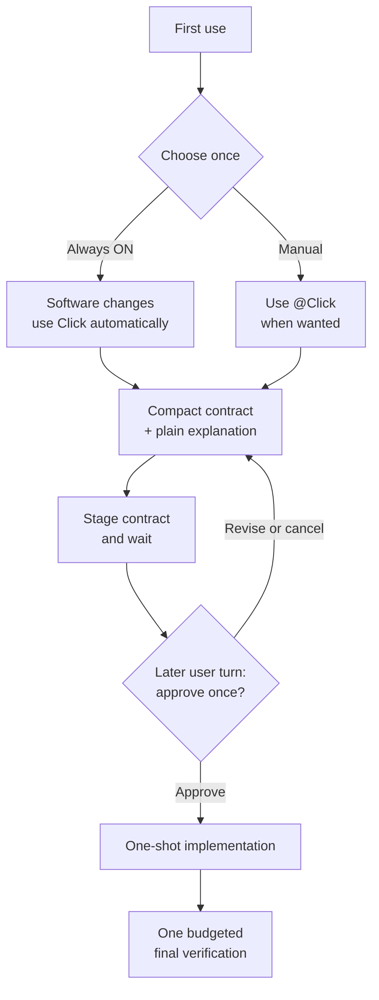

# Click

English | [한국어](README.ko.md)

[](https://github.com/grapefruit0205/click/actions/workflows/ci.yml)
[](LICENSE)

> Approve the boundary once. Build without replanning. Verify once.

Click is a Codex plugin for people tired of capable models repeatedly planning, rereading, rescanning, and over-verifying software work. On first use, choose **Always ON (recommended)** or **Manual**. Always ON applies Click automatically to software creation, modification, deletion, refactoring, and repair. Manual applies it only when you mention `@Click`.

For a change, Click reads the narrowest relevant repository context, translates the request into one compact execution contract, explains the same meaning plainly, and asks for one approval before editing. After approval it implements inside that boundary in one shot. During active work, versioned argv-based `inspect`, `mutate`, and `verify` runners make supported command intent explicit and execute it without a shell. The Hook blocks observable rereading, rescanning, replanning, and out-of-budget verification loops while leaving necessary in-scope implementation choices open.

Questions, explanations, and simple read-only inspection remain normal in Always ON mode. Code review also needs no build contract or approval; Click instead applies a read-only anti-loop guard that allows initial evidence gathering but blocks repeated successful structured reads and repeat repository-wide inventory.

Click is not an architecture-pattern picker or a full specification system. You do not need to choose “modular monolith,” “event-driven,” “batch,” or “functional” up front. Click derives the smallest design language that the requested behavior and existing system actually need.

## Quick start

```bash
codex plugin marketplace add grapefruit0205/click
codex plugin add click@click
```

Restart the ChatGPT desktop app, inspect and trust the included Click Hook, then start a new task. Before the first code-changing request, Click asks once:

```text
Use Always ON for future software changes (recommended), or Manual only when I mention @Click?
```

Choose Always ON for the default experience. Choose Manual if you prefer explicit invocation:

```text
@Click Add order cancellation. Prevent duplicate refunds and preserve the existing API.
```

You can later say “Set Click to Always ON,” “Set Click to Manual,” or “Skip Click for this task.” The first two preferences persist outside the target repository; the last bypass applies only to the current turn. Click does not place preference or contract files in your project.

<details>
<summary>Upgrading from Build Brief or an older Click installation</summary>

For `click@build-brief` 0.9.0:

```bash
codex plugin remove click@build-brief
codex plugin marketplace remove build-brief
codex plugin marketplace add grapefruit0205/click
codex plugin add click@click
```

For Build Brief 0.8, replace the first command with `codex plugin remove build-brief@build-brief`.

</details>

## How it works



The initial request is not approval of an unseen design. Click first stages and shows both the developer contract and the easy explanation, then stops. The Hook records `staged_turn_id`, rejects pass or a second stage in that same `UserPromptSubmit` turn, and accepts the exact contract only from a later user turn. You may revise or cancel the proposal there. Once you approve it, Click records `approved_turn_id`, keeps the semantic contract fixed, and implements without asking you to approve another plan. This proves that another user response occurred; the Skill still interprets whether that response actually means approval because the Hook does not classify natural-language consent.

Only a real change to the approved result, boundary, must-hold behavior, or verification commitment requires stopping. Necessary files, libraries, tools, services, and implementation tactics inside the approved boundary do not require a replacement contract.

When final verification passes for the current code revision, the next change request can stage a fresh contract normally. Verification that has not run, is running, failed, or became stale after another mutation does not unlock replacement. The new contract starts with clean inspection, mutation, and verification state and needs its own approval; no `bypass` or manual state deletion is required.

## Example: from request to approval

Given this request:

```text
@Click Add order cancellation. Prevent duplicate refunds and preserve the existing API.
```

Click may present a compact contract like this before touching code:

```json
{
  "outcome": "An eligible order can be cancelled through the existing API and receives at most one refund.",
  "boundary": {
    "in_scope": ["the current cancellation and refund path"],
    "out_of_scope": ["new payment providers", "unrelated order-state cleanup"]
  },
  "must_hold": [
    "Concurrent or repeated requests cannot create a second refund.",
    "Existing request fields, response fields, and status meanings remain compatible.",
    "A payment-provider failure must not leave the order marked as refunded."
  ],
  "build": {
    "approach": [
      "Reuse the current cancellation path, add an idempotent refund record, and make the refund state transition atomic."
    ],
    "semantics": [
      "The refund result is recorded once and repeated requests return the recorded result."
    ]
  },
  "verification": {
    "scale": "full",
    "done_when": [
      "Cancellation tests cover success, duplicate, concurrent, and provider-failure cases.",
      "The existing API regression suite still passes."
    ]
  },
  "plain_language": "Customers can cancel an eligible order, but retries or simultaneous requests cannot refund it twice. The public API stays the same, and a failed payment call cannot falsely complete the refund. Because this touches payments and concurrency, Click recommends full verification."
}
```

Click then asks one question: approve this contract and its verification scale, revise it, or cancel? Approval authorizes the developer meaning in the contract—not merely the easy summary—and starts implementation.

The exact design is repository-dependent. The example shows the contract shape, not a universal refund architecture.

## The compact contract

| Field | What it fixes |
| --- | --- |
| `outcome` | The concrete result and user-visible behavior |
| `boundary` | What may change and what stays outside the work |
| `must_hold` | Observable safety, compatibility, and correctness promises |
| `build` | The smallest repository-aware implementation route |
| `verification` | One risk-based scale and the evidence that means done |
| `plain_language` | The same contract explained for a non-specialist |

`build.semantics`, `build.order`, and `verification.intermediate_gate` appear only when state meaning, safe ordering, or an irreversible boundary makes them necessary. Click does not mirror the same work into separate phases, steps, tasks, and plans.

The contract locks the result and its boundaries. It does not lock every low-level implementation choice. This is how Click stays small without forcing reapproval whenever the implementation needs an in-scope dependency, file, or tool.

## Always ON without getting in the way

| Request | Always ON behavior |
| --- | --- |
| Create, change, delete, refactor, or repair software | Show one compact contract and plain explanation, then wait for one approval |
| Code review without fixes | No build contract or approval; use the read-only anti-loop guard |
| Question or explanation | Answer normally |
| Simple read-only lookup | Inspect normally without creating an observation ledger |
| User explicitly opts out | Bypass Click for that turn only |

During code review, Click permits one useful repository-wide inventory when needed. After a successful inventory it requires narrower inspection, blocks an identical successful read or search, rejects plan-tool churn, and prevents project mutation while the review guard is active. A later request to fix findings starts a separate compact build contract.

Simple recognized direct reads remain convenient. For ambiguous or tracked work, Click uses `click-gate inspect` with a program-and-arguments array instead of guessing from a shell string. The review guard covers supported local Hook paths; it does not deduplicate hidden reasoning, hosted search, unmatched connectors, or custom wrappers.

## Implementation without loops

Across staging, review, implementation, and verification, the Hook enforces these observable rules:

| Guard | What happens |
| --- | --- |
| Reuse evidence | An identical structured read or search that already succeeded is blocked until an in-scope mutation makes the evidence stale. |
| No parallel planning | Matched `update_plan` calls are rejected while the workflow is armed, staged, approved but incomplete, or in review—even from a later turn. Bypass or current-revision completion releases ordinary later planning. |
| No full inventory reset | Root-level inventory such as `rg --files`, `find .`, recursive root listings, and equivalent Git inventory scans are rejected; path-scoped inspection remains available. |
| Make command intent explicit | Ambiguous active Bash is rejected with guidance to use structured `inspect` for reading, `mutate` for implementation, or `verify` for final checks. |
| Keep checks in budget | Final checks must run through the structured `click-gate verify` batch and fit the approved scale. |
| Separate proposal from approval | Same-turn pass and same-turn replacement staging are rejected; the exact digest can pass only after a later `UserPromptSubmit`. |

A failed observation or one whose output exceeds 48,000 bytes gets one unchanged retry. A source mutation resets successful observation evidence because the code may have changed. Hook state changes use a cross-platform lock so parallel result recording does not strand a false “running” observation. The Hook stores request digests and non-content metadata, not command bodies or output.

These are tool-level guardrails, not a reasoning-token cap or operating-system sandbox. The Hook cannot inspect hidden reasoning, detect a plan written only in prose, observe unmatched connectors or hosted tools, prove semantic boundary compliance, or stop allowed custom code from hiding several operations.

### Structured capabilities

Each capability uses protocol version `1` and separates the executable from every argument. Accepted argv arrays run with `shell=False`, so pipelines, redirections, command substitutions, and shell wrappers cannot be hidden in the request.

```text
click-gate inspect '{"version":1,"commands":[["git","status","--short"],["sed","-n","1,160p","src/app.py"]]}'
click-gate mutate '{"version":1,"argv":["python3","scripts/generate.py","--target","src"]}'
```

`inspect` accepts only the Hook's bounded read-only operations. `mutate` requires the exact approved contract and marks prior evidence stale. Ordinary canonical edit tools such as `apply_patch`, `Edit`, and `Write` remain supported mutations without a shell envelope. Malformed requests and shell interpreters fail closed. See [the capability protocol](skills/click/references/capability-protocol.md) for the exact schemas and enforcement boundary.

## Automatic verification budget

Click chooses the smallest sufficient scale from the current risk and repository evidence. The user approves it as part of the contract; there is no second budget prompt.

| Scale | Typical use | Automatic ceiling |
| --- | --- | ---: |
| `quick` | Small, local, reversible change | 1 unit |
| `focused` | Ordinary bounded feature or repair | 4 units |
| `full` | Payments, auth, deletion, migrations, public contracts, or cross-boundary concurrency | 10 units |

A `targeted` check costs 1 unit, a `broad` check costs 3, and a `deep` check costs 5. The submitted value is not trusted as the cost: the Hook infers a minimum class from each recognized argv and automatically raises an underdeclared check before calculating the total. These values are ceilings, not targets.

Click submits one explicit argv check per entry to:

```text
click-gate verify '{"version":1,"checks":[{"argv":["python3","-m","unittest","discover","-s","tests","-q"],"class":"broad"},{"argv":["git","diff","--check"],"class":"targeted"}]}'
```

The Hook validates and normalizes the submitted classes, executes the accepted final batch without a shell, and records the real exit codes. For Python, only explicit `python -m pytest`, `python -m unittest`, and `python -m coverage` runners qualify; Python `-c` and direct Python scripts are rejected as verification. Legacy shell-string `commands` batches are rejected with migration guidance. A failed batch may be retried once unchanged for a transient failure; after that, an in-scope mutation is required. A later mutation makes an earlier success stale and permits the same batch again.

In a Git worktree, the runner snapshots tracked content and any pre-existing untracked content before the batch. If protected content changes, the batch fails stale and advances the mutation revision instead of recording false success. Newly created untracked test artifacts are not protected, which avoids treating ordinary caches and generated test output as source mutation. Outside Git this content-diff guard is unavailable; argv validation, shell-free execution, and revision state still apply.

Minimum-class inference closes simple underdeclaration. An unknown verification-like wrapper name is charged conservatively as `deep`, and an unrecognized command is rejected, but an allowed program can still conceal expensive work internally. This is not a security or resource sandbox and does not prove that the chosen tests are semantically sufficient.

## Minimum design still protects the important parts

Minimum design removes ceremony, not necessary safeguards.

| Concern | What the contract preserves when relevant |
| --- | --- |
| Concurrency | Race behavior, duplicate execution, idempotency |
| State | Valid transitions, persistence points, ownership |
| Failure | Partial failure, retry, recovery, external errors |
| Security | Authentication, authorization, secrets, privacy boundaries |
| Compatibility | Existing API, data, statuses, and user-visible behavior |

Material conditions belong in `must_hold`; concrete state or failure meaning belongs in optional `build.semantics`; observable proof belongs in `verification.done_when`. The Hook protects contract shape, approval order, digest equality, visible loops, and visible verification breadth. It does not prove that the implementation is architecturally correct or semantically faithful by itself.

More precisely, Click does not semantically decide whether a new microservice, queue, or abstraction is overdesign. The Skill and semantic grader prefer the smallest evidence-backed design; the Hook blocks the repeated planning, whole-repository rediscovery, and repeated-verification loops that often produce design expansion. Product claims are limited to that observable enforcement boundary.

## Who Click is for

Click targets two groups:

- users of high-capability models who are tired of repeated planning, repository exploration, and excessive verification;
- people building MVPs, internal tools, automations, and clearly bounded features who want minimum design followed by continuous implementation.

It is especially useful for:

- a brownfield feature that must preserve an existing API;
- idempotency, concurrency, state transitions, or failure recovery;
- a migration or other high-impact change with a clear safe boundary;
- a handoff where another person or agent must implement the same meaning;
- an MVP, internal tool, or automation where you want minimum planning followed by continuous implementation.

Manual mode or a per-turn bypass is usually better for tiny, obvious, reversible, or exploratory changes where no durable approval boundary is useful. For legal, regulated, security-critical, or operationally irreversible work, Click does not replace expert review, authorization, or deployment controls.

## Evidence and honest limits

The v0.15.0 source release passes 112 deterministic tests locally. They cover persistent out-of-repository mode selection, per-prompt routing context, Manual fail-open behavior, Always ON mutation gating, code-review anti-loop behavior, compact-contract validation, distinct-turn approval, completed-contract rollover, active-lifecycle plan blocking, minimum verification-class inference, Python verification restrictions, Git protected-content mutation detection, versioned inspect/mutate/verify requests, shell-free argv execution, state locking and abandoned-runner recovery, retry state, content-free Hook state, A/B metric mechanics, semantic-grader mechanics, and repository policy. Cross-platform CI is configured for Linux, macOS, and Windows.

The repository also includes version-14 golden cases, a semantic grader, and an A/B runner configured for six pinned self-hosted tasks, three conditions, five shuffled repetitions per condition, and `gpt-5.6-sol` at `max` reasoning effort. It reports correctness, tokens, elapsed time, completed tool items, duplicate successful commands, repeated root inventory, plan items, verification commands, distributions, and paired deltas against no-plugin baselines. Those 90 condition trials are intentionally **not run during installation or CI** because they consume paid model time.

This is evaluation infrastructure, not a benchmark result. Until those trials are run, human-calibrated, and then repeated on several unrelated real repositories, Click does not claim that it improves success rate, accuracy, time, token use, or overdesign across projects. The checked-in v0.5.0 single-run pilot remains historical failure evidence, not evidence for v0.15.0.

Click is not claimed to be the first or only workflow in this area. It overlaps with spec-driven, autonomous-loop, and approval-gated tools; its deliberately narrow emphasis is one persistent choice, one compact contract, one approval, one-shot implementation, observable anti-loop guards, and one final verification budget.

A ready-to-edit launch post for developer communities is available in [COMMUNITY_POSTS.md](COMMUNITY_POSTS.md).

<details>
<summary>Repository structure and local validation</summary>

```text
.codex-plugin/plugin.json             Plugin manifest
.agents/plugins/marketplace.json      GitHub marketplace entry
skills/click/                         One-shot design-and-build Skill
skills/click/references/modes.md      Persistent mode and code-review behavior
skills/click/references/capability-protocol.md  Structured runner schemas
skills/fix/                           Compact repair Skill
hooks/click_gate.py                   Contract, capability, anti-loop, and budget guard
hooks/hooks.json                      Lifecycle Hook configuration
evals/                                Golden cases, A/B runner, semantic grader
tests/                                Deterministic Hook, grader, and policy tests
COMMUNITY_POSTS.md                    Ready-to-edit English and Korean launch posts
LICENSE                               MIT License
```

```bash
python3 /path/to/skill-creator/scripts/quick_validate.py skills/click
python3 /path/to/skill-creator/scripts/quick_validate.py skills/fix
python3 /path/to/plugin-creator/scripts/validate_plugin.py .
python3 -m unittest discover -s tests -v
```

The A/B runner refuses to start model calls unless the operator adds the explicit paid-run acknowledgement:

```bash
python3 evals/run_ab.py --results /path/to/results --execute-paid-runs
```

</details>

<details>
<summary>Related approaches</summary>

| Project | Overlap | Click's narrower emphasis |
| --- | --- | --- |
| [GitHub Spec Kit](https://github.com/github/spec-kit) | Specification, planning, tasks, implementation | One compact contract and one approval instead of a persistent multi-command specification process |
| [OpenSpec](https://github.com/Fission-AI/OpenSpec) | Agreement before AI-assisted coding | No project-local specification store; the Hook keeps only a digest outside the target repository |
| [Kiro Specs](https://kiro.dev/docs/cli/v3/specs/) | Requirements, design, tasks, verified execution | One complete contract review followed by one-shot implementation |
| [Agentic SDLC Codex Plugin](https://github.com/aantenore/agentic-sdlc-codex-plugin) | Hash-bound proposals and approval | A smaller pre-code boundary rather than broader SDLC governance |

This is a bounded comparison, not an exhaustive novelty search.

</details>

## License

Click is released under the [MIT License](LICENSE).
