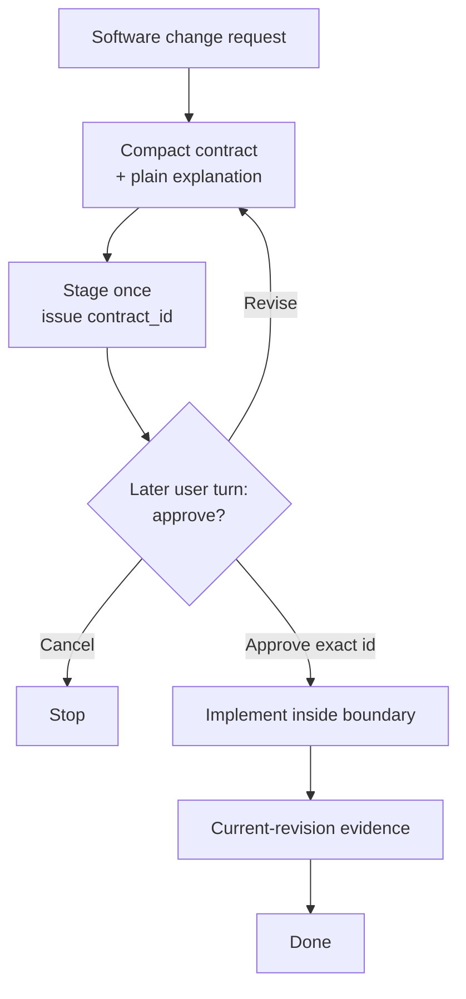

# Click — Hook-enforced workflow for Codex coding agents

English | [한국어](README.ko.md) | [简体中文](README.zh-CN.md)

Community: [LINUX DO](https://linux.do/)

[](https://github.com/grapefruit0205/click/actions/workflows/ci.yml)
[](LICENSE)

### Prompt-only coding workflows are over.

> **Prompts can suggest behavior. Hooks can enforce the workflow.**

**Click is a Codex plugin that turns a software-change request into one compact contract, then uses a persistent Hook state machine to keep the observable execution path inside the boundary you approved.**

Most coding-agent workflows still rely on the model remembering instructions such as:

```text
Plan once.
Stay in scope.
Do not rescan the repository.
Do not keep rewriting the plan.
Run only the checks that are actually needed.
```

That works until context grows, the task branches, or the agent decides to plan and prove the same thing again.

Click moves authority and evidence guarantees into the supported tool boundary.
Exploration preferences remain non-blocking guidance there; they do not become
execution authority.

```text
request
   ↓
compact contract
   ↓
Later user turn approval
   ↓
implementation
   ↓
current-revision evidence
   ↓
done
```

> **The model decides how to implement the change. The Hook decides whether the workflow is allowed to move forward.**

**One contract. One approval. One implementation boundary. One evidence set.**

## Core purpose

> **Click binds AI execution to approved intent and returns verifiable evidence.**

Click's stable product boundary is an authorization-and-evidence runtime, not a
model workflow optimizer. The canonical admission test and policy layers are in
the [Click Product Constitution](PRODUCT_CONSTITUTION.md); the current guard
inventory and migration status are in [Click Guard Classification](GUARD_CLASSIFICATION.md).

Click keeps authority and evidence integrity as hard runtime guarantees while
treating model workflow strategy as non-authoritative guidance. In particular,
`update_plan` remains available: it cannot approve, replace, or widen the active
contract, and it does not change the contract digest or evidence state.

## Why Click?

A prompt can tell an agent what it *should* do. Click adds persistent state around what the agent is *allowed* to do on the observable tool path.

| Prompt-only workflow | Click |
| --- | --- |
| Hope the model remembers the plan | Persist the approved workflow state |
| Hope approval happens at the right time | Stage a digest-bound `contract_id` and require a later user turn |
| Ask the agent not to rescan | Offer non-blocking narrowing guidance; inventory count does not alter authority |
| Ask the agent not to replan | Offer non-blocking guidance; `update_plan` cannot alter contract authority |
| Ask the agent not to rerun proof | Reuse current structured evidence and receipts |
| Let verification drift away from the task | Bind each completion condition to revision-bound evidence and exact receipts |
| Stop when the agent says it is done | Require declared evidence to be current for the latest mutation revision |

The core idea is simple:

> **Do not keep asking the coding agent to remember the process. Put the process in the execution boundary.**

## What the Hook actually enforces

During staging, implementation, review, and verification, Click can enforce these **observable workflow rules**:

- **Proposal and approval are separate.** Staging emits an opaque `contract_id`; the same user turn cannot both stage and pass it.
- **Mutation waits for approval.** An active contract remains locked until the exact staged ID is approved and passed.
- **Planning stays advisory.** Plan tools such as `update_plan` remain available and cannot approve, replace, or widen the active contract.
- **Repository exploration stays advisory.** A distinct-digest broad inventory remains available with narrowing guidance even while another broad inventory is running or after one succeeds; only active runner and execution interlocks remain hard.
- **Repeated observations stay available.** A fresh identical structured read/search receives reuse guidance and a new one-use runner; it is not confused with replay of a consumed runner token.
- **Verification is evidence-bound.** Local checks name the approved `evidence_id` they prove. Click binds their exact execution receipts without scoring whether the model's chosen verification breadth is sufficient.
- **Completion follows the code.** A mutation advances the revision and makes older completion evidence stale rather than silently reusing it.
- **Local server lifecycle is owned.** Recognized development servers use Click's managed service path so the exact isolated child can be cleaned up.

The Hook controls the **observable tool path**. It does not inspect hidden reasoning, prove semantic correctness by itself, or act as an operating-system sandbox.

## The compact contract

Click turns the request and relevant repository context into one small execution contract:

| Field | What it fixes |
| --- | --- |
| `outcome` | The concrete result and user-visible behavior |
| `boundary` | What may change and what stays outside the work |
| `must_hold` | Observable safety, compatibility, and correctness promises |
| `build` | The smallest repository-aware implementation route |
| `verification` | One risk-based scale and the evidence that means done |
| `plain_language` | The same contract explained for a non-specialist |

The contract locks the **meaning, boundary, and completion commitment**. It does not freeze every file, dependency, library, or low-level implementation choice.

If the agent discovers that an in-scope file, tool, or dependency is necessary, it can still use it. Reapproval is needed only when the approved outcome, boundary, must-hold behavior, or verification commitment materially changes.

## How it works



The initial request is **not** approval of an unseen design. Click stages the canonical contract once, receives an opaque `contract_id`, shows the contract, and stops. The next approval passes only that ID, not the JSON again.

When every declared evidence source is current for the latest mutation revision and no managed service remains active, the contract is complete and the next change can start from clean workflow state.

## Quick start

```bash
codex plugin marketplace add grapefruit0205/click
codex plugin add click@click
```

Restart the ChatGPT desktop app, inspect and trust the included Click Hook, then start a new task.

On first use, choose **Always ON** to apply Click to software changes by default, or **Manual** to activate it only when you mention `@Click`.

```text
@Click Add order cancellation.
Prevent duplicate refunds and preserve the existing API.
```

You can later say “Set Click to Always ON” or “Set Click to Manual.” A one-turn `@Click bypass` and `@Click cancel` are also available for explicit control.

## Example contract

For the cancellation request above, repository evidence might produce a contract like this:

```json
{
  "outcome": "An eligible order can be cancelled through the existing API and receives at most one refund.",
  "boundary": {
    "in_scope": ["the current cancellation and refund path"],
    "out_of_scope": ["new payment providers", "unrelated order-state cleanup"]
  },
  "must_hold": [
    "Concurrent or repeated requests cannot create a second refund.",
    "Existing request fields, response fields, and status meanings remain compatible."
  ],
  "build": {
    "approach": ["Reuse the current cancellation path and make the refund transition idempotent and atomic."]
  },
  "verification": {
    "scale": "full",
    "evidence": [
      {"id": "E1", "kind": "argv", "description": "cancellation and duplicate-refund tests", "dependencies": ["src/orders/", "tests/test_cancellation.py"]},
      {"id": "E2", "kind": "argv", "description": "existing API regression tests"}
    ],
    "done_when": [
      {"condition": "Refund behavior is correct.", "primary_evidence": "E1"},
      {"condition": "The public API remains compatible.", "primary_evidence": "E2"}
    ]
  },
  "plain_language": "Customers can cancel an eligible order, but retries or simultaneous requests cannot refund it twice. Existing API compatibility is preserved."
}
```

The exact design is repository-dependent. The example shows the contract shape, not a universal refund architecture.

## Evidence-driven anti-loop behavior

| Guard | Behavior |
| --- | --- |
| Advise on repeated observations | A fresh identical structured read/search remains available through a new one-use runner; prior success or repeated failure adds guidance, while an active same-digest reservation remains blocked |
| Advise without gating plans | `update_plan` remains available; its output cannot stage, approve, replace, or widen a contract |
| Advise after broad inventory | Distinct broad requests remain available with narrowing guidance; an active exact-digest runner retains its separate state interlock |
| Advise on ordinary argv retries | A fixed failure count does not block a fresh verification retry; verification that changed protected repository content still requires an approved mutation |
| Make command intent explicit | Ambiguous active shell work is replaced by structured `inspect`, `mutate`, `service`, or `verify` paths |
| Keep verification strategy non-authoritative | The model chooses evidence and `argv`; Click binds exact check-group digests and observed results to receipts |
| Bind known host coverage | Verification receipts include the current Codex or Antigravity known-surface digest, so reuse cannot silently cross hosts or Hook coverage revisions |
| Reuse dependency-safe evidence | An approval-bound dependency declaration or committed repository mapping can carry an exact success across revisions only while its resolved files, check, environment, executable, and approved mutation snapshot still match |
| Track completion by source | All declared sources must be current; no placeholder local check is invented when no `argv` source exists |
| Advise on Browser workflow repetition | Fresh normalized Browser repeats, retries, and long timed interactions remain allowed with guidance; assigned-source, serial-call, tool-result, revision, and completion-replay checks remain hard |

## Advisory verification profiles

Before approval, the Skill or model recommends the smallest sufficient verification profile from the current risk and repository evidence. The profile is a qualitative statement of intended depth and remains digest-bound so the approved contract is represented faithfully. During execution the model chooses the concrete `argv`; Click binds the exact check-group digest, revision, environment, executable fingerprint, known host coverage identity, and observed result to the receipt. The Hook does not infer verification sufficiency or turn a plugin-authored numeric spectrum into authority or advice.

| Profile | Typical use |
| --- | --- |
| `quick` | Small, local, reversible change |
| `focused` | Ordinary bounded feature or repair |
| `full` | Payments, auth, deletion, migrations, public contracts, or cross-boundary concurrency |

Legacy class-unit fields remain readable for persisted-state and direct-caller compatibility, but they are not receipt evidence and produce no runtime guidance. A numeric verification budget should be enforced only when a user or repository explicitly owns that policy.

Evidence may come from local `argv` checks or explicitly declared Browser, hosted, manual, or existing sources. An `argv` source completes only through the real success of its linked local runner. Non-argv completion is an explicit attestation; the Hook records the approved source identity and current revision but does not independently prove unmatched external or manual work.

An `argv` evidence source may optionally declare deterministic repository-relative `dependencies`. The model proposes them before staging, so approval binds them into the contract digest; uncertain sources omit the field and rerun normally. `*` stays within one path segment, `**` crosses directories only as a complete segment, and a trailing slash selects a directory prefix. A committed `.click/evidence-dependencies.json` can supply exact argv-to-path mappings. Click records the resolved file list, supports repository-internal relative symlinks, invalidates only a changed relevant mapping rather than every unrelated manifest entry, and reruns after missing mutation receipts or out-of-bound workspace drift.

## Structured capabilities

Click separates executables from arguments and uses structured capability paths:

```text
click-gate inspect '{"version":1,"commands":[["git","status","--short"],["sed","-n","1,160p","src/app.py"]]}'
click-gate mutate '{"version":1,"argv":["python3","scripts/generate.py","--target","src"]}'
click-gate service '{"version":1,"action":"start","argv":["python3","-m","http.server","4173","--bind","127.0.0.1"]}'
click-gate service '{"version":1,"action":"stop"}'
click-gate evidence '{"version":1,"evidence_id":"E-browser"}'
click-gate verify '{"version":2,"checks":[{"evidence_id":"E1","argv":["python3","-m","pytest","tests/test_cancellation.py"],"class":"targeted"}]}'
```

Recognized reads are constrained by the Hook's read-only capability policy. Exact schemas, trusted executable rules, shell-free execution details, snapshots, claims, and process boundaries live in the [capability protocol](skills/click/references/capability-protocol.md).

Click is a **workflow guardrail**, not an OS security sandbox.

## Google Antigravity adapter — experimental

The repository also builds a self-contained Google Antigravity plugin that shares Click's contract state machine, evidence ledger, verification receipts, and shell-free runners.

```bash
python3 scripts/build_antigravity_distribution.py
agy plugin install ./dist/antigravity
```

Antigravity IDE users may also copy `dist/antigravity` into `.agents/plugins/click` for one workspace or `~/.gemini/config/plugins/click` globally.

Antigravity's Hook contract differs from Codex. Native file/search and unrelated MCP or Skill tools remain available, but cross-tool deduplication and Browser evidence are not currently supported. See [`platforms/antigravity/README.md`](platforms/antigravity/README.md) for the exact limits.

## Update an existing installation — v0.31.0

The current release is **v0.31.0**.

```bash
codex plugin marketplace upgrade click
codex plugin add click@click
```

Restart the ChatGPT desktop app and review/trust the updated Hook. v0.31.0 adds opt-in dependency-aware evidence reuse across approved revisions. Reuse is allowed only when the approved dependency set, exact check, environment, executable, and mutation receipt still match; otherwise Click runs the check again. Begin a fresh contract after upgrading instead of reusing a pending runner from an older installation.

Detailed release history is in [RELEASE_NOTES.md](RELEASE_NOTES.md).

## Honest limits

Click makes strong claims only where the Hook can observe and enforce behavior.

Its host coverage receipt is explicitly `known-surfaces-only`: it detects a
host or registered Hook-surface change, but cannot manufacture events the host
never dispatches.

It does **not** claim that the Hook can:

- inspect hidden reasoning or a plan written only in prose;
- observe every unmatched connector or hosted tool;
- enforce a host execution path when the Codex client does not dispatch the matching Hook event;
- independently prove semantic boundary compliance or architectural correctness;
- prove that an unmatched manual or external attestation truly occurred;
- stop allowed custom code from hiding multiple operations;
- replace expert review, authorization, deployment controls, or an OS sandbox.

The repository's deterministic suite tests the observable Hook and contract behavior across Linux, macOS, and Windows. Click does not claim project-wide improvements in success rate, accuracy, time, token use, or overdesign without independent measurements on unrelated real repositories.

## Related approaches

Click overlaps with spec-driven, autonomous-loop, and approval-gated tools, but deliberately stays narrow: **one compact contract, one approval, one implementation boundary, observable anti-loop guards, and one bounded evidence commitment.**

See [COMMUNITY_POSTS.md](COMMUNITY_POSTS.md) for ready-to-edit launch copy.

## License

Click is released under the [MIT License](LICENSE).
