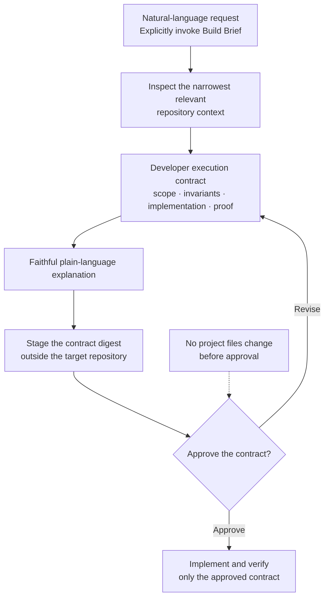

# Build Brief

English | [한국어](README.ko.md)

[](https://github.com/grapefruit0205/build-brief/actions/workflows/ci.yml)
[](LICENSE)

Build Brief is an explicitly invoked Codex plugin that turns a software request and the relevant repository context into a complete, approval-bound developer execution contract. It creates the developer contract first, translates the same meaning into plain language, asks for approval, and then implements only what was approved.

It is not an architecture-pattern picker. Users do not have to choose “modular monolith,” “microservices,” “event-driven,” “batch,” or “functional.” Build Brief derives whatever software-design language the actual behavior and codebase require, then maps that meaning into executable work.

## Why use it if an LLM can already design software?

Strong coding models already infer design from natural language. Build Brief does not add intelligence to the model. It makes the model's implicit reasoning visible, reviewable, reusable, and approval-bound when requirements, invariants, compatibility, failure behavior, or handoffs matter.

Natural language remains the default. Use Build Brief only when you want to inspect and approve the complete design-and-execution meaning before code changes.

Codex can load a Skill when its metadata matches a request or when the user invokes it directly. Build Brief deliberately accepts only direct selection so it does not turn ordinary coding into an unwanted approval gate. See the official [OpenAI Skills documentation](https://developers.openai.com/plugins/concepts/skills).

## Is it worth using?

Build Brief has a credible use case, but its quality benefit is not yet proven by post-v0.8 behavioral A/B results. Treat the current release as an experimental approval guardrail, not as a claim that every task becomes better when wrapped in a design process.

The value equation is simple: use it when the expected cost of misunderstood scope or an invisible design assumption is greater than the cost of one contract review.

| It is a good candidate when... | Prefer ordinary natural-language coding when... |
| --- | --- |
| A brownfield change must preserve compatibility, data ownership, idempotency, concurrency, migration, or failure behavior | The change is small, local, reversible, and already unambiguous |
| A non-specialist needs to approve the same meaning that a developer or agent will execute | You do not need to inspect the design before the model implements it |
| Work will be handed between people, models, or sessions and implicit assumptions would be costly | You are exploring a disposable prototype and expect the direction to change rapidly |
| Scope drift or speculative architecture has caused rework before | The extra review, tokens, and latency cost more than a likely misunderstanding |

### Evidence status

Verified for v0.8.0:

- The repository encodes explicit-only activation, fail-open uninvoked behavior, complete contract fields, staged-versus-passed digest equality, opt-out, and optional strict mode.
- Thirty-four deterministic tests cover the Hook, grader, and repository policy. The release passed the public [Linux, macOS, and Windows CI run](https://github.com/grapefruit0205/build-brief/actions/runs/33041589014).
- The semantic scorer can reject missing execution fields, premature implementation, explanation mismatch, unapproved scope, and unjustified design additions after a model or human supplies the semantic judgment.

Not established yet:

- Whether Build Brief improves implementation success, reduces missed invariants, or reduces overdesign across real projects.
- Whether any quality gain outweighs its additional tokens, latency, and approval step.
- Adoption, retention, or user-satisfaction evidence.

The included golden cases and A/B harness are evaluation infrastructure, not product-performance results.

## How it works



Once Build Brief is explicitly selected, wording does not change the workflow. “Design it,” “build it,” “implement it,” “do it,” `설계해줘`, `구현해줘`, and equivalent expressions in other languages all produce the same complete contract. A question about Build Brief is not an invocation, and Build Brief never activates merely because a task is large or architectural.

## One contract, two views

The authoritative developer execution contract contains:

| Field | Purpose |
| --- | --- |
| `boundary` | Existing component, data owner, or external contract that owns the behavior |
| `invariants` | Observable requirements that must remain true |
| `system_semantics` | Material state, ownership, flow, timing, concurrency, consistency, failure, security, compatibility, migration, and operational meaning |
| `plan` | Approved goal, scope, non-goals, and top-down approach |
| `implementation` | Concrete design mapped onto current code and system boundaries |
| `phases` | Proportional implementation checkpoints |
| `steps` | Ordered changes inside the phases |
| `tasks` | Concrete approved code, test, configuration, schema, or documentation units |
| `execution_order` | Dependency and safe-sequencing constraints |
| `minimality` | Existing structure to reuse and evidence for every material addition |
| `proof` | Acceptance criteria and focused verification |

`plain_language` is a faithful easy explanation of that complete contract. It cannot add a decision absent from the developer contract or hide an invariant, compatibility promise, failure behavior, implementation element, task, or execution constraint.

The six execution fields are required but must remain distinct and proportional. A small change may use one concise item per field. Field presence is not permission to inflate a one-file edit into a project.

## Approval is a real boundary

- The original request is not approval of a contract that has not been shown yet.
- Build Brief shows the developer contract first, then its easy translation, and asks whether to approve, revise, simplify, or cancel.
- The Hook records a digest of the staged contract, not its plaintext, outside the target repository.
- After approval, the Hook accepts only the identical staged contract.
- Implementation must stay inside the approved behavior, scope, architecture, dependencies, schemas, public contracts, failure semantics, tasks, and execution constraints.
- A material change requires a revised contract, a regenerated easy explanation, and new approval before more mutation.
- Low-level reversible choices already contained by the approved boundary and tasks do not require another approval.

The Hook enforces structure, ordering, and staged-versus-passed equality. It cannot prove that a design is correct, that a human genuinely approved it, or that every code change semantically matches the contract. The Skill, repository evidence, focused verification, semantic grader, and user review cover those boundaries.

## Minimum-sufficient design

Required behavior and invariants are the correctness gate. Among candidates that satisfy them, Build Brief chooses the smallest justified design delta and maximizes reuse of the current system.

A new deployable unit, store, queue or asynchronous boundary, public contract, framework or dependency, abstraction layer, configuration surface, or operational component needs all four:

1. a current requirement or repository fact;
2. evidence that the existing structure is insufficient;
3. the concrete failure the addition prevents;
4. focused proof.

Hypothetical scale, future reuse, imagined teams, and fashionable vocabulary are not evidence. Necessary concurrency, safety, compatibility, and failure handling are not overdesign merely because they add code.

## Example

Input:

```text
$build-brief Design and implement order cancellation. Prevent duplicate refunds and preserve the existing API.
```

Build Brief first traces the existing cancellation, refund persistence, payment adapter, and API contract. It then produces a top-down contract whose invariants preserve API behavior and prevent a second refund under retries or concurrent cancellation; whose implementation, phases, steps, tasks, plan, and execution order map that meaning onto the current system; and whose proof covers compatibility, retries, concurrency, and failure behavior.

It then explains the same result plainly, for example: “Cancellation will continue through the current API. Retrying or sending the same cancellation at the same time must not refund twice. We will reuse the existing order and payment paths, change only the approved cancellation and verification units, and test compatibility and duplicate-refund cases.”

It asks:

> Do you approve this execution contract? If approved, I will implement only this contract.

No project file changes before that approval.

## Installation from GitHub

You need a Codex version with plugin marketplaces and Python 3.10 or newer, available as `python3` or `py -3` on Windows.

```bash
codex plugin marketplace add grapefruit0205/build-brief
codex plugin add build-brief@build-brief
```

Restart the ChatGPT desktop app after installation. Review and trust the included Build Brief Hook when prompted; in Codex CLI, inspect it with `/hooks`. Start a new task after installation or Hook changes so Codex loads the current release.

## Usage

For ordinary work, keep using natural language without Build Brief. To use the approval workflow, select the plugin or invoke the Skill explicitly:

```text
$build-brief Add partial refunds to this legacy checkout without changing existing full refunds.
```

Build Brief inspects the relevant code, stages and shows the complete contract and easy explanation, then stops. Continue only after reviewing it:

```text
I approve this execution contract. Implement exactly what was approved.
```

If you want a contract for handoff but no coding, say so explicitly. Build Brief still creates all fields but does not mutate the project:

```text
$build-brief Create the complete execution contract and easy explanation for another developer. Do not implement it.
```

To opt out after invocation:

```text
Continue this work without Build Brief.
```

Optional strict mode applies the Gate session-wide only when the user explicitly requests it. Build Brief never enables strict mode on its own.

## Repository structure

```text
.codex-plugin/plugin.json             Plugin manifest
.agents/plugins/marketplace.json      GitHub marketplace entry
LICENSE                               MIT License
skills/build-brief/SKILL.md           Skill entry point
skills/build-brief/references/        Contract and translation guidance
hooks/hooks.json                      Codex lifecycle Hook configuration
hooks/build_brief_gate.py             Local mutation and contract-equality guard
evals/golden-prompts.yaml             Activation and semantic cases
evals/semantic_grader.py              Deterministic scorer after semantic judgment
evals/semantic-judgment.schema.json   Structured model/human judgment contract
evals/SEMANTIC_GRADER.md              Evidence-based judge guidance
tests/                                Deterministic Hook, grader, and policy tests
```

This release contains no MCP server, app connection, external API call, credential requirement, or third-party runtime dependency. Hook state lives under Codex-provided `PLUGIN_DATA`; no contract plaintext or runtime state is written into the target repository.

## Validation and evaluation

```bash
python3 /path/to/skill-creator/scripts/quick_validate.py skills/build-brief
python3 /path/to/plugin-creator/scripts/validate_plugin.py .
python3 -m unittest discover -s tests -v
```

`evals/golden-prompts.yaml` defines expected behavior; it is not a benchmark result. The bounded A/B runner compares no-plugin, explicitly invoked Skill-only, and explicitly invoked Skill-plus-Hook conditions on pinned disposable repositories. The semantic grader hard-fails missing behavior, unwanted blocking, premature implementation, explanation mismatch, missing execution fields, and changes outside the approved contract, then penalizes unjustified design delta.

The recorded v0.5.0 opt-out pilot remains historical evidence for the unwanted-blocking defect fixed in later releases. It contains one run per condition and is not a general performance claim.

## Related approaches

Yes, adjacent and overlapping tools already exist. Build Brief is not presented as the first or only spec-driven workflow.

| Project | Where it overlaps | Build Brief's narrower emphasis |
| --- | --- | --- |
| [GitHub Spec Kit](https://github.com/github/spec-kit) | Moves from specification through planning and tasks into implementation | One explicitly invoked, repository-aware execution contract and approval boundary instead of a durable multi-command specification process |
| [OpenSpec](https://github.com/Fission-AI/OpenSpec) | Adds agreement and structured artifacts before AI-assisted coding | No project-local spec store; the Hook keeps only a contract digest outside the target repository |
| [Kiro Specs](https://kiro.dev/docs/cli/v3/specs/) | Produces requirements, design, tasks, and verified execution | A Codex plugin centered on one full-contract review rather than an integrated multi-phase product workflow |
| [Spec-Driven Development Plugin](https://github.com/Habib0x0/spec-driven-plugin) | Provides requirements, design, and task workflows for Claude Code and Codex | A single developer contract paired with a faithful non-technical explanation and one approval target |
| [AI SDLC Skills](https://github.com/kevinlin/skills) | Uses spec-driven stages and human approval gates before implementation | One top-down approval of the complete execution meaning rather than an approval gate between every stage |
| [Spec-Driven Planning](https://github.com/johnnykor82/spec-driven-planning) | Adds a planning gate, scope-change protocol, and verification for long-running Codex work | Creates the approval target from natural language and repository context; it does not assume an approved specification already exists |
| [Agentic SDLC Codex Plugin](https://github.com/aantenore/agentic-sdlc-codex-plugin) | Uses hash-bound proposals, explicit approvals, and auditable execution | A broader SDLC governance workflow with separate context and proposal checkpoints; Build Brief stays a small, explicit pre-code contract flow |
| [Controlled Execution System](https://pypi.org/project/controlled-execution-system/) | Turns intent into a bounded manifest for Codex or Claude Code, then collects evidence, review, and approval | A local governance wrapper with its own project state; Build Brief is an installable Codex plugin that asks for contract approval before implementation |

This is a bounded positioning comparison, not an exhaustive novelty search. Build Brief's hypothesis is that some users want less ceremony than a persistent specification system but a stronger approval boundary than an ordinary prompt: developer language first, an equivalent easy explanation second, then approval and scope-locked execution.

## Help validate the hypothesis

The most useful contribution is reproducible evidence, not a testimonial. Open an [issue](https://github.com/grapefruit0205/build-brief/issues) with a public disposable repository, one consequential request, the model and environment, and raw results for ordinary Codex, explicitly invoked Skill-only, and Skill-plus-Hook runs. Report implementation success, missed invariants, unjustified design additions, scope fidelity, tokens, elapsed time, and tool calls.

Do not run the A/B harness against production systems or repositories containing secrets. Keep failed and unfavorable results; they are part of the evidence.

## Current limits

Explicit selection costs more time and tokens than ordinary natural-language coding because the complete contract and explanation are displayed before implementation. Build Brief therefore stays opt-in and fail-open when unused. The Hook starts a small standard-library Python process for covered local tool calls, which adds modest per-tool latency.

The Hook covers supported lifecycle mutation paths; it is an ordering guardrail, not a security sandbox. Real legal policy, production traffic, organizational practice, and other facts absent from the repository still require user input. Behavioral A/B evaluation and semantic grading improve confidence but cannot prove that an architecture is absolutely correct.

## License

Build Brief is released under the [MIT License](LICENSE).
