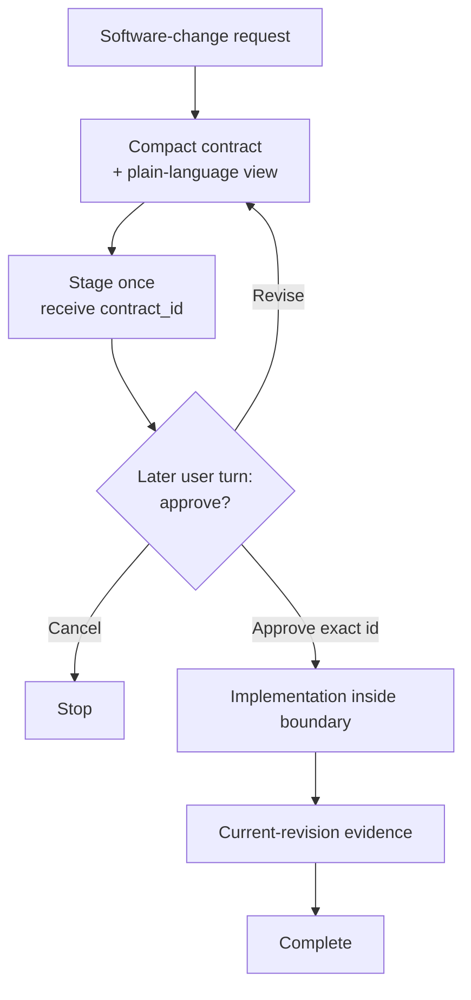

# Click — Hook-enforced workflow for Codex coding agents

English | [한국어](README.ko.md) | [简体中文](README.zh-CN.md)

Community link: [LINUX DO](https://linux.do/)

[](https://github.com/grapefruit0205/click/actions/workflows/ci.yml)
[](LICENSE)

### Prompt-only coding workflows are over.

> **Prompts can suggest behavior. Hooks can enforce the workflow.**

**Click is a Codex plugin that turns a software-change request into a compact contract, then uses a persistent Hook state machine to keep the observable execution path inside that approved boundary.**

Most coding-agent workflows still ask the model to remember rules such as:

```text
Plan once.
Stay in scope.
Do not rescan the repository.
Do not keep rewriting the plan.
Run only the checks that are actually needed.
```

That works until context grows, the task branches, or the agent decides to plan and prove the same thing again.

Click moves those workflow rules out of prompt-only convention and into the supported tool boundary.

```text
request
   ↓
compact contract
   ↓
later-turn approval
   ↓
implementation
   ↓
current-revision evidence
   ↓
done
```

> **The model decides how to implement the change. The Hook decides whether the workflow is allowed to move forward.**

**One contract. One approval. One implementation boundary. One evidence set.**

## Why Click?

A prompt can tell an agent what it should do. Click adds state for what it is currently allowed to do.

| Prompt-only workflow | Click |
| --- | --- |
| Ask the model to remember the plan | Persist the approved workflow state |
| Hope approval happens at the right time | Stage a digest-bound contract ID and require a later user turn |
| Ask the agent not to rescan | Allow the first useful broad inventory, then require narrower inspection |
| Ask it not to re-plan | Reject matched plan-tool churn while the workflow is active |
| Ask it not to rerun the same proof | Reuse current structured evidence and block duplicate successful checks |
| Let verification expand as the task grows | Bind completion evidence to an approved verification budget |
| Treat “looks done” as completion | Require declared evidence to be current for the latest mutation revision |

This is the core idea behind Click:

> **Stop asking the coding agent to remember the process. Put the process in the execution boundary.**

## What the Hook enforces

Across staging, implementation, review, and verification, Click can enforce observable workflow rules such as:

- **Proposal and approval are separate.** A staged contract receives an opaque `contract_id`; the same user turn cannot both stage and pass it.
- **Unapproved mutation stays blocked.** An active contract remains locked until the exact staged ID is approved and passed.
- **Replanning is bounded.** Matched `update_plan` calls are rejected while the Click workflow is active, except for an explicit one-turn bypass.
- **Repository rediscovery narrows.** One useful root inventory may establish context for the current revision; later broad inventories are rejected and inspection must narrow.
- **Successful structured reads are reused.** Identical successful observations are not repeated until an in-scope mutation makes them stale.
- **Verification is evidence-bound.** Local checks name the approved `evidence_id` they prove and stay inside the approved cumulative budget.
- **Completion follows the latest code.** A mutation advances the revision and makes older completion evidence stale instead of silently reusing it.
- **Managed local servers have an owner.** Recognized development servers run through Click's managed service path so their isolated child process can be cleaned up.

The Hook controls the **observable tool path**. It does not inspect hidden chain-of-thought, prove that a design is semantically correct, or act as an operating-system sandbox.

## The compact contract

Click turns the request and relevant repository context into one small execution contract:

| Field | What it fixes |
| --- | --- |
| `outcome` | The concrete result and user-visible behavior |
| `boundary` | What may change and what stays outside the work |
| `must_hold` | Observable safety, compatibility, and correctness promises |
| `build` | The smallest repository-aware implementation route |
| `verification` | One risk-based scale and the evidence that means done |
| `plain_language` | The same contract explained for a non-specialist |

The contract locks the **meaning, boundary, and completion commitment**. It does **not** freeze every file, dependency, library, or low-level implementation choice.

If the agent discovers that an in-scope dependency, file, or tool is needed, it can still use it. Reapproval is required only when the approved result, boundary, must-hold behavior, or verification commitment materially changes.

## How it works



The initial request is **not** approval of an unseen design. Click stages the canonical JSON once, receives an opaque `contract_id`, shows the contract, and stops. The Hook records the staged turn and rejects same-turn pass or replacement staging.

A later explicit approval passes only the emitted ID. The Hook matches it to the staged digest before implementation can proceed. Revising the proposal creates a new ID and invalidates the old handle.

When all declared evidence is current for the latest mutation revision and no Click-managed service remains active, the contract completes and the next change can start cleanly.

## Quick start

```bash
codex plugin marketplace add grapefruit0205/click
codex plugin add click@click
```

Restart the ChatGPT desktop app, inspect and trust the included Click Hook, then start a new task.

On first use, choose:

```text
Always ON
```

for software-changing tasks by default, or:

```text
Manual
```

to activate Click only when you mention `@Click`.

Example:

```text
@Click Add order cancellation.
Prevent duplicate refunds and preserve the existing API.
```

You can later say “Set Click to Always ON” or “Set Click to Manual.” Preferences persist outside the target repository.

To bypass Click for exactly one turn, put `@Click bypass` on the first line. To discard the active contract, use `@Click cancel`. The autocomplete `plugin://click@click` forms are also supported. These authorizations are one-turn only and are not reusable.

## Always ON without getting in the way

| Request | Always ON behavior |
| --- | --- |
| Create, change, delete, refactor, or repair software | Show one compact contract and wait for one approval |
| Code review without fixes | No build contract; use the read-only anti-loop guard |
| Question or explanation | Answer normally |
| Simple read-only lookup | Inspect normally without creating a full observation ledger |
| `@Click bypass` on the first line | Authorize one bypass for that turn; keep the active contract |
| `@Click cancel` on the first line | Authorize one cancel and clear the active contract |

## Example contract

Given:

```text
@Click Add order cancellation. Prevent duplicate refunds and preserve the existing API.
```

Click may stage a repository-dependent contract shaped like this:

```json
{
  "outcome": "An eligible order can be cancelled through the existing API and receives at most one refund.",
  "boundary": {
    "in_scope": ["the current cancellation and refund path"],
    "out_of_scope": ["new payment providers", "unrelated order-state cleanup"]
  },
  "must_hold": [
    "Concurrent or repeated requests cannot create a second refund.",
    "Existing request fields, response fields, and status meanings remain compatible.",
    "A payment-provider failure must not leave the order marked as refunded."
  ],
  "build": {
    "approach": ["Reuse the current cancellation path and make the refund transition idempotent and atomic."]
  },
  "verification": {
    "scale": "full",
    "evidence": [
      {"id": "E1", "kind": "argv", "description": "cancellation and duplicate-refund tests"},
      {"id": "E2", "kind": "argv", "description": "existing API regression tests"}
    ],
    "done_when": [
      {"condition": "Refund behavior is correct.", "primary_evidence": "E1"},
      {"condition": "The public API remains compatible.", "primary_evidence": "E2"}
    ]
  },
  "plain_language": "Customers can cancel an eligible order, but retries or simultaneous requests cannot refund it twice. The public API stays compatible."
}
```

The exact design is repository-dependent. The example shows the contract shape, not a universal refund architecture.

## Evidence-driven anti-loop behavior

| Guard | What happens |
| --- | --- |
| Reuse evidence | An identical structured read or search that already succeeded is blocked until an in-scope mutation makes it stale. |
| No plan churn | Matched `update_plan` calls are rejected while the workflow is armed, staged, approved-but-incomplete, or in review. |
| Inventory once, then narrow | The first useful root inventory may run for the current revision; later broad inventory is rejected. |
| Make command intent explicit | Ambiguous active Bash is rejected in favor of structured `inspect`, `mutate`, `service`, or `verify`. |
| Keep checks in one budget | Each local final check names its registered `argv` evidence source, and cumulative reservations must fit the approved scale. |
| Track completion by source | Every declared source must be current for the latest revision; Click does not invent a local check when no `argv` source was approved. |
| Deduplicate Browser evidence | Successful normalized Browser input is not repeated; one identical retry is allowed after failure, while materially different input remains available. |
| Separate proposal from approval | Same-turn stage/pass is rejected; later approval passes only the exact digest-bound ID. |

## Automatic verification budget

Click chooses the smallest sufficient verification scale from the current risk and repository evidence. The user approves that scale as part of the contract.

| Scale | Typical use | Automatic ceiling |
| --- | --- | ---: |
| `quick` | Small, local, reversible change | 1 unit |
| `focused` | Ordinary bounded feature or repair | 4 units |
| `full` | Payments, auth, deletion, migrations, public contracts, or cross-boundary concurrency | 10 units |

A `targeted` check costs 1 unit, a `broad` check costs 3, and a `deep` check costs 5. The Hook infers a minimum scope instead of trusting an underdeclared class.

Evidence can be local `argv` checks or explicitly declared Browser, hosted, manual, or existing sources. `argv` evidence completes only through the linked local runner. Non-argv sources use explicit completion attestation; the Hook records the approved ID, kind, and current revision but does not independently prove an unmatched external or manual execution happened.

## Structured capabilities

Click separates executable programs from their arguments and runs accepted argv arrays without a shell.

```text
click-gate inspect '{"version":1,"commands":[["git","status","--short"],["sed","-n","1,160p","src/app.py"]]}'
click-gate mutate '{"version":1,"argv":["python3","scripts/generate.py","--target","src"]}'
click-gate service '{"version":1,"action":"start","argv":["python3","-m","http.server","4173","--bind","127.0.0.1"]}'
click-gate service '{"version":1,"action":"stop"}'
click-gate evidence '{"version":1,"evidence_id":"E-browser"}'
click-gate verify '{"version":2,"checks":[{"evidence_id":"E1","argv":["python3","-m","pytest","tests/test_cancellation.py"],"class":"targeted"}]}'
```

Recognized reads are constrained to the Hook's read-only capability policy. Verification recognizes common bounded forms for pytest/unittest/coverage, Node, `uv`, npm, Ruff, mypy, TypeScript, Cargo, and Go. Exact schemas and the enforcement boundary are documented in [the capability protocol](skills/click/references/capability-protocol.md).

Click is a workflow guardrail, **not** an operating-system sandbox. It does not cover secrets, arbitrary network access, external paths, or behavior hidden inside an approved custom program.

## Google Antigravity adapter — experimental

The repository also builds a self-contained Google Antigravity plugin that shares Click's contract state machine, evidence ledger, verification budget, and shell-free runners:

```bash
python3 scripts/build_antigravity_distribution.py
agy plugin install ./dist/antigravity
```

Antigravity IDE users may instead copy `dist/antigravity` to `.agents/plugins/click` for one workspace or `~/.gemini/config/plugins/click` globally.

Antigravity's Hook contract differs from Codex. Native file/search and unrelated MCP or Skill tools remain available, but cross-tool deduplication and Browser evidence are not currently supported there. See [`platforms/antigravity/README.md`](platforms/antigravity/README.md) for the exact limits.

## Updating an existing installation

For v0.24.3, refresh the Git marketplace snapshot and reinstall the plugin:

```bash
codex plugin marketplace upgrade click
codex plugin add click@click
```

Restart the ChatGPT desktop app and review/trust the updated Hook. Do not reuse a pending runner command created by an older installation; let the updated Hook issue a fresh rewritten command.

<details>
<summary>Upgrading from Build Brief</summary>

```bash
codex plugin remove click@build-brief
codex plugin marketplace remove build-brief
codex plugin marketplace add grapefruit0205/click
codex plugin add click@click
```

For Build Brief 0.8, replace the first command with `codex plugin remove build-brief@build-brief`.

</details>

## Minimum design still protects the important parts

Minimum design removes ceremony, not necessary safeguards.

| Concern | What the contract preserves when relevant |
| --- | --- |
| Concurrency | Race behavior, duplicate execution, idempotency |
| State | Valid transitions, persistence points, ownership |
| Failure | Partial failure, retry, recovery, external errors |
| Security | Authentication, authorization, secrets, privacy boundaries |
| Compatibility | Existing API, data, statuses, and user-visible behavior |

The Skill and semantic grader prefer the smallest evidence-backed design. The Hook does not decide whether a microservice, queue, or abstraction is semantically “overdesigned”; it blocks observable planning, rediscovery, and repeated-verification loops that can cause the design to keep expanding.

## Who Click is for

Click is especially useful for:

- users of high-capability coding models who are tired of repeated planning, repository exploration, and excessive verification;
- brownfield features that must preserve an existing API;
- idempotency, concurrency, state transitions, and failure recovery;
- migrations or other high-impact changes with a clear safe boundary;
- handoffs where another person or agent must implement the same approved meaning;
- MVPs, internal tools, and automations where you want minimum planning followed by continuous implementation.

Manual mode or a one-turn bypass is usually better for tiny, obvious, reversible, or exploratory changes where no durable approval boundary is useful.

## Evidence and honest limits

Click's deterministic suite covers persistent modes, distinct-turn approval, active-contract locking, read and plan anti-loops, evidence-bound verification, current-revision completion, cumulative verification reservations, exact receipt reuse, Browser input deduplication, managed-service cleanup, process isolation, fail-closed Git snapshots, workspace-mutation detection, distribution consistency, and repository policy. Required CI runs across Linux, macOS, and Windows.

These gates prove **observable Hook and contract behavior only**.

Click does not claim that the Hook can:

- inspect hidden reasoning or a plan written only in prose;
- observe every unmatched connector or hosted tool;
- prove semantic boundary compliance or architectural correctness by itself;
- independently prove that manual or unmatched external evidence is true;
- stop an allowed custom program from hiding several operations;
- replace expert review, authorization, deployment controls, or an OS security sandbox.

Click also does not claim project-wide improvements in success rate, accuracy, time, token use, or overdesign without independent measurements on unrelated real repositories.

That boundary is intentional: **strong claims where the Hook can observe and enforce; honest limits everywhere else.**

A ready-to-edit launch post is available in [COMMUNITY_POSTS.md](COMMUNITY_POSTS.md).

<details>
<summary>Repository structure and local validation</summary>

```text
.codex-plugin/plugin.json             Plugin manifest
.agents/plugins/marketplace.json      GitHub marketplace entry
skills/click/                         One-shot design-and-build Skill
skills/click/references/modes.md      Persistent mode and code-review behavior
skills/click/references/capability-protocol.md  Structured runner schemas
skills/fix/                           Compact repair Skill
hooks/click_state.py                  State paths, atomic persistence, and locking
hooks/click_process.py                Shell-free process execution, isolation, and termination
hooks/click_evidence.py               Content-free evidence registry and ledger mechanics
hooks/click_gate.py                   Contract policy, capability orchestration, anti-loop, and budgets
hooks/hooks.json                      Lifecycle Hook configuration
evals/                                Golden cases and semantic grader
tests/                                Deterministic Hook, grader, and policy tests
scripts/validate_distribution.py     Repository-owned release validator
COMMUNITY_POSTS.md                    Ready-to-edit community launch posts
LICENSE                               MIT License
```

```bash
python3 scripts/validate_distribution.py
python3 -m compileall -q hooks evals scripts tests
python3 -m unittest discover -s tests -v
git diff --check
```

</details>

<details>
<summary>Related approaches</summary>

| Project | Overlap | Click's narrower emphasis |
| --- | --- | --- |
| [GitHub Spec Kit](https://github.com/github/spec-kit) | Specification, planning, tasks, implementation | One compact contract and one approval instead of a persistent multi-command specification process |
| [OpenSpec](https://github.com/Fission-AI/OpenSpec) | Agreement before AI-assisted coding | No project-local specification store; the Hook keeps only content-free lifecycle metadata and a digest outside the target repository |
| [Kiro Specs](https://kiro.dev/docs/cli/v3/specs/) | Requirements, design, tasks, verified execution | One complete contract review followed by one-shot implementation |
| [Agentic SDLC Codex Plugin](https://github.com/aantenore/agentic-sdlc-codex-plugin) | Hash-bound proposals and approval | A smaller pre-code boundary rather than broader SDLC governance |

This is a bounded comparison, not an exhaustive novelty search.

</details>

## License

Click is released under the [MIT License](LICENSE).