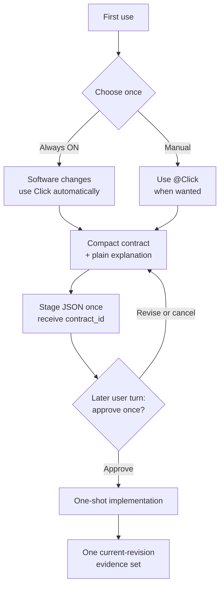

# Click

English | [한국어](README.ko.md) | [简体中文](README.zh-CN.md)

Community link: [LINUX DO](https://linux.do/)

[](https://github.com/grapefruit0205/click/actions/workflows/ci.yml)
[](LICENSE)

> Agree once on what changes and what must hold. Then finish implementation and the necessary checks inside that boundary.

Click is a Codex plugin for people who want coding agents to agree on a software change once and then finish it without repeatedly rewriting the plan, rescanning the repository, or proving the same result twice. It turns your request and the relevant repository context into a short contract—what will change, what must stay true, and what evidence will count—explains it plainly, waits for approval, then keeps implementation and verification inside that boundary.

Choose **Always ON (recommended)** for software changes by default or **Manual** for tasks where you mention `@Click`. Questions, explanations, simple lookup, and read-only review remain lightweight.

## Core purpose

Click's core purpose is to preserve one user-approved boundary from proposal through implementation and necessary verification. It is not a larger specification system or an architecture-pattern picker. Click makes three things explicit—what changes, what must stay true, and what evidence is enough—then blocks observable replanning, repeated repository-wide exploration, and duplicate verification while leaving necessary in-scope implementation choices open.

## Quick start

```bash
codex plugin marketplace add grapefruit0205/click
codex plugin add click@click
```

Restart the ChatGPT desktop app, inspect and trust the included Click Hook, then start a new task. Before the first code-changing request, Click asks once:

```text
Use Always ON for future software changes (recommended), or Manual only when I mention @Click?
```

Choose Always ON for the default experience. Choose Manual if you prefer explicit invocation:

```text
@Click Add order cancellation. Prevent duplicate refunds and preserve the existing API.
```

## Google Antigravity adapter (experimental source build)

The repository also builds a self-contained Google Antigravity plugin that
shares Click's contract state machine, evidence ledger, verification budget,
and shell-free runners with the Codex plugin:

```bash
python3 scripts/build_antigravity_distribution.py
agy plugin install ./dist/antigravity
```

Antigravity IDE users may instead copy `dist/antigravity` to
`.agents/plugins/click` for one workspace or
`~/.gemini/config/plugins/click` globally. Codex continues to use its existing
`.codex-plugin/plugin.json` and Codex Hook adapter; installing one target does
not replace the other.

Antigravity's Hook contract differs from Codex. Click therefore uses an exact
absolute launcher injected at runtime for structured commands and requires a
fully idle `model_stop`, a new readable user transcript entry, and the next
`PreInvocation` for the proposal/approval execution boundary. Direct read-only
`run_command` calls also use that control launcher. The launcher accepts one
expansion-free Bash command; chaining, redirects, substitutions, globs, and
multiline suffixes fail closed. Native file/search and
unrelated MCP or Skill tools remain available but are not cross-tool
deduplicated. Browser evidence is not currently supported. See
[`platforms/antigravity/README.md`](platforms/antigravity/README.md) for the
exact limits instead of assuming full host parity.

## Update to v0.24.4

If Click is already installed, explicitly refresh its Git marketplace snapshot and reinstall the plugin to load this release:

```bash
codex plugin marketplace upgrade click
codex plugin add click@click
```

Restart the ChatGPT desktop app, review and trust the updated Click Hook, and start a new task. Existing mode preferences remain outside the target repository. v0.24.4 extracts contract validation into the leaf `hooks/click_contract.py` module while preserving `click_gate._validate_contract` as a direct compatibility alias and retaining the exact validation order and error messages. Verification now automatically recovers when prepared project, user, PATH, or toolchain environment values differ at runner startup: an authenticated aggregate binding projects the current values onto the prepared key set, ignores runner-only additions, and records the actual rebound environment digest without asking for another approval. The exact executable fingerprint remains fixed, and malformed or tampered bindings still fail closed. Contract shape, evidence protocol, mode behavior, v0.24.3's runner-claim and admission cleanup rules, the v0.24.2 Windows `${PLUGIN_ROOT}` repair, and v0.24.1's three-second SessionEnd limit remain unchanged. This patch does not claim to repair a host path that fails to dispatch the matching PreToolUse event at all, so issue #25 remains open. Do not reuse a pending runner command created by an older installation; let the updated Hook issue a fresh rewritten command.

You can later say “Set Click to Always ON” or “Set Click to Manual.” Those preferences persist outside the target repository. To bypass Click for exactly one turn, make the first line of that user prompt either `@Click bypass` or the autocomplete form `[@Click](plugin://click@click) bypass`; the Hook authorizes one same-turn `click-gate bypass` and keeps any active contract intact. Use the corresponding `cancel` form to authorize one same-turn `click-gate cancel` and discard the active contract. The `@Click` label and action are case-insensitive, but the plugin URI must match exactly and the directive line cannot contain extra text. The task may continue on later lines. Neither authorization is reusable or carries across turns. Click does not place preference or contract files in your project.

<details>
<summary>Upgrading from Build Brief or an older Click installation</summary>

For `click@build-brief` 0.9.0:

```bash
codex plugin remove click@build-brief
codex plugin marketplace remove build-brief
codex plugin marketplace add grapefruit0205/click
codex plugin add click@click
```

For Build Brief 0.8, replace the first command with `codex plugin remove build-brief@build-brief`.

</details>

## Evidence-bound completion in v0.21.0

Version 0.21 links every declared completion source to Hook state for the current mutation revision. Every local argv check names the approved evidence ID it proves; successful Browser work is observed and then explicitly finalized; hosted, manual, and existing sources remain honest attestations rather than independently observed external proof. A contract completes as soon as every declared source is current and no managed service remains active, so a contract with no argv source does not need an unrelated local verification command.

## Evidence-driven anti-loop behavior in v0.24.0

Version 0.24 bases normal repetition decisions on successful current-revision evidence rather than raw call counts. Approved implementation and review may establish one broad repository inventory, then must narrow. Verification may submit unresolved argv sources in bounded subsets, while exact per-source reservations keep the total inside one approved scale. Browser calls are deduplicated by normalized input rather than a normal three-call or 90-second cap. The content-free evidence registry and ledger mechanics also live in the dedicated `click_evidence.py` module without changing verification protocol version `2`. The historical v0.23.0 release introduced the shared process boundary but did not include these evidence-state rules.

## How it works



The initial request is not approval of an unseen design. Click stages the contract JSON once, receives an opaque `contract_id`, shows that id with both contract views, then stops. The Hook records `staged_turn_id` and rejects pass or replacement staging in the same `UserPromptSubmit` turn. A later explicit approval passes only the emitted id—never the JSON again—and the Hook matches it to the staged digest before recording `approved_turn_id`. Revising the proposal issues a new id and invalidates the old handle. This proves that another user response occurred; the Skill still interprets whether that response actually means approval because the Hook does not classify natural-language consent.

Only a real change to the approved result, boundary, must-hold behavior, or verification commitment requires stopping. Necessary files, libraries, tools, services, and implementation tactics inside the approved boundary do not require a replacement contract.

In Manual mode, fail-open behavior applies only when no Click contract is active. Once a contract is staged, or approved but missing current-revision completion evidence, that session state keeps ordinary mutations blocked across later turns. This prevents an approval turn from editing before the bound `contract_id` is passed. If an approved implementation is interrupted and resumed in another turn, Click arms and passes the same id before continuing; it does not resend the JSON or invent a replacement contract.

When every declared evidence source is complete for the current code revision and no managed service remains active, the next change request can stage a fresh contract normally. An `argv` source completes only through its linked verification check; a contract with no `argv` source does not need a placeholder local verification batch. Evidence that is missing, running, failed, or stale after another mutation does not unlock replacement. The new contract starts with clean inspection, mutation, and evidence state and needs its own approval; no `bypass` or manual state deletion is required.

## Example: from request to approval

Given this request:

```text
@Click Add order cancellation. Prevent duplicate refunds and preserve the existing API.
```

The canonical staged JSON has this compact shape before Click renders its developer and easy-language views:

```json
{
  "outcome": "An eligible order can be cancelled through the existing API and receives at most one refund.",
  "boundary": {
    "in_scope": ["the current cancellation and refund path"],
    "out_of_scope": ["new payment providers", "unrelated order-state cleanup"]
  },
  "must_hold": [
    "Concurrent or repeated requests cannot create a second refund.",
    "Existing request fields, response fields, and status meanings remain compatible.",
    "A payment-provider failure must not leave the order marked as refunded."
  ],
  "build": {
    "approach": [
      "Reuse the current cancellation path, add an idempotent refund record, and make the refund state transition atomic."
    ],
    "semantics": [
      "The refund result is recorded once and repeated requests return the recorded result."
    ]
  },
  "verification": {
    "scale": "full",
    "evidence": [
      {
        "id": "E1",
        "kind": "argv",
        "description": "cancellation tests for success, duplicate, concurrent, and provider-failure cases"
      },
      {
        "id": "E2",
        "kind": "argv",
        "description": "the existing API regression suite"
      }
    ],
    "done_when": [
      {
        "condition": "Refund behavior is correct.",
        "primary_evidence": "E1"
      },
      {
        "condition": "The public API remains compatible.",
        "primary_evidence": "E2"
      }
    ]
  },
  "plain_language": "Customers can cancel an eligible order, but retries or simultaneous requests cannot refund it twice. The public API stays the same, and a failed payment call cannot falsely complete the refund. Because this touches payments and concurrency, Click recommends full verification."
}
```

Staging returns `CLICK_CONTRACT_ID=ctr_0123456789abcdef0123456789abcdef`. Click shows that id and asks one question: approve this contract and its verification scale, revise it, or cancel? Approval authorizes the developer meaning in the contract—not merely the easy summary—and the later turn passes only this id to start implementation. `plain_language` remains an exact, digest-bound value in the canonical JSON; the presentation shows the developer fields from `outcome` through `verification` without echoing it, then renders that exact value once as the separate easy-language view.

The exact design is repository-dependent. The example shows the contract shape, not a universal refund architecture.

## The compact contract

| Field | What it fixes |
| --- | --- |
| `outcome` | The concrete result and user-visible behavior |
| `boundary` | What may change and what stays outside the work |
| `must_hold` | Observable safety, compatibility, and correctness promises |
| `build` | The smallest repository-aware implementation route |
| `verification` | One risk-based scale and the evidence that means done |
| `plain_language` | The same contract explained for a non-specialist |

`build.semantics`, `build.order`, and `verification.intermediate_gate` appear only when state meaning, safe ordering, or an irreversible boundary makes them necessary. Click does not mirror the same work into separate phases, steps, tasks, and plans.

The contract locks the result and its boundaries. It does not lock every low-level implementation choice. This is how Click stays small without forcing reapproval whenever the implementation needs an in-scope dependency, file, or tool.

## Always ON without getting in the way

| Request | Always ON behavior |
| --- | --- |
| Create, change, delete, refactor, or repair software | Show one compact contract and plain explanation, then wait for one approval |
| Code review without fixes | No build contract or approval; use the read-only anti-loop guard |
| Question or explanation | Answer normally |
| Simple read-only lookup | Inspect normally without creating an observation ledger |
| First line is plain or autocomplete `@Click bypass` | Authorize one bypass for that turn; keep any active contract |
| First line is plain or autocomplete `@Click cancel` | Authorize one cancel that clears the active contract |

During code review, Click permits one useful repository-wide inventory such as `rg --files` for the current revision when needed. While it runs, and after it succeeds, later broad inventory is blocked even if the command differs; narrower inspection remains available. The same first-inventory-then-narrow rule applies after an implementation contract is approved. Review mode also blocks an identical successful read or search, rejects plan-tool churn, and prevents project mutation. A later request to fix findings starts a separate compact build contract.

Simple recognized direct reads remain convenient. For ambiguous or tracked work, Click uses `click-gate inspect` with a program-and-arguments array instead of guessing from a shell string. The review guard covers supported local Hook paths; it does not deduplicate hidden reasoning, hosted search, unmatched connectors, or custom wrappers.

## Implementation without loops

Across staging, review, implementation, and verification, the Hook enforces these observable rules:

| Guard | What happens |
| --- | --- |
| Reuse evidence | An identical structured read or search that already succeeded is blocked until an in-scope mutation makes the evidence stale. |
| No parallel planning | Matched `update_plan` calls are rejected while the workflow is armed, staged, approved but incomplete, or in review—even from a later turn. A user-authorized bypass releases planning only for that turn; current-revision completion releases ordinary later planning. |
| Inventory once, then narrow | The first useful root inventory may run for the current revision. Concurrent broad inventory and every later broad inventory after success are rejected even when argv differs; path-scoped inspection remains available. |
| Make command intent explicit | Ambiguous active Bash is rejected with guidance to use structured `inspect` for reading, `mutate` for implementation, or `verify` for final checks. |
| Keep checks in one cumulative budget | Each local final check names its registered `argv` source through `evidence_id`. A request may cover any nonempty unresolved subset, while the first accepted check group and inferred units for every source stay reserved against the contract's approved scale. |
| Track completion by source | Completion requires every declared evidence source to be current for the latest mutation revision and no managed service to remain active; it does not manufacture a local check when no `argv` source was approved. |
| Deduplicate Browser evidence | Browser MCP calls require an assigned Browser primary source and remain serial. Repeated successful normalized input is blocked; a failed input gets one identical retry before that input is blocked, while different input remains available. Per-call timeout and wait bounds remain. |
| Own local servers | Recognized development servers use `click-gate service`; Click supervises and stops the exact isolated child instead of leaving a foreground mutation open. |
| Separate proposal from approval | Stage emits an opaque id bound to the digest. Same-turn pass and replacement staging are rejected; a later approval passes only that exact id. |

A failed observation or one whose output exceeds 48,000 bytes gets one unchanged retry. Before a tracked read executes, its runner atomically claims the active revision, digest, one-use token, replay state, and freshness. An unclaimed startup reservation expires after 30 seconds; a claimed read remains active until its synchronous result is recorded or the user explicitly cancels, so elapsed time cannot silently release mutation or final verification. A source mutation resets successful observation evidence because the code may have changed. Hook state changes use a cross-platform lock so parallel result recording does not strand a false “running” observation. The Hook stores request digests, deterministically hashed evidence IDs, and non-content metadata such as source kind, status, revision, reserved units, and receipt fingerprints—not command bodies, contract prose, or output. Hashing avoids plaintext ID storage; it does not make predictable short IDs confidential.

These are tool-level guardrails, not a reasoning-token cap or operating-system sandbox. The Hook cannot inspect hidden reasoning, detect a plan written only in prose, observe unmatched connectors or hosted tools, prove that a hosted, manual, or existing-evidence attestation corresponds to an independently observed external execution, prove semantic boundary compliance, or stop allowed custom code from hiding several operations.

### Structured capabilities

Inspection, mutation, managed-service, and evidence-recording requests use protocol version `1`; verification batches use version `2` so every check can bind to one registered evidence ID. Executable requests separate the program from every argument. Accepted argv arrays run with `shell=False` in a new POSIX session or Windows process group, so pipelines, redirections, command substitutions, and shell wrappers cannot be hidden in the request, and group-directed child signals cannot reach the Codex parent group.

```text
click-gate inspect '{"version":1,"commands":[["git","status","--short"],["sed","-n","1,160p","src/app.py"]]}'
click-gate mutate '{"version":1,"argv":["python3","scripts/generate.py","--target","src"]}'
click-gate service '{"version":1,"action":"start","argv":["python3","-m","http.server","4173","--bind","127.0.0.1"]}'
click-gate service '{"version":1,"action":"stop"}'
click-gate evidence '{"version":1,"evidence_id":"E-browser"}'
```

`inspect` accepts only the Hook's bounded read-only operations. Read executables must use bare names; separator-qualified names, Windows drive-prefixed names, repository PATH shadows, and repository-resolving symlinks fail closed. The boundary is the nearest containing Git repository, or the current working directory outside Git. Recognized direct reads are rewritten through the shell-free runner, which executes the resolved absolute program with empty, relative, and repository entries removed from PATH; read children also drop inherited loader-injection variables such as `LD_*`, `DYLD_*`, `GCONV_PATH`, and `LOCPATH`. Git reads use subcommand-specific positive option policies and additionally ignore inherited `GIT_*` variables plus system/global Git config. `mutate` atomically claims approved state, the exact digest, a one-use token, replay state, and pre-start expiry before execution. Once claimed, it remains active until its result is recorded or the user cancels; elapsed time alone cannot authorize a parallel runner. Every stateful runner carries a canonical `gate-state` root and state path instead of trusting ambient `PLUGIN_DATA`. Recognized long-running servers use `service`; both its start runner and detached supervisor make one-use digest-bound claims before spawning, then the supervisor owns and cleans up the exact child process group. Malformed requests, shell interpreters, and direct process-control names such as `pkill` still fail closed. `evidence` cannot attest an `argv` source. Ordinary edit tools remain supported without a shell envelope. Click is a workflow guardrail, not an operating-system sandbox: it does not cover secrets, network access, external paths, concurrent same-user replacement of an accepted executable outside the repository, or behavior hidden inside an approved custom program. See [the capability protocol](skills/click/references/capability-protocol.md) for the exact schemas and enforcement boundary.

SSH Git inspection is **Experimental and POSIX-remote-shell only**. It supports only bounded `git status`, `git rev-parse HEAD`, `git merge-base`, and `git remote get-url` reads, accepts no caller-provided SSH options, requires an already-known host key, disables interactive password flows, host-key updates, forwarding, local commands, and TTY allocation, and fails quickly with connection and keepalive limits. Unknown hosts, non-POSIX remote shells, and unreachable servers fail closed. This is a convenience guardrail, not a general remote executor or security sandbox.

## Automatic verification budget

Click chooses the smallest sufficient scale from the current risk and repository evidence. The user approves it as part of the contract; there is no second budget prompt.

Each source is declared once in `verification.evidence` with an ID, a typed `kind`, and a description. Every `done_when` condition references exactly one cheapest sufficient source ID through `primary_evidence`; one ID may cover several conditions. Click prefers current valid evidence and narrow automated checks, using browser, manual, hosted, broad-suite, or timed end-to-end evidence only when cheaper sources cannot prove the condition. It does not duplicate an automated result through another surface, and it stops when every source is complete for the current mutation revision and no managed service remains active. The state ledger retains ID hashes plus non-content metadata such as kind, status, revision, retry counters, and check digests; a count and typed registry digest detect partial entry loss.

Semantic sufficiency still belongs to the Skill and grader. The Hook observes the canonical Browser MCP path structurally: Browser calls are denied unless one referenced evidence source has `kind: "browser"`, then run serially under normalized-input deduplication. A successful input is blocked on repetition for the current revision. A failed input may be retried unchanged once and is then blocked; a materially different input remains available. Once any assigned call succeeds, the source stays observed even if a later distinct input fails. There is no normal three-call or 90-second cap. A single tool timeout may not exceed 30 seconds, obvious waits above five seconds are rejected, and a 256-unique-input ceiling limits state growth rather than defining a target. After the assigned proof is sufficient, `click-gate evidence '{"version":1,"evidence_id":"E-browser"}'` finalizes that source. A later mutation resets collection and completion, and final completion prevents replay. Hosted, manual, and existing sources use the same command as an explicit completion attestation. The Hook checks the approved id, kind, and current revision, but it does not independently prove that an unmatched external or manual execution occurred. An `argv` source can never be attested this way; it completes only when its linked checks succeed through the local runner.

| Scale | Typical use | Automatic ceiling |
| --- | --- | ---: |
| `quick` | Small, local, reversible change | 1 unit |
| `focused` | Ordinary bounded feature or repair | 4 units |
| `full` | Payments, auth, deletion, migrations, public contracts, or cross-boundary concurrency | 10 units |

A `targeted` check costs 1 unit, a `broad` check costs 3, and a `deep` check costs 5. The submitted value is not trusted as the cost: the Hook first recognizes the runner, then estimates its actual scope. One exact file or test node may be targeted; filters such as `-k` or regex selection, multiple files or packages, directories, and whole suites are at least broad. An exact integration or security node is broad, while a whole integration or security suite is deep. The Hook automatically raises an underdeclared check before calculating the total. These values are ceilings, not targets.

When the registry includes `argv` sources, Click submits one nonempty unresolved subset at a time and normally coalesces related checks when practical. Verification protocol version `2` requires every check to name its registered source:

```text
click-gate verify '{"version":2,"checks":[{"evidence_id":"E1","argv":["python3","-m","pytest","tests/test_cancellation.py"],"class":"targeted"},{"evidence_id":"E2","argv":["python3","-m","pytest","tests/test_api_regression.py"],"class":"targeted"}]}'
```

The Hook resolves each `evidence_id` to a declared source of kind `argv`, includes that binding in the normalized check-group digest, validates and normalizes submitted classes, executes accepted checks without a shell, and records real exit codes per source. The first accepted group for each source reserves its exact digest and inferred units for the lifetime of the active contract. Later attempts for that source must match, and cumulative reservations across all sources must fit the selected scale, so several small requests cannot split around the budget. Missing ids, unknown ids, ids of another kind, empty requests, and changed reserved check groups fail before execution; an exact valid current receipt is reused without executing the check again. If the registry has no `argv` source, no local verification batch is required merely to unlock completion. For Python, explicit pytest, unittest, and coverage module runners qualify, including Windows `py -3 -m ...`; Python `-c` and direct Python scripts are rejected. Common bounded forms such as exact-file `node --check` and `node --test`, `uv run pytest`, `npm run lint`, `npm run build`, `ruff check`, `mypy`, `tsc --noEmit`, `cargo check`, `cargo clippy`, and `go vet` are recognized and charged by their inferred scope. Project-wide `node --test` is broad, and Node eval/print forms are rejected as verification. Legacy shell-string `commands` batches and protocol version `1` verification batches are rejected with migration guidance. A failed source gets one unchanged retry while earlier current sources are omitted; after that, an in-scope mutation or changed input is required.

An exact successful argv check is skipped rather than re-executed only when its stored receipt still matches the same active contract and mutation revision, normalized check group, protected Git tree digest, Hook-prepared execution context, and resolved executable fingerprint. Before issuing the rewritten runner, Click binds every prepared environment key and value with keyed content-free hashes. The runner requires every prepared value to match, excludes launcher-only additions from the child check, then fingerprints the resolved target and pins the selected launcher path immediately before execution. This preserves virtual-environment and shim behavior, while hardened structured SSH options and remote-URL redaction remain active after pinning. macOS or Windows shell bookkeeping therefore does not cause a false rerun, while a changed prepared value or executable fails closed. A new mutation revision always leaves the older source stale, even when the tree later looks identical; Click does not auto-promote it. A non-Git worktree, missing receipt data, or any mismatch reruns the check.

Only an unclaimed verification reservation may expire into a retry; a claimed batch remains running until it records a result or the user cancels. In a Git worktree, the runner snapshots tracked content and pre-existing **non-ignored** untracked content before the batch. If the initial snapshot cannot be established, no check executes. If protected content changes, the batch fails stale and advances the mutation revision instead of recording false success. It also reports every new non-ignored untracked path, and any such path fails the batch stale. Expected generated artifacts should be Git-ignored or produced during the approved mutation phase. Git-ignored paths, external dependencies, and external service state are not represented by this snapshot. Outside Git this content-diff and receipt-reuse guard is unavailable; argv validation, shell-free execution, and revision state still apply.

Minimum class inference closes simple underdeclaration. An unknown verification-like wrapper name is charged conservatively as `deep`, and an unrecognized command is rejected, but an allowed program can still conceal expensive work internally. This is not a security or resource sandbox and does not prove that the chosen tests are semantically sufficient.

## Minimum design still protects the important parts

Minimum design removes ceremony, not necessary safeguards.

| Concern | What the contract preserves when relevant |
| --- | --- |
| Concurrency | Race behavior, duplicate execution, idempotency |
| State | Valid transitions, persistence points, ownership |
| Failure | Partial failure, retry, recovery, external errors |
| Security | Authentication, authorization, secrets, privacy boundaries |
| Compatibility | Existing API, data, statuses, and user-visible behavior |

Material conditions belong in `must_hold`; concrete state or failure meaning belongs in optional `build.semantics`; evidence sources belong in `verification.evidence`, and observable conditions reference them from `verification.done_when`. The Hook protects contract shape, approval order, digest equality, visible loops, and visible verification breadth. It does not prove that the implementation is architecturally correct or semantically faithful by itself.

More precisely, Click does not semantically decide whether a new microservice, queue, or abstraction is overdesign. The Skill and semantic grader prefer the smallest evidence-backed design; the Hook blocks the repeated planning, whole-repository rediscovery, and repeated-verification loops that often produce design expansion. Product claims are limited to that observable enforcement boundary.

## Who Click is for

Click targets two groups:

- users of high-capability models who are tired of repeated planning, repository exploration, and excessive verification;
- people building MVPs, internal tools, automations, and clearly bounded features who want minimum design followed by continuous implementation.

It is especially useful for:

- a brownfield feature that must preserve an existing API;
- idempotency, concurrency, state transitions, or failure recovery;
- a migration or other high-impact change with a clear safe boundary;
- a handoff where another person or agent must implement the same meaning;
- an MVP, internal tool, or automation where you want minimum planning followed by continuous implementation.

Manual mode or a per-turn bypass is usually better for tiny, obvious, reversible, or exploratory changes where no durable approval boundary is useful. For legal, regulated, security-critical, or operationally irreversible work, Click does not replace expert review, authorization, or deployment controls.

## Evidence and honest limits

Publishing v0.24.0 requires the deterministic suite to cover persistent modes, distinct-turn approval, active-contract locking, read and plan anti-loops, evidence-bound argv verification, per-source current-revision completion, first-successful broad inventory admission, cumulative source reservations, exact current-revision receipt reuse, Browser input deduplication, explicit non-argv attestation limits, managed-service one-use launch claims and cleanup, repository-excluded executable resolution, state-root binding, pre-execution runner claims, hardened Git inspection, fail-closed Git snapshots, process isolation, verification-time workspace mutation detection, the shared state-storage, process-mechanics, and content-free evidence-ledger boundaries, sibling-only source/distribution startup, distribution consistency, and repository policy. Required CI is configured to run the suite on Linux, macOS, and Windows; Ubuntu also validates the plugin, marketplace, Click/Fix skills, Python compilation, and whitespace errors.

The repository also includes version-18 golden cases and a semantic grader for deterministic fixture-based policy review. These artifacts check contract shape and expected behavior; they are not runtime productivity measurements.

These gates prove observable Hook and contract behavior only. Click does not claim that it improves success rate, accuracy, time, token use, or overdesign across projects without independent measurements on unrelated real repositories.

Click is not claimed to be the first or only workflow in this area. It overlaps with spec-driven, autonomous-loop, and approval-gated tools; its deliberately narrow emphasis is one persistent choice, one compact contract, one approval, one-shot implementation, observable anti-loop guards, and one bounded completion-evidence commitment.

A ready-to-edit launch post for developer communities is available in [COMMUNITY_POSTS.md](COMMUNITY_POSTS.md).

<details>
<summary>Repository structure and local validation</summary>

```text
.codex-plugin/plugin.json             Plugin manifest
.agents/plugins/marketplace.json      GitHub marketplace entry
skills/click/                         One-shot design-and-build Skill
skills/click/references/modes.md      Persistent mode and code-review behavior
skills/click/references/capability-protocol.md  Structured runner schemas
skills/fix/                           Compact repair Skill
hooks/click_state.py                  State paths, atomic persistence, and locking
hooks/click_process.py                Shell-free process execution, isolation, and termination
hooks/click_evidence.py               Content-free evidence registry and ledger mechanics
hooks/click_gate.py                   Contract policy, capability orchestration, anti-loop, and budgets
hooks/hooks.json                      Lifecycle Hook configuration
evals/                                Golden cases and semantic grader
tests/                                Deterministic Hook, grader, and policy tests
scripts/validate_distribution.py     Repository-owned release validator
COMMUNITY_POSTS.md                    Ready-to-edit English and Korean launch posts
LICENSE                               MIT License
```

```bash
python3 scripts/validate_distribution.py
python3 -m compileall -q hooks evals scripts tests
python3 -m unittest discover -s tests -v
git diff --check
```

</details>

<details>
<summary>Related approaches</summary>

| Project | Overlap | Click's narrower emphasis |
| --- | --- | --- |
| [GitHub Spec Kit](https://github.com/github/spec-kit) | Specification, planning, tasks, implementation | One compact contract and one approval instead of a persistent multi-command specification process |
| [OpenSpec](https://github.com/Fission-AI/OpenSpec) | Agreement before AI-assisted coding | No project-local specification store; the Hook keeps only content-free lifecycle metadata and a digest outside the target repository |
| [Kiro Specs](https://kiro.dev/docs/cli/v3/specs/) | Requirements, design, tasks, verified execution | One complete contract review followed by one-shot implementation |
| [Agentic SDLC Codex Plugin](https://github.com/aantenore/agentic-sdlc-codex-plugin) | Hash-bound proposals and approval | A smaller pre-code boundary rather than broader SDLC governance |

This is a bounded comparison, not an exhaustive novelty search.

</details>

## License

Click is released under the [MIT License](LICENSE).
