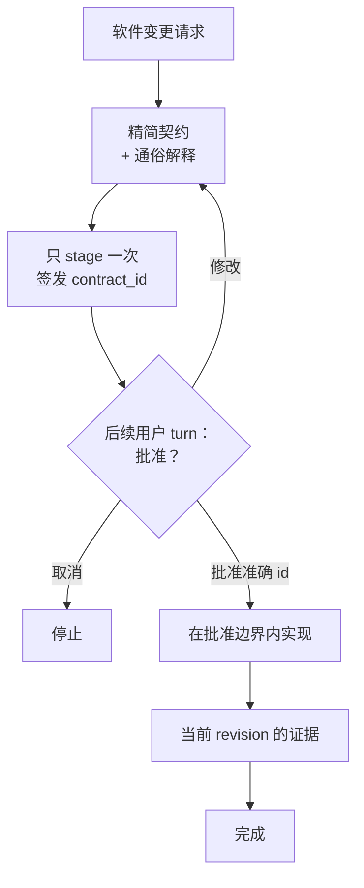

# Click — 由 Hook 强制执行的 Codex 编码代理工作流

[English](README.md) | [한국어](README.ko.md) | 简体中文

社区：[LINUX DO](https://linux.do/)

[](https://github.com/grapefruit0205/click/actions/workflows/ci.yml)
[](LICENSE)

### 只靠提示词控制编码工作流的时代已经结束。

> **提示词可以建议行为。Hook 可以强制执行工作流。**

**Click 是一款 Codex 插件：它把软件变更请求转换成一份精简执行契约，再通过持久化的 Hook 状态机，把可观察的执行路径保持在用户批准的边界内。**

大多数编码代理工作流仍然只是要求模型记住这些规则：

```text
只规划一次。
不要超出范围。
不要重新扫描整个仓库。
不要反复改写计划。
只运行真正需要的验证。
```

当上下文变长、任务开始分叉时，模型仍可能重新规划、重新探索仓库，或者再次证明已经证明过的结果。

Click 不再只把这些规则当作**提示词里的要求**，而是把它们移到受支持的**工具执行边界**中。

```text
请求
 ↓
精简契约
 ↓
后续用户 turn 批准
 ↓
实现
 ↓
当前 revision 的完成证据
 ↓
完成
```

> **如何实现，由模型决定。工作流是否允许进入下一阶段，由 Hook 决定。**

**一份契约。一次批准。一条实现边界。一组完成证据。**

## 为什么需要 Click？

提示词可以告诉代理它**应该做什么**。Click 则为代理当前**被允许做什么**增加持久状态。

| 只靠提示词的工作流 | Click |
| --- | --- |
| 希望模型一直记住计划 | 持久保存已批准的 workflow 状态 |
| 希望批准恰好发生在正确时机 | stage 一个绑定 digest 的契约 ID，并要求后续用户 turn 批准 |
| 要求代理不要重新扫描 | 允许第一次有价值的全局 inventory，之后强制缩小检查范围 |
| 要求代理不要重新规划 | 工作流 active 时拒绝匹配到的 plan-tool 反复变动 |
| 要求代理不要重复同一验证 | 复用当前结构化证据，并阻止重复执行已经成功的同一检查 |
| 任务越做越大，验证也越做越大 | 把完成证据绑定到已批准的验证预算 |
| “看起来完成了”就结束 | 声明的证据必须对最新 mutation revision 仍然 current |

Click 的核心思想很简单：

> **不要一直要求编码代理记住流程。把流程放进执行边界。**

## Hook 实际会强制什么

在 stage、implementation、review 和 verification 过程中，Click 可以强制以下**可观察的 workflow 规则**：

- **提案与批准分离。** stage 契约后会签发不透明的 `contract_id`；同一个用户 turn 不能既 stage 又 pass。
- **批准前阻止 mutation。** active 契约会保持锁定，直到准确的 staged ID 被批准并 pass。
- **限制重新规划。** Click workflow active 时，匹配到的 `update_plan` 反复调用会被拒绝；用户明确授权的单 turn bypass 除外。
- **仓库探索必须逐渐收窄。** 当前 revision 第一次有用的 root inventory 可以在需要时执行，但之后的全局 inventory 会被拒绝，只允许更窄的检查。
- **复用已经成功的结构化读取。** 在范围内 mutation 使证据 stale 之前，不重复同一个成功 observation。
- **验证绑定 evidence。** local check 必须指定自己证明的已批准 `evidence_id`，累计验证成本必须处于批准预算内。
- **完成状态跟随最新代码。** mutation 会推进 revision，使旧的完成证据 stale，而不是静默沿用。
- **管理本地服务器生命周期。** 可识别的开发服务器通过 Click 的 managed service 路径运行，以便清理准确的隔离子进程。

Hook 控制的是**可观察的 tool path**。它不会读取隐藏推理，不会单独证明设计在语义上正确，也不是操作系统 sandbox。

## 精简执行契约

Click 会把请求和相关仓库上下文整理成一份小型执行契约：

| 字段 | 固定的内容 |
| --- | --- |
| `outcome` | 具体结果和用户可见行为 |
| `boundary` | 可以改变什么，以及哪些内容不属于本次工作 |
| `must_hold` | 可观察的安全性、兼容性和正确性承诺 |
| `build` | 最小且符合仓库现状的实现路径 |
| `verification` | 一种基于风险的验证规模，以及完成所需证据 |
| `plain_language` | 用非专业人士也能理解的方式解释同一契约 |

契约锁定的是**语义、边界和完成承诺**。它不会冻结每个文件、依赖、库或底层实现选择。

如果代理发现批准范围内需要新的文件、工具或依赖，仍然可以使用。只有已批准的结果、边界、must-hold 行为或验证承诺发生实质变化时，才需要重新批准。

## 工作原理



最初的请求**不等于**批准一份尚未展示的设计。Click 只 stage 一次 canonical JSON，获得不透明的 `contract_id`，展示契约，然后停止。Hook 会记录 staged turn，并拒绝同一个 turn 的 pass 或替换 stage。

后续用户 turn 的明确批准只 pass 已签发的 ID，而不是再次发送整个 JSON。Hook 会先把 ID 与 staged digest 匹配，之后实现才能继续。修改提案会签发新 ID，并使旧 handle 失效。

当最新 mutation revision 中所有声明的完成证据都为 current，且没有 Click 管理的服务仍处于活动状态时，契约完成，下一个变更任务可以从干净状态开始。

## 快速开始

```bash
codex plugin marketplace add grapefruit0205/click
codex plugin add click@click
```

重启 ChatGPT 桌面应用，检查并信任随附的 Click Hook，然后开始新任务。

第一次使用时，可以选择：

```text
Always ON
```

默认应用于软件变更任务，或者：

```text
Manual
```

只有在你明确提到 `@Click` 时才启用。

示例：

```text
@Click 添加订单取消功能。
防止重复退款，并保持现有 API 兼容。
```

之后可以说“Set Click to Always ON”或“Set Click to Manual”来修改模式。偏好会持久保存在目标仓库之外。

如果只想绕过一个 turn，请把 `@Click bypass` 放在第一行；如果要丢弃 active 契约，请使用 `@Click cancel`。自动补全的 `plugin://click@click` 形式也受支持。两种授权都只对当前 turn 有效，不能重复使用。

## Always ON，但不打扰

| 请求 | Always ON 行为 |
| --- | --- |
| 创建、修改、删除、重构或修复软件 | 展示一份精简契约，并等待一次批准 |
| 只做代码审查、不修复 | 不创建实现契约，只使用只读 anti-loop guard |
| 提问或解释 | 正常回答 |
| 简单只读查询 | 正常检查，不创建完整 observation ledger |
| 第一行的 `@Click bypass` | 当前 turn 只授权一次 bypass，并保留 active 契约 |
| 第一行的 `@Click cancel` | 只授权一次 cancel，并清除 active 契约 |

## 契约示例

假设请求为：

```text
@Click 添加订单取消功能。防止重复退款，并保持现有 API 兼容。
```

根据仓库实际情况，Click 可能 stage 一份类似下面的契约：

```json
{
  "outcome": "符合条件的订单可以通过现有 API 取消，并且最多只退款一次。",
  "boundary": {
    "in_scope": ["当前的取消和退款路径"],
    "out_of_scope": ["新的支付服务商", "与本功能无关的订单状态清理"]
  },
  "must_hold": [
    "并发或重复请求不能产生第二次退款。",
    "现有请求字段、响应字段和状态含义保持兼容。",
    "支付服务商失败时，订单不能被标记为已退款。"
  ],
  "build": {
    "approach": ["复用当前取消路径，并让退款转换具备幂等性和原子性。"]
  },
  "verification": {
    "scale": "full",
    "evidence": [
      {"id": "E1", "kind": "argv", "description": "订单取消与重复退款测试"},
      {"id": "E2", "kind": "argv", "description": "现有 API 回归测试"}
    ],
    "done_when": [
      {"condition": "退款行为正确。", "primary_evidence": "E1"},
      {"condition": "公共 API 保持兼容。", "primary_evidence": "E2"}
    ]
  },
  "plain_language": "客户可以取消符合条件的订单，但重试或同时发出的请求不能导致重复退款。现有 API 保持兼容。"
}
```

具体设计取决于仓库。此示例展示的是契约结构，而不是通用退款架构。

## 证据驱动的 anti-loop

| 防护规则 | 行为 |
| --- | --- |
| 复用已有证据 | 已成功的相同结构化读取或搜索在范围内 mutation 使其 stale 前不会重复执行 |
| 阻止 plan churn | workflow 处于 armed、staged、approved-but-incomplete 或 review 状态时，匹配的 `update_plan` 会被拒绝 |
| 第一次 inventory 后缩小范围 | 当前 revision 第一次有价值的 root inventory 可以执行，之后的 broad inventory 会被拒绝 |
| 明确命令意图 | active 状态下含义不明确的 Bash 会被拒绝，改用结构化 `inspect`、`mutate`、`service` 或 `verify` |
| 所有检查共享一个预算 | 每项 local final check 必须指定已注册的 `argv` evidence source，累计预约必须处于批准规模内 |
| 按 source 跟踪完成 | 最新 revision 中所有声明 source 必须 current；没有 `argv` source 时不会为了形式制造 local check |
| 去重 Browser evidence | 成功的规范化输入不会重复；相同失败只允许再试一次，不同输入仍可继续 |
| 提案与批准分离 | 同 turn stage/pass 被拒绝，后续批准只 pass 与 digest 绑定的准确 ID |

## 自动验证预算

Click 根据当前风险和仓库证据选择最小且足够的验证规模。用户把这个规模作为契约的一部分批准。

| 规模 | 典型用途 | 自动上限 |
| --- | --- | ---: |
| `quick` | 小型、局部、可逆的变更 | 1 unit |
| `focused` | 普通且边界清晰的功能或修复 | 4 units |
| `full` | 支付、认证、删除、迁移、公共契约或跨边界并发 | 10 units |

一项 `targeted` check 花费 1 unit，`broad` 为 3，`deep` 为 5。Hook 不会直接相信被低报的 class，而会推断最低实际范围。

证据可以是 local `argv` check，也可以是显式声明的 Browser、hosted、manual 或 existing source。`argv` evidence 只能通过关联 local runner 的真实成功完成。non-argv source 使用显式 completion attestation；Hook 会记录已批准的 ID、kind 和当前 revision，但不会独立证明 matcher 外部执行或人工步骤真的发生过。

## 结构化 capability

Click 将可执行程序与参数分离，并在不使用 shell 的情况下运行已接受的 argv 数组。

```text
click-gate inspect '{"version":1,"commands":[["git","status","--short"],["sed","-n","1,160p","src/app.py"]]}'
click-gate mutate '{"version":1,"argv":["python3","scripts/generate.py","--target","src"]}'
click-gate service '{"version":1,"action":"start","argv":["python3","-m","http.server","4173","--bind","127.0.0.1"]}'
click-gate service '{"version":1,"action":"stop"}'
click-gate evidence '{"version":1,"evidence_id":"E-browser"}'
click-gate verify '{"version":2,"checks":[{"evidence_id":"E1","argv":["python3","-m","pytest","tests/test_cancellation.py"],"class":"targeted"}]}'
```

识别出的读取会被限制在 Hook 的只读 capability 策略内。验证会识别 pytest/unittest/coverage、Node、`uv`、npm、Ruff、mypy、TypeScript、Cargo 和 Go 的常见受限形式。精确 schema 与执行边界请参阅[能力协议](skills/click/references/capability-protocol.md)。

Click 是 workflow guardrail，**不是操作系统 sandbox**。它不保护 secret、任意 network access、外部路径，也无法阻止已批准自定义程序内部隐藏的行为。

## Google Antigravity 适配器 — 实验性

此仓库还可以生成一个独立的 Google Antigravity 插件，它与 Click 共享契约状态机、evidence ledger、验证预算和 shell-free runner：

```bash
python3 scripts/build_antigravity_distribution.py
agy plugin install ./dist/antigravity
```

Antigravity IDE 用户也可以把 `dist/antigravity` 复制到工作区的 `.agents/plugins/click`，或复制到全局 `~/.gemini/config/plugins/click`。

Antigravity 的 Hook 契约与 Codex 不同。native file/search 和其他 MCP、Skill 工具仍可使用，但目前不支持 cross-tool 去重和 Browser evidence。准确限制请参阅 [`platforms/antigravity/README.md`](platforms/antigravity/README.md)。

## 更新现有安装

v0.24.3 需要刷新 Git marketplace snapshot 并重新安装插件：

```bash
codex plugin marketplace upgrade click
codex plugin add click@click
```

重启 ChatGPT 桌面应用并重新检查、信任更新后的 Hook。不要重复使用旧安装留下的待执行 runner 命令；让更新后的 Hook 重新签发。

<details>
<summary>从 Build Brief 迁移</summary>

```bash
codex plugin remove click@build-brief
codex plugin marketplace remove build-brief
codex plugin marketplace add grapefruit0205/click
codex plugin add click@click
```

对于 Build Brief 0.8，请把第一条命令替换为 `codex plugin remove build-brief@build-brief`。

</details>

## 最小设计仍然保护重要事项

最小设计去掉的是仪式和重复，不是必要的防护。

| 关注点 | 相关时契约会保护的内容 |
| --- | --- |
| 并发 | 竞态行为、重复执行、幂等性 |
| 状态 | 有效转换、持久化点、所有权 |
| 失败 | 部分失败、重试、恢复、外部错误 |
| 安全 | 身份认证、授权、密钥、隐私边界 |
| 兼容性 | 现有 API、数据、状态和用户可见行为 |

Skill 和 semantic grader 倾向于选择最小且有证据支持的设计。Hook 不会从语义上判断一个新 microservice、queue 或 abstraction 是否“过度设计”；它会阻止容易让设计不断膨胀的**可观察重复规划、重新探索与重复验证循环**。

## Click 适合谁

Click 尤其适合：

- 厌倦高能力编码模型反复规划、重新探索仓库和过度验证的用户；
- 必须保持现有 API 的 brownfield 功能；
- 幂等性、并发、状态转换和失败恢复；
- 具有明确安全边界的迁移或其他高影响变更；
- 需要另一个人或 agent 实现同一批准语义的交接；
- 希望最少规划后连续实现的 MVP、内部工具和自动化。

对于微小、显而易见、可逆或探索性变更，如果不需要持久的批准边界，Manual 模式或单 turn bypass 通常更简单。

## 证据与诚实边界

Click 的确定性测试 suite 覆盖持久模式、跨 turn 批准、active-contract 锁、read/plan anti-loop、evidence-bound 验证、当前 revision 完成、累计验证预约、准确 receipt 复用、Browser input 去重、managed-service 清理、process isolation、Git snapshot fail-closed、验证期间 workspace mutation 检测、分发一致性和仓库策略。必需 CI 在 Linux、macOS 和 Windows 上运行。

这些 gate 只证明**可观察的 Hook 与契约行为**。

Click 不会声称 Hook 能够：

- 检查隐藏推理或只写在自然语言中的计划；
- 观察所有 matcher 外的 connector 或 hosted tool；
- 单独证明语义边界合规或架构正确性；
- 独立证明人工步骤或 matcher 外部证据真实发生；
- 阻止已允许自定义程序内部隐藏多项操作；
- 替代专家审查、授权、部署控制或 OS 安全 sandbox。

在多个无关真实仓库中完成独立测量之前，Click 也不会声称能在项目层面提高成功率、准确性、速度、token 使用效率或减少过度设计。

这个边界是有意为之：**Hook 能观察并强制的地方，做强声明；其他地方，明确说明限制。**

开发者社区发布文案位于 [COMMUNITY_POSTS.md](COMMUNITY_POSTS.md)。

<details>
<summary>仓库结构与本地验证</summary>

```text
.codex-plugin/plugin.json             插件 manifest
.agents/plugins/marketplace.json      GitHub marketplace 条目
skills/click/                         One-shot 设计与构建 Skill
skills/click/references/modes.md      持久模式与代码审查行为
skills/click/references/capability-protocol.md  结构化 runner schema
skills/fix/                           精简修复 Skill
hooks/click_state.py                  状态路径、原子持久化与锁
hooks/click_process.py                无 shell 的进程执行、隔离与终止
hooks/click_evidence.py               不保存内容的 evidence registry 与 ledger 机制
hooks/click_gate.py                   契约策略、capability 编排、anti-loop 与预算
hooks/hooks.json                      lifecycle Hook 配置
evals/                                golden cases 与 semantic grader
tests/                                确定性 Hook、grader 与策略测试
scripts/validate_distribution.py     仓库自带 release validator
COMMUNITY_POSTS.md                    社区发布文案
LICENSE                               MIT License
```

```bash
python3 scripts/validate_distribution.py
python3 -m compileall -q hooks evals scripts tests
python3 -m unittest discover -s tests -v
git diff --check
```

</details>

<details>
<summary>相关方案</summary>

| 项目 | 重叠部分 | Click 更窄的重点 |
| --- | --- | --- |
| [GitHub Spec Kit](https://github.com/github/spec-kit) | 规格、规划、任务、实现 | 使用一份精简契约和一次批准，而不是持久的多命令规格流程 |
| [OpenSpec](https://github.com/Fission-AI/OpenSpec) | AI 辅助编码前先达成一致 | 不使用项目内规格存储；只在目标仓库外保存 digest 和不含正文的 lifecycle metadata |
| [Kiro Specs](https://kiro.dev/docs/cli/v3/specs/) | 需求、设计、任务、验证执行 | 审阅一份完整契约后进行 One-shot 实现 |
| [Agentic SDLC Codex Plugin](https://github.com/aantenore/agentic-sdlc-codex-plugin) | hash 绑定的提案与批准 | 使用更小的编码前边界，而不是更广泛的 SDLC 治理 |

这是有限范围的比较，不是详尽的新颖性检索。

</details>

## 许可证

Click 采用 [MIT 许可证](LICENSE)发布。