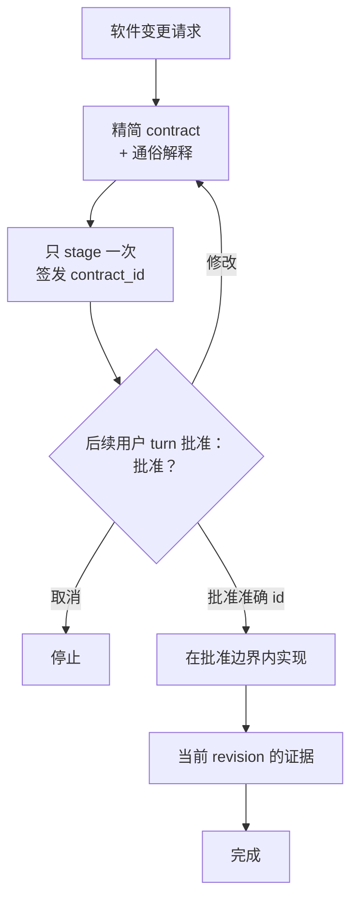

# Click — 面向 Codex 编码代理的 revision-aware evidence

[English](README.md) | [한국어](README.ko.md) | 简体中文

社区：[LINUX DO](https://linux.do/)

[](https://github.com/grapefruit0205/click/actions/workflows/ci.yml)
[](LICENSE)

### 正常工作，同时保留与代码一致的证据。

> **默认 Evidence；高风险工作使用批准绑定的 Guarded。**

**Click 是一款 Codex 插件：host 保持正常执行，Click 记录 prompt lineage、mutation revision 和可复用 verification evidence；高风险工作可用 Guarded 将执行绑定到一份易读的批准 contract。**

大多数编码代理工作流仍然只是要求模型记住这些规则：

```text
只规划一次。
不要超出范围。
不要重新扫描整个仓库。
不要反复改写计划。
只运行真正需要的验证。
```

当上下文变长、任务开始分叉时，模型仍可能重新规划、重新探索仓库，或者再次证明已经证明过的结果。

Click 把权限与 evidence 保证移到受支持的**工具执行边界**中。
探索偏好在那里仍是非阻断提示，不会成为执行权限。

```text
请求 → 实现 → 当前 revision evidence → 诚实 receipt

高风险：四段式 contract → 后续批准 → Guarded 执行 → receipt
```

> **如何实现，由模型决定。工作流是否允许进入下一阶段，由 Hook 决定。**

**默认模式没有 Click 批准摩擦；只有需要时才启用强批准边界。**

## 核心目的

> **普通 host 授权工作返回 revision-aware evidence；选择 Guarded 时，Click 将 AI 执行绑定到批准意图。**

Click 的稳定产品边界是授权与证据 runtime，而不是模型工作流优化器。
正式的准入测试和策略分层见 [Click 产品宪法](PRODUCT_CONSTITUTION.md)，
当前 guard 清单和迁移状态见 [Click guard 分类](GUARD_CLASSIFICATION.md)。

Click 将权限与 evidence 完整性保留为 hard runtime 保证，同时把模型的
workflow 策略视为不具授权效力的提示。尤其是，`update_plan` 仍然可用，
但它不能批准、替换或扩大 active contract，也不会改变 contract digest 或
evidence 状态。

## 为什么需要 Click？

提示词可以告诉代理它*应该做什么*。Click 则在可观察的 tool path 上，为代理当前*被允许做什么*增加持久状态。

| 只靠提示词的工作流 | Click |
| --- | --- |
| 希望模型一直记住计划 | 持久保存已批准的 workflow 状态 |
| 希望批准恰好发生在正确时机 | stage 一个绑定 digest 的 `contract_id`，并要求后续用户 turn |
| 要求代理不要重新扫描 | 提供非阻断的缩小范围提示；inventory 次数不会改变权限 |
| 要求代理不要重新规划 | 提供非阻断提示；`update_plan` 不能改变 contract 权限 |
| 要求代理不要重复同一验证 | 复用 current structured evidence 与 receipt |
| 验证逐渐偏离任务意图 | 把每项完成条件绑定到 revision-bound evidence 与准确 receipt |
| “看起来完成了”就结束 | 声明证据必须对最新 mutation revision 保持 current |

核心思想很简单：

> **不要一直要求编码代理记住流程。把流程放进执行边界。**

### 强制执行边界，而不是限制推理

> **Click 限制的是执行可以做什么，而不是模型必须如何思考。**

读取哪些文件、按什么顺序探索、如何推理问题、选择哪种实现，以及具体运行
哪些验证命令，都仍由模型在已批准 contract 内决定。Click 的 hard
enforcement 从可观察行为真正重要的地方开始：批准、mutation 与外部 side
effect、replay 与篡改防护，以及 evidence 完整性。

因此，Click 可以约束无人值守任务的执行边界，而不会把针对特定模型的搜索
技巧变成 hard gate。

### proof input 改变时才重新验证，而不是 revision 一变就重跑

新的 Git revision 并不意味着所有已通过的检查都自动失效。Click 的
**dependency-aware revision cache**会记录检查为什么有效，并且只有在解析后的
dependency 文件及其内容、准确 check、环境、可执行文件、已知 host coverage
和已批准 mutation snapshot 全部保持一致时，才会把准确的成功 evidence
带到下一个 revision。

```text
revision 12  认证代码改变   → 运行认证测试 → 通过
revision 13  只改变 README → proof input 未变 → 复用通过证据
revision 14  认证代码改变   → proof input 改变 → 重新运行测试
```

只要任何必要绑定缺失、含糊或发生变化，Click 就会 fail closed，并要求重新
运行检查。这样既不需要仅凭模型声称“这是无关变更”，也能避免只修改文档后
仍重新运行整套 300 项测试。

## 三种模式

| 模式 | 用户体验 | 执行权限 |
| --- | --- | --- |
| **Evidence**（默认） | 无 Click contract 或批准提示；正常执行并返回 evidence receipt | host |
| **Guarded** | 一次批准 Goal、Changes、Unchanged、Completion checks，随后在范围内连续执行 | 已批准 contract |
| **Off** | 普通工作不受 Click 管理；显式 `@Click` 可启动 Guarded | host |

升级时会保留已有权限选择的含义：`on` 迁移为 Guarded，`manual` 迁移为 Off；只有新安装和未设置的用户默认使用 Evidence。已经 stage 或尚未完成的 Guarded contract 不会被解锁，必须完成或显式取消。

Evidence receipt 明确写入 `approval_bound: false` 和 `execution_authority: host`，不会假装工作由 Click 批准。Guarded receipt 继续绑定 contract digest、批准 turn、one-use claim、replay/篡改防护、mutation revision、环境和 evidence lineage。

## Hook 实际会强制什么

在 stage、implementation、review 和 verification 期间，Click 可以强制以下**可观察 workflow 规则**：

- **Guarded 提案与批准分离。** stage 后签发不透明的 `contract_id`；同一个用户 turn 不能同时 stage 和 pass。
- **Guarded 批准前阻止 mutation。** active contract 保持锁定，直到准确 staged ID 被批准并 pass。
- **Evidence receipt 保持诚实。** 绑定 host 权限、follow-up prompt digest、mutation、check、环境与 cache lineage。
- **规划保持 advisory。** `update_plan` 等 plan tool 仍然可用，但不能批准、替换或扩大 active contract。
- **仓库探索保持 advisory。** 不同 digest 的 broad inventory 即使在另一个 broad inventory 运行期间或成功之后仍可执行，并会收到缩小范围提示；只有 active runner 与执行 interlock 继续作为 hard guard。
- **重复观察仍然可用。** 对已成功的相同 structured read/search 发起新请求时，Click 会给出复用提示并签发新的 one-use runner，不会把它与已消费 runner token 的 replay 混为一谈。
- **验证绑定 evidence。** local check 必须指定它所证明的已批准 `evidence_id`。Click 会绑定准确执行 receipt，但不会对模型所选验证范围是否充分进行评分。
- **完成状态跟随代码。** mutation 会推进 revision，使旧完成证据 stale，而不是静默复用。
- **持有本地服务器生命周期。** 可识别开发服务器使用 Click 的 managed service 路径，以便清理准确的隔离子进程。

Hook 控制的是**可观察的 tool path**。它不会读取隐藏推理，不会单独证明语义正确性，也不是操作系统 sandbox。

## Guarded contract

Guarded 内部仍保留 canonical JSON，用于 schema 校验与 digest 绑定；成功的 stage Hook 响应会同时提供 runtime 生成的 **Goal**、**Changes**、**Unchanged**、**Completion checks** projection 与 ID，因此 Skill 无需重新概括。原始 JSON 只放在可选的 Technical contract 详情中，且该 projection 不作为 contract 明文持久化。

| 字段 | 固定的内容 |
| --- | --- |
| `outcome` | 具体结果和用户可见行为 |
| `boundary` | 可以改变什么，以及哪些内容不属于本次工作 |
| `must_hold` | 可观察的安全性、兼容性和正确性承诺 |
| `build` | 最小且符合仓库现状的实现路径 |
| `verification` | 基于风险的验证规模，以及完成所需证据 |
| `plain_language` | 用非专业人士也能理解的方式解释同一 contract |

contract 锁定的是**语义、边界和完成承诺**，而不是每个文件、依赖、库或底层实现选择。

如果发现范围内需要文件、工具、依赖，或收到细节补充与缩小范围的 follow-up，可以记录 audit digest 后继续。只有结果、可见行为、边界、must-hold、权限或验证承诺发生实质变化时，才重新批准。Follow-up digest 只能证明请求已记录，不能证明 runtime 已在语义上判定它属于原范围。

## Guarded 工作原理



最初的请求**不等于**批准一份尚未展示的设计。Click 只 stage 一次 canonical contract，获得一个不透明的 `contract_id`，展示 contract，然后停止。后续批准只 pass 该 ID，不再次发送整个 JSON。

当最新 mutation revision 的所有声明 evidence source 都为 current，且没有 Click managed service 仍处于活动状态时，contract 完成，下一个变更可以从干净 workflow 状态开始。

## 快速开始

```bash
codex plugin marketplace add grapefruit0205/click
codex plugin add click@click
```

重启 ChatGPT 桌面应用，检查并信任随附的 Click Hook，然后开始新任务。

新安装与现有用户默认使用 **Evidence**：正常工作，不增加 Click 自己的批准提示。高风险工作选择 **Guarded**；要关闭普通 Click 管理则选择 **Off**。

```text
click-gate default evidence
click-gate default guarded
click-gate default off
```

```text
@Click 添加订单取消功能。
防止重复退款，并保持现有 API 兼容。
```

之后可随时切换模式。单 turn 的 `@Click bypass` 与清除 active contract 的 `@Click cancel` 仍然可用，但不会偷偷解锁 active Guarded contract。

## Guarded 技术 contract 示例

用户通常只看到四段式易读界面。打开 Technical contract 详情后，canonical JSON 可能如下：

```json
{
  "outcome": "符合条件的订单可以通过现有 API 取消，并且最多只退款一次。",
  "boundary": {
    "in_scope": ["当前的取消和退款路径"],
    "out_of_scope": ["新的支付服务商", "与本功能无关的订单状态清理"]
  },
  "must_hold": [
    "并发或重复请求不能产生第二次退款。",
    "现有请求字段、响应字段和状态含义保持兼容。"
  ],
  "build": {
    "approach": ["复用当前取消路径，并让退款转换具备幂等性和原子性。"]
  },
  "verification": {
    "scale": "full",
    "evidence": [
      {"id": "E1", "kind": "argv", "description": "订单取消与重复退款测试", "dependencies": ["src/orders/", "tests/test_cancellation.py"]},
      {"id": "E2", "kind": "argv", "description": "现有 API 回归测试"}
    ],
    "done_when": [
      {"condition": "退款行为正确。", "primary_evidence": "E1"},
      {"condition": "公共 API 保持兼容。", "primary_evidence": "E2"}
    ]
  },
  "plain_language": "客户可以取消符合条件的订单，但重试或同时发出的请求不能导致重复退款。现有 API 兼容性保持不变。"
}
```

具体设计取决于仓库。此示例展示的是 contract 结构，而不是通用退款架构。

## 证据驱动的 anti-loop

| 防护规则 | 行为 |
| --- | --- |
| 提示但不阻断重复观察 | 已成功或反复失败的相同 structured read/search 仍可通过新的 one-use runner 执行并收到提示；相同 digest 的 runner 正在运行时仍会阻断 |
| 提示但不阻断规划 | `update_plan` 仍然可用，但不能 stage、批准、替换或扩大 contract |
| broad inventory 后提示缩小范围 | 不同 broad 请求仍可在提示下执行；正在运行的相同 digest runner 由独立状态 interlock 阻止 |
| 提示但不阻断普通 argv 重试 | 固定失败次数不会阻断新的 verification 重试；改变 protected repository content 的 verification 仍需要已记录 mutation 路径 |
| 明确命令意图 | active 状态下含义不明确的 shell 工作改用 structured `inspect`、`mutate`、`service` 或 `verify` |
| 不把验证策略变成权限 | 模型选择 evidence 与 `argv`；Click 把准确 check-group digest 和观察结果绑定到 receipt |
| 绑定已知 host coverage | verification receipt 包含当前 Codex 或 Antigravity 的 known-surface digest，因此证据不会静默跨 host 或 Hook coverage revision 复用 |
| 复用 dependency-safe evidence | Guarded 可用批准 dependency 或 committed mapping；Evidence 只用 committed mapping，且所有解析绑定必须一致 |
| 按 source 跟踪完成 | 所有声明 source 必须 current；没有 `argv` source 时不会为了形式制造 local check |
| 提示 Browser workflow 重复 | 规范化 Browser 重复、重试和长定时交互在提示下仍可执行；已分配 source、串行调用、tool result、revision 与完成后 replay 的绑定仍为 hard gate |

## Advisory 验证 profile

Guarded 在批准前建议最小充分 profile，并绑定到 contract digest。Evidence 没有批准步骤，只保留 focused marker，由模型在执行时选择具体检查。Click 绑定 check-group digest、revision、环境、可执行文件、host coverage 与结果，但不会把充分性或数字估计当作权限。

| Profile | 典型用途 |
| --- | --- |
| `quick` | 小型、局部、可逆的变更 |
| `focused` | 普通且边界清晰的功能或修复 |
| `full` | 支付、认证、删除、迁移、公共 contract 或跨边界并发 |

旧 class-unit 字段仅为持久化 state 与直接调用者兼容而保留；它们不是 receipt 证据，也不会产生 runtime 提示。只有用户或仓库明确拥有该策略时，才应强制数字验证预算。

Guarded 可声明 local `argv`、Browser、hosted、manual 或 existing source；Evidence 动态注册实际使用的 argv id。argv 只能由 runner 的真实成功完成。non-argv attestation 不会独立证明 matcher 外部或人工动作。

Guarded 的 argv source 可在 stage 前声明仓库相对 `dependencies` 并绑定批准 digest。Evidence 不授予运行时 dependency 猜测任何权限，跨 revision 只能使用已提交的 `.click/evidence-dependencies.json`。Click 记录解析文件和内部相对 symlink；相关映射、mutation receipt 或 workspace 变化时重新验证。

## 结构化 capability

Click 将可执行程序与参数分离，并使用结构化 capability 路径：

```text
click-gate inspect '{"version":1,"commands":[["git","status","--short"],["sed","-n","1,160p","src/app.py"]]}'
click-gate mutate '{"version":1,"argv":["python3","scripts/generate.py","--target","src"]}'
click-gate service '{"version":1,"action":"start","argv":["python3","-m","http.server","4173","--bind","127.0.0.1"]}'
click-gate service '{"version":1,"action":"stop"}'
click-gate evidence '{"version":1,"evidence_id":"E-browser"}'
click-gate verify '{"version":2,"checks":[{"evidence_id":"E1","argv":["python3","-m","pytest","tests/test_cancellation.py"],"class":"targeted"}]}'
```

识别出的读取受 Hook 的只读 capability 策略约束。准确 schema、可信可执行程序规则、无 shell 执行、snapshot、claim 与 process 边界请参阅[能力协议](skills/click/references/capability-protocol.md)。

Click 是 **workflow guardrail**，不是 OS 安全 sandbox。

## Google Antigravity 适配器 — 实验性

此仓库还可以生成一个独立的 Google Antigravity 插件，它与 Click 共享 contract 状态机、evidence ledger、验证 receipt 计量和 shell-free runner。

```bash
python3 scripts/build_antigravity_distribution.py
agy plugin install ./dist/antigravity
```

Antigravity IDE 用户也可以把 `dist/antigravity` 复制到工作区的 `.agents/plugins/click`，或复制到全局 `~/.gemini/config/plugins/click`。

Antigravity 的 Hook contract 与 Codex 不同。native file/search 和其他 MCP、Skill 工具仍可使用，但目前还不支持 cross-tool 去重和 Browser evidence。准确限制请参阅 [`platforms/antigravity/README.md`](platforms/antigravity/README.md)。

## 更新现有安装 — v0.36.2

当前版本是 **v0.36.2**。

```bash
codex plugin marketplace upgrade click
codex plugin add click@click
```

重启 ChatGPT 桌面应用并检查、信任更新后的 Hook。v0.36.2 将 mode、inspection policy、prompt lineage 和 contract-state persistence 分离到明确的 runtime leaf 边界中。现有 lifecycle 与 gate 兼容符号、Evidence/Guarded 权限、runner 恢复、receipt 语义以及 Antigravity runtime 行为保持不变。升级后请新建任务，以加载新的 Hook 代码。

详细发布历史见 [RELEASE_NOTES.md](RELEASE_NOTES.md)。

## 完成收据

当前 evidence 完成且受管服务停止后，`click-gate receipt export` 输出 canonical
v2 envelope。Guarded 绑定 contract ID、digest、stage 与批准 turn。Evidence
写入 `contract: null`、`approval_bound: false`、`execution_authority: host`，并绑定
intent 与 follow-up digest。两者都绑定 claim、最终 mutation/workspace digest 及
每项 evidence 的环境、可执行文件、host coverage 与 dependency lineage。原始
argv、token、contract prose、prompt 和 workspace 路径不会写入收据。

如果受支持 host 省略了 mutation 对应的 `PostToolUse`，Click 不会虚构成功
exit code。只有后续 one-use verification 在相同或更新 revision 通过，且最终
evidence 与 workspace snapshot 仍匹配时，receipt export 才能把该已准入 claim
结算为 `observed`。没有后续见证的 claim 仍会阻止 export。

在运行命令之外保存输出的 JSON 后，可以在无网络、无活动 Click state 的
情况下验证：

```text
click-gate receipt verify ./completion-receipt.json
```

当前 envelope 的 assurance 是 `unsigned-integrity-only`。它会拒绝 malformed
正文或不匹配的 canonical digest，但无法识别同时重写正文和 digest 的攻击者。
发布者真实性与不可否认性需要后续的公钥签名层。

## 证据与诚实边界

Click 只在 Hook 真正可以观察并强制执行的范围内做强声明。

host coverage receipt 明确标记为 `known-surfaces-only`：它可以检测 host 或已注册 Hook surface 的变化，但无法生成 host 从未派发的事件。

它不会声称 Hook 能够：

- 检查隐藏推理或只写在自然语言中的计划；
- 观察所有 matcher 外的 connector 或 hosted tool；
- 在 Codex 客户端没有派发匹配 Hook 事件时强制对应的宿主执行路径；
- 单独证明语义边界合规或架构正确性；
- 独立证明 matcher 外部人工或外部 attestation 真实发生；
- 阻止已允许自定义程序内部隐藏多项操作；
- 替代专家审查、授权、部署控制或 OS sandbox。

仓库的确定性测试 suite 会在 Linux、macOS 和 Windows 上检查可观察的 Hook 与 contract 行为。在多个无关真实仓库中完成独立测量之前，Click 不声称能在项目层面提高成功率、准确性、速度、token 使用效率或减少过度设计。

## 相关方案

Click 与 spec-driven、autonomous-loop、approval-gated 工具有部分重叠，但刻意保持狭窄：**一份精简 contract、一次批准、一条实现边界、可观察的 anti-loop guard，以及一个有界 evidence commitment。**

社区发布文案见 [COMMUNITY_POSTS.md](COMMUNITY_POSTS.md)。

## 许可证

Click 采用 [MIT 许可证](LICENSE)发布。
