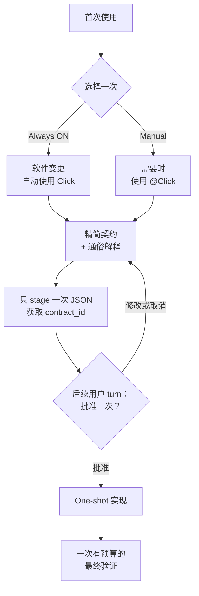

# Click

[English](README.md) | [한국어](README.ko.md) | 简体中文

[](https://github.com/grapefruit0205/click/actions/workflows/ci.yml)
[](LICENSE)

> 一次约定要改什么、必须守住什么，然后在这个边界内完成实现和必要验证。

Click 是一款面向 Codex 的插件，适合希望与编码代理只约定一次软件变更，然后不再反复改写计划、重新扫描整个仓库或用不同工具重复证明同一结果的用户。它会把请求和相关仓库上下文整理成一份简短契约——要改什么、必须保持什么、什么证据算完成——用易懂语言解释并等待批准，随后让实现和验证始终留在这个边界内。

若希望默认应用于软件变更，请选择 **Always ON（推荐）**；若只想在提及 `@Click` 的任务中使用，请选择 **Manual**。提问、解释、简单查询和只读代码审查仍保持轻量。

## 核心目的

Click 的核心目的是让用户批准的一条变更边界，从提案一直保持到实现和必要验证完成。它不是用来制造更大的规格，也不会代替用户选择架构模式。Click 会明确要改什么、必须保持什么、什么证据已经足够，并限制可观察到的重复规划、全仓库重复探索和重复验证，同时保留批准范围内必要的实现选择。

## 快速开始

```bash
codex plugin marketplace add grapefruit0205/click
codex plugin add click@click
```

重启 ChatGPT 桌面应用，检查并信任随附的 Click Hook，然后新建一个任务。首次提出会修改代码的请求前，Click 只询问一次：

```text
Use Always ON for future software changes (recommended), or Manual only when I mention @Click?
```

若想获得默认体验，请选择 Always ON。若希望显式调用，请选择 Manual：

```text
@Click 添加订单取消功能。防止重复退款，并保持现有 API 兼容。
```

## 更新到 v0.20.0

如果已经安装 Click，需要明确刷新 Git marketplace 快照并重新安装插件，才能加载本版本。

```bash
codex plugin marketplace upgrade click
codex plugin add click@click
```

重新启动 ChatGPT 桌面应用，检查并信任更新后的 Click Hook，然后开始一个新任务。现有模式偏好仍保存在目标仓库之外。如果自动化直接调用 `click-gate`，请让 `pass` 使用发出的 `contract_id` 而不是契约 JSON，并把内联 `done_when` 字符串迁移为结构化证据引用。

之后你可以说“Set Click to Always ON”或“Set Click to Manual”，这些偏好会持久保存在目标仓库之外。若只想绕过一个 turn，请把用户提示的第一行写成 `@Click bypass`，或使用自动补全形式 `[@Click](plugin://click@click) bypass`；Hook 只授权同一 turn 的一次 `click-gate bypass`，并保留活动契约。要丢弃活动契约，请使用对应的 `cancel` 形式来授权一次 `click-gate cancel`。`@Click` 标签和动作不区分大小写，但 plugin URI 必须完全匹配，指令行不能包含其他文字；实际任务可以从第二行继续。两种授权都不能重复使用或带到下一个 turn。Click 不会把偏好或契约文件放进你的项目。

<details>
<summary>从 Build Brief 或旧版 Click 升级</summary>

对于 `click@build-brief` 0.9.0：

```bash
codex plugin remove click@build-brief
codex plugin marketplace remove build-brief
codex plugin marketplace add grapefruit0205/click
codex plugin add click@click
```

对于 Build Brief 0.8，请将第一条命令替换为 `codex plugin remove build-brief@build-brief`。

</details>

## 工作原理



最初的请求并不等于批准一份尚未展示的设计。Click 只 stage 一次契约 JSON，获取一个不透明的 `contract_id`，把该 id 与开发者契约和通俗解释一起展示，然后停止。Hook 会记录 `staged_turn_id`，拒绝同一个 `UserPromptSubmit` turn 中的 pass 或替换 stage。后续 turn 的明确批准只传递已签发的 id，不再传递 JSON；Hook 将它与 staged digest 匹配后记录 `approved_turn_id`。修改并重新 stage 提案会签发新 id，使旧 handle 失效。这能证明期间发生了另一次用户回复；由于 Hook 不会判断自然语言是否表示同意，Skill 仍负责解释该回复是否真的意味着批准。

只有对已批准结果、边界、must-hold 行为或验证承诺的实质性变更才需要停止。在已批准边界内所需的文件、库、工具、服务和实现策略，不需要替换契约。

在 Manual 模式下，fail-open 行为只适用于没有活动 Click 契约的情况。一旦契约已 staged，或已经 approved 但当前 revision 尚未验证，该会话状态会在后续 turn 中继续阻止普通 mutation。这可以防止在批准 turn 中、绑定契约的 `contract_id` 尚未 pass 前就开始编辑。如果已批准的实现被中断并在另一个 turn 中恢复，Click 会重新 arm 并 pass 同一个 id；它不会再次发送 JSON，也不会编造替代契约。

当最终验证针对当前代码 revision 通过后，下一个变更请求就可以正常 stage 一份新契约。尚未运行、正在运行、失败，或在另一次 mutation 后变为 stale 的验证，都不会解锁替换。新契约会从干净的 inspection、mutation 和 verification 状态开始，并需要自己的批准；无需 `bypass` 或手动删除状态。

## 示例：从请求到批准

给出以下请求：

```text
@Click 添加订单取消功能。防止重复退款，并保持现有 API 兼容。
```

在修改代码前，Click 可能会展示如下精简契约：

```json
{
  "outcome": "符合条件的订单可以通过现有 API 取消，并且最多只退款一次。",
  "boundary": {
    "in_scope": ["当前的取消和退款路径"],
    "out_of_scope": ["新的支付服务商", "与本功能无关的订单状态清理"]
  },
  "must_hold": [
    "并发或重复请求不能产生第二次退款。",
    "现有请求字段、响应字段和状态含义保持兼容。",
    "支付服务商失败时，订单不能被标记为已退款。"
  ],
  "build": {
    "approach": [
      "复用当前取消路径，增加幂等退款记录，并使退款状态转换具备原子性。"
    ],
    "semantics": [
      "退款结果只记录一次，重复请求返回已记录的结果。"
    ]
  },
  "verification": {
    "scale": "full",
    "evidence": [
      {
        "id": "E1",
        "kind": "argv",
        "description": "覆盖成功、重复、并发和支付服务商失败的取消测试"
      },
      {
        "id": "E2",
        "kind": "argv",
        "description": "现有 API 回归测试套件"
      }
    ],
    "done_when": [
      {
        "condition": "退款行为正确。",
        "primary_evidence": "E1"
      },
      {
        "condition": "公共 API 保持兼容。",
        "primary_evidence": "E2"
      }
    ]
  },
  "plain_language": "客户可以取消符合条件的订单，但重试或同时发出的请求不能导致重复退款。公共 API 保持不变，支付调用失败也不能错误地完成退款。由于此变更涉及支付和并发，Click 推荐 full 验证。"
}
```

stage 会返回 `CLICK_CONTRACT_ID=ctr_0123456789abcdef0123456789abcdef`。随后 Click 展示该 id 并只问一个问题：批准该契约及其验证规模、修改，还是取消？批准意味着授权契约中的开发者语义，而不仅是通俗摘要；后续 turn 只 pass 该 id 来启动实现。

具体设计取决于仓库。此示例展示的是契约结构，而不是通用的退款架构。

## 精简执行契约

| 字段 | 它固定的内容 |
| --- | --- |
| `outcome` | 具体结果和用户可见行为 |
| `boundary` | 可以改变什么，以及哪些内容不在工作范围内 |
| `must_hold` | 可观察的安全性、兼容性和正确性承诺 |
| `build` | 最小且符合仓库现状的实现路径 |
| `verification` | 一种基于风险的规模，以及完成所需的证据 |
| `plain_language` | 用非专业人士也能理解的方式解释同一契约 |

只有当状态含义、安全顺序或不可逆边界确实需要时，才会出现 `build.semantics`、`build.order` 和 `verification.intermediate_gate`。Click 不会把同一工作重复展开为不同的 phases、steps、tasks 和 plans。

契约固定结果及其边界，而不会锁死每一个底层实现选择。因此 Click 可以保持精简，也不会因为实现需要范围内的依赖、文件或工具就强制重新批准。

## Always ON，但不打扰

| 请求 | Always ON 的行为 |
| --- | --- |
| 创建、修改、删除、重构或修复软件 | 展示一份精简契约和通俗解释，然后等待一次批准 |
| 只做代码审查、不修复 | 不需要构建契约或批准；使用只读防循环守卫 |
| 提问或解释 | 正常回答 |
| 简单的只读查询 | 正常检查，不创建 observation ledger |
| 第一行是普通或自动补全的 `@Click bypass` | 只在当前 turn 绕过 Click，并保留活动契约 |
| 第一行是普通或自动补全的 `@Click cancel` | 清除活动契约一次 |

代码审查期间，Click 会在需要时允许一次有用的全仓库清单读取。清单读取成功后，它会要求使用更窄范围的检查，阻止完全相同的成功读取或搜索，拒绝 plan 工具反复变动，并在审查守卫活动期间阻止项目 mutation。之后若要求修复发现的问题，则会启动一份独立的精简构建契约。

识别明确的直接读取仍然很方便。对于含义不明确或需要追踪的工作，Click 使用带有程序与参数数组的 `click-gate inspect`，而不是从 shell 字符串猜测。审查守卫覆盖受支持的本地 Hook 路径；它无法去重隐藏推理、hosted search、未匹配的 connector 或自定义 wrapper。

## 无循环实现

在 staging、review、implementation 和 verification 期间，Hook 会执行以下可观察规则：

| 防护规则 | 行为 |
| --- | --- |
| 复用证据 | 已成功的相同结构化读取或搜索会被阻止，直到范围内 mutation 使证据失效。 |
| 不并行规划 | 当工作流处于 armed、staged、approved 但未完成，或 review 状态时，匹配的 `update_plan` 调用会被拒绝，即使来自后续 turn 也一样。bypass 或当前 revision 完成后，普通的后续规划才会恢复。 |
| 不重置全仓库清单 | 根级清单命令（如 `rg --files`、`find .`、递归根目录列表及等价的 Git 清单扫描）会被拒绝；仍可使用限定路径的检查。 |
| 明确命令意图 | 活动状态下，含义不明确的 Bash 会被拒绝，并提示读取使用结构化 `inspect`、实现使用 `mutate`、最终检查使用 `verify`。 |
| 检查必须在预算内 | 最终检查必须通过结构化的 `click-gate verify` batch 运行，并符合已批准的规模。 |
| 限定 Browser 证据 | Browser MCP 只有被明确指定为主要证据时，才获得三次调用、90 秒的代表性 session；长时间推进和完成后重放会被拒绝。 |
| 持有本地服务器生命周期 | 可识别的开发服务器通过 `click-gate service` 启停，由 Click 清理准确的隔离子进程。 |
| 提案与批准分离 | stage 会签发绑定 digest 的不透明 id。同 turn pass 和替换 stage 会被拒绝；后续批准只 pass 该 id。 |

失败的 observation，或输出超过 48,000 字节的 observation，可以原样重试一次。源代码 mutation 会重置成功的 observation 证据，因为代码可能已经变化。Hook 状态变更使用跨平台锁，因此并行结果记录不会遗留错误的“running” observation。Hook 只存储请求 digest 和不含内容的元数据，不存储命令正文或输出。

这些是工具层面的 guardrail，不是推理 token 上限，也不是操作系统 sandbox。Hook 无法检查隐藏推理、识别只写在自然语言中的计划、观察未匹配的 connector 或 hosted tools、证明是否遵守语义边界，或阻止被允许的自定义代码在内部隐藏多项操作。

### 结构化能力

每项 capability 都使用协议版本 `1`，并将可执行程序与每个参数分离。获准的 argv 数组会在新的 POSIX session 或 Windows process group 中以 `shell=False` 运行，因此无法在请求中隐藏 pipeline、redirection、命令替换或 shell wrapper，而且子进程发往 group 的 signal 无法触及 Codex 父 group。

```text
click-gate inspect '{"version":1,"commands":[["git","status","--short"],["sed","-n","1,160p","src/app.py"]]}'
click-gate mutate '{"version":1,"argv":["python3","scripts/generate.py","--target","src"]}'
click-gate service '{"version":1,"action":"start","argv":["python3","-m","http.server","4173","--bind","127.0.0.1"]}'
click-gate service '{"version":1,"action":"stop"}'
```

`inspect` 只接受 Hook 限定的只读操作。Git 读取采用按 subcommand 划分的 positive option policy；`git grep`、`git cat-file`、任意 `--format`/`--pretty` 输出、signature 输出选项以及 `git status -v/-vv` 都被排除。允许的 Git 读取会忽略继承的 `GIT_*` 变量和 system/global Git config，强制安全的 log·diff 设置，关闭 pager 与 optional lock，并为支持的 diff 输出加入 `--no-ext-diff` 和 `--no-textconv`。`mutate` 要求在当前 turn 中 pass 与已批准 digest 绑定的已签发 id，并把先前证据标记为 stale。可识别的长时开发服务器会在 `mutate` 中被拒绝，改由 `service` 启动；Click supervisor 持有准确的子进程和 process group，并在显式 stop、`SessionEnd` 或两小时上限时清理。普通 `apply_patch`、`Edit` 和 `Write` 仍可直接作为 mutation 使用。格式错误的请求、shell interpreter，以及 `kill`、`pkill`、`killall`、`taskkill`、`Stop-Process` 等直接 process-control 可执行程序都会 fail closed。获准的自定义程序仍可能在内部隐藏明确的进程操作，因此 Click 是 workflow guardrail，而不是操作系统 sandbox。精确 schema 和执行边界请参阅[能力协议](skills/click/references/capability-protocol.md)。

SSH Git 读取是 **Experimental，并且只支持远端 POSIX shell**。它只允许受限的 `git status`、`git rev-parse HEAD`、`git merge-base` 和 `git remote get-url`，不接受用户提供的 SSH option。它要求 host key 已知，关闭交互式 password、host-key 更新、forwarding、local command 和 TTY，并通过 connection 与 keepalive 限制快速失败。未知 host、非 POSIX 远端 shell 和无响应 server 都会 fail closed。这不是通用远程执行器或安全 sandbox。

## 自动验证预算

Click 根据当前风险和仓库证据选择最小且足够的规模。用户会把它作为契约的一部分批准，不会出现第二次预算提示。

每个证据源只在 `verification.evidence` 中声明一次，包含 id、类型化的 `kind` 和说明。每个 `done_when` 条件通过 `primary_evidence` 引用一个充分且成本最低的证据 id；一个 id 可以覆盖多个条件。Click 优先复用当前 revision 仍然有效的证据和范围最窄的自动检查；只有更便宜的来源无法证明条件时，才使用浏览器、人工、hosted、完整 suite 或耗时的 end-to-end 证据。它不会通过另一个界面重复证明自动检查已经证明的结果，并会在所有条件都有当前证据后立即停止。语义上的充分性仍由 Skill 和 grader 判断，但 Hook 会结构化计量标准 Browser MCP 路径：只有一个被引用证据源的 `kind` 为 `browser` 时，才允许一个串行代表性 session，最多三次调用、90 秒实测时间；单次 tool timeout 不得超过 30 秒，明确 wait 不得超过五秒，完成后也不能重放。后续 mutation 会重置该证据，matcher 之外的 connector 仍不在此计量范围内。

| 规模 | 典型用途 | 自动上限 |
| --- | --- | ---: |
| `quick` | 小型、局部、可逆的变更 | 1 unit |
| `focused` | 普通且边界明确的功能或修复 | 4 units |
| `full` | 支付、认证、删除、迁移、公共契约或跨边界并发 | 10 units |

一项 `targeted` 检查花费 1 unit，`broad` 花费 3，`deep` 花费 5。提交的值不会被直接信任为成本：Hook 会先识别 runner，再估算实际范围。一个明确文件或测试节点可以是 targeted；`-k` 或正则筛选、多个文件或 package、目录以及完整套件至少是 broad。一个明确的集成或安全测试节点是 broad，而完整的集成或安全套件是 deep。Hook 会在计算总量前自动提高被低报的检查等级。这些数值是上限，不是目标。

Click 会把每项检查作为一个明确的 argv 条目提交给：

```text
click-gate verify '{"version":1,"checks":[{"argv":["python3","-m","unittest","discover","-s","tests","-q"],"class":"broad"},{"argv":["git","diff","--check"],"class":"targeted"}]}'
```

Hook 会验证并规范化提交的 class，在不使用 shell 的情况下执行已接受的最终 batch，并记录真实退出码。对于 Python，只允许明确的 pytest、unittest 和 coverage 模块 runner，包括 Windows 的 `py -3 -m ...`；Python `-c` 和直接执行 Python 脚本会被拒绝。指定一个准确文件的 `node --check`、`node --test`，以及 `uv run pytest`、`npm run lint`、`npm run build`、`ruff check`、`mypy`、`tsc --noEmit`、`cargo check`、`cargo clippy` 和 `go vet`，会被识别并按推断范围计费。项目级 `node --test` 是 broad，Node eval/print 不属于验证能力。旧版 shell-string `commands` batch 会被拒绝，同时给出迁移提示。失败的 batch 可因临时故障原样重试一次；之后必须先进行范围内 mutation。后续 mutation 会使之前的成功结果 stale，并允许再次运行同一 batch。

在 Git worktree 中，runner 会在 batch 前快照 tracked 内容以及既有的 **non-ignored untracked** 内容。如果受保护内容发生变化，batch 会以 stale 失败，并推进 mutation revision，而不是记录错误的成功结果。它还会报告每一个新出现的 non-ignored untracked 路径；任何这类新路径都会作为 workspace 变更使验证 stale 失败并推进 mutation revision。source、application、library、configuration 或 migration 分类只用于让警告更明确。预期生成的产物应被 Git ignore，或在已批准的 mutation 阶段生成。该快照无法看到被 Git ignore 的路径。在 Git 之外，这一内容差异守卫不可用；argv 验证、无 shell 执行和 revision 状态仍然有效。

最低 class 推断可以防住简单的低报。未知但看起来用于验证的 wrapper 名称会被保守地计为 `deep`，无法识别的命令会被拒绝，但一个获准程序仍可能在内部隐藏昂贵工作。这里不是安全或资源 sandbox，也不能证明所选测试在语义上足够。

## 最小设计仍保护重要事项

最小设计去掉的是仪式，不是必要的防护。

| 关注点 | 相关时契约会保护的内容 |
| --- | --- |
| 并发 | 竞态行为、重复执行、幂等性 |
| 状态 | 有效转换、持久化点、所有权 |
| 失败 | 部分失败、重试、恢复、外部错误 |
| 安全 | 身份认证、授权、密钥、隐私边界 |
| 兼容性 | 现有 API、数据、状态和用户可见行为 |

重要条件属于 `must_hold`；具体的状态或失败含义属于可选的 `build.semantics`。证据源在 `verification.evidence` 中声明，可观察的完成条件从 `verification.done_when` 引用其 id。Hook 会保护契约结构、批准顺序、digest 一致性、可见循环和可见的验证范围，但它本身无法证明实现的架构正确性或语义忠实度。

更准确地说，Click 不会从语义上判断一个新微服务、queue 或 abstraction 是否属于过度设计。Skill 和 semantic grader 倾向于选择最小且有证据支持的设计；Hook 则阻止经常导致设计膨胀的重复规划、全仓库重新发现和重复验证循环。产品声明仅限于这个可观察的执行边界。

## Click 适合谁

Click 面向两类用户：

- 厌倦高能力模型反复规划、探索仓库和过度验证的用户；
- 构建 MVP、内部工具、自动化和边界清晰功能，并希望最小设计后连续实现的人。

它尤其适合：

- 必须保持现有 API 的 brownfield 功能；
- 幂等性、并发、状态转换或失败恢复；
- 边界清晰且影响较大的迁移或其他变更；
- 需要另一个人或 agent 实现同一含义的交接；
- 希望少量规划后连续实现的 MVP、内部工具或自动化。

对于微小、显而易见、可逆或探索性变更，如果不需要持久的批准边界，Manual 模式或按 turn bypass 通常更合适。对于法律、受监管、安全关键或运营上不可逆的工作，Click 不能替代专家审查、授权或部署控制。

## 证据与诚实边界

v0.20.0 源码以确定性 suite 作为 release gate。覆盖内容包括：持久模式、跨 turn 批准、active-contract 锁、读取与 plan 防循环、范围感知的本地验证、结构化证据引用、Browser 主要证据分配和预算、受管服务器启动与停止、Node 文件检查、加固的 Git 读取、process 隔离、验证期间 workspace mutation 检测、发布一致性和仓库策略。必需 CI 会在 Linux、macOS 和 Windows 运行该 suite，并在 Ubuntu 额外验证 plugin、marketplace、Click/Fix Skill、Python compilation 和 whitespace。

仓库还包含用于确定性 fixture 策略审查的 version-17 golden cases 和 semantic grader。这些资料检查契约结构与预期行为，并不测量 runtime 生产力。

这些 gate 只证明可观察的 Hook 与契约行为。在多个无关真实仓库中完成独立测量之前，Click 不会声称能跨项目提高成功率、准确性、速度、token 使用效率或减少过度设计。

Click 并不声称自己是该领域的第一个或唯一工作流。它与 spec-driven、autonomous-loop 和 approval-gated 工具有重叠；其刻意收窄的重点是：一次持久选择、一份精简契约、一次批准、One-shot 实现、可观察的防循环守卫，以及一次最终验证预算。

[COMMUNITY_POSTS.md](COMMUNITY_POSTS.md) 中提供了可编辑的开发者社区发布文案。

<details>
<summary>仓库结构与本地验证</summary>

```text
.codex-plugin/plugin.json             插件 manifest
.agents/plugins/marketplace.json      GitHub marketplace 条目
skills/click/                         One-shot 设计与构建 Skill
skills/click/references/modes.md      持久模式与代码审查行为
skills/click/references/capability-protocol.md  结构化 runner schema
skills/fix/                           精简修复 Skill
hooks/click_gate.py                   契约、capability、防循环和预算守卫
hooks/hooks.json                      生命周期 Hook 配置
evals/                                Golden cases 和 semantic grader
tests/                                确定性 Hook、grader 和策略测试
scripts/validate_distribution.py     仓库自带的 release validator
COMMUNITY_POSTS.md                    可编辑的英文和韩文发布文案
LICENSE                               MIT License
```

```bash
python3 scripts/validate_distribution.py
python3 -m compileall -q hooks evals scripts tests
python3 -m unittest discover -s tests -v
git diff --check
```

</details>

<details>
<summary>相关方案</summary>

| 项目 | 重叠部分 | Click 更窄的重点 |
| --- | --- | --- |
| [GitHub Spec Kit](https://github.com/github/spec-kit) | 规格、规划、任务、实现 | 使用一份精简契约和一次批准，而不是持久的多命令规格流程 |
| [OpenSpec](https://github.com/Fission-AI/OpenSpec) | AI 辅助编码前先达成一致 | 不使用项目内规格存储；Hook 只在目标仓库外保存 digest 和不含正文的 lifecycle metadata |
| [Kiro Specs](https://kiro.dev/docs/cli/v3/specs/) | 需求、设计、任务、验证执行 | 审阅一份完整契约后进行 One-shot 实现 |
| [Agentic SDLC Codex Plugin](https://github.com/aantenore/agentic-sdlc-codex-plugin) | hash 绑定的提案与批准 | 使用更小的编码前边界，而不是更广泛的 SDLC 治理 |

这是有限范围的比较，不是详尽的新颖性检索。

</details>

## 许可证

Click 采用 [MIT 许可证](LICENSE)发布。
